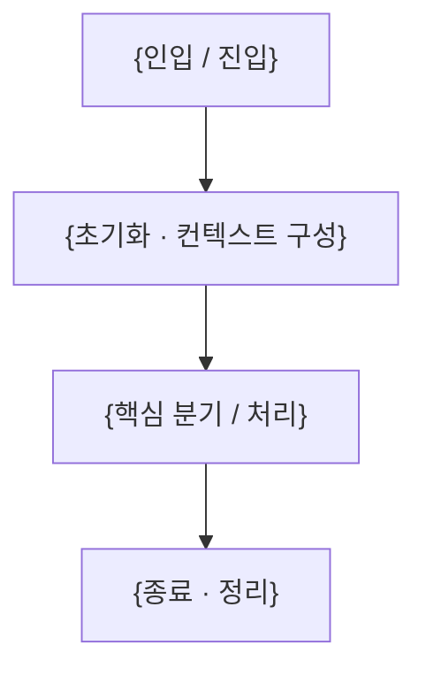

# ColorTrip

**다채로울지도(ColorTrip)** 는 충청북도 11개 시·군을 여행 퀘스트로 탐험하고, 완료한 지역을 지도 위에 색칠해 나가는 모바일 앱입니다. **backend(Python) + frontend(Flutter)** 를 함께 관리하는 모노레포입니다.

> AI 코딩 에이전트로 작업한다면 먼저 [docs/AGENT_GUIDE.md](docs/AGENT_GUIDE.md)를 읽으세요.

## 주요 기능

### 🎯 핵심 기능

<!-- 사용자/도메인 관점의 핵심 기능. 상세 동작은 각 기능 스펙의 description.md를 SOT로 둔다. -->
- **여행 퀘스트·지도 색칠**: 카카오로 시작 → 여행 DNA 진단(초기 설문) → 시·군별 퀘스트를 사진·GPS·OX퀴즈로 인증 → 완료할수록 지도가 진하게 칠해짐. 타임라인·공유 카드로 기록. (상세: [docs/specs/000-frontend-app/description.md](docs/specs/000-frontend-app/description.md))

### 🏗️ 아키텍처 특징

- **모노레포**: backend(Python)와 frontend(Flutter)를 한 저장소에서 관리
- **프론트엔드 단독 구동(현재)**: 백엔드 연동 전까지 프론트엔드는 정적 데이터 + 메모리 상태로 동작(Repository 인터페이스로 후속 API 교체 seam 확보). 자세한 결정은 [docs/specs/000-frontend-app/plan.md](docs/specs/000-frontend-app/plan.md).

## 요구사항

- **Python**: {버전 — 예: 3.12+} (백엔드, 추후)
- **Flutter / Dart**: Flutter 3.44+ / Dart 3.12+
- **패키지 매니저**: {백엔드 — 예: uv} / 프론트엔드 — pub
- 외부 키: 현재 프론트엔드 단독 구동에는 불필요(카카오 로그인 스텁·정적 데이터). 후속 연동 시 [인증·보안](docs/conventions/auth-security.md)·[외부 API](docs/conventions/external-apis.md) 컨벤션 참고.

## 설치 및 설정

### 백엔드 (`backend/`)

```bash
cd backend
{의존성 설치 명령}        # 예: uv sync
{개발 의존성 설치 명령}   # 예: uv sync --group dev
```

### 프론트엔드 (`frontend/`)

```bash
cd frontend
flutter pub get
```

### 환경 변수 설정

각 영역 루트에 `.env`(또는 해당 도구의 설정 파일)를 만들고 다음을 설정합니다:

```bash
# {그룹 — 예: 핵심 인프라}
{KEY}={값/설명}

# {그룹 — 예: 외부 API 키}
{KEY}={값/설명}
```

## 실행 방법

### 백엔드

```bash
{실행 명령}
```

- **용도**: {}

### 프론트엔드

```bash
cd frontend
flutter run                 # 연결된 기기/시뮬레이터
flutter run -d chrome       # 웹(빠른 확인용)
```

- **용도**: 다채로울지도 앱 구동. iOS/Android 실행은 각 플랫폼 툴체인(Xcode/Android SDK) 필요. 빠른 확인은 웹(Chrome)으로 가능.

## 프로젝트 구조

{레이어/영역 의존 방향, 예: frontend → (API) → backend}

```text
.
├── AGENTS.md       # Codex 등 에이전트 진입점 → docs/AGENT_GUIDE.md
├── CLAUDE.md       # Claude Code 진입점 → docs/AGENT_GUIDE.md
├── README.md       # 프로젝트 개요·구조·실행 (이 문서)
├── backend/        # 백엔드 — Python (도메인 골격: core·integrations·quests·regions)
├── frontend/       # 프론트엔드 — Flutter 앱 (다채로울지도)
│   ├── lib/
│   │   ├── main.dart        # 진입점 (ProviderScope)
│   │   ├── app/             # MaterialApp.router·GoRouter 라우트·테마(디자인 토큰)·앱 셸(탭바)
│   │   ├── core/            # Dio 클라이언트(설정)·공용 위젯(지도·토스트)
│   │   ├── data/            # 모델·정적 데이터(static/)·Repository(정적/Auth 스텁)
│   │   ├── state/           # 전역 상태(Riverpod)·파생 통계·지도 색칠 헬퍼
│   │   └── features/        # 화면 단위: onboarding·survey·home·quests·timeline·profile
│   └── pubspec.yaml
└── docs/           # 문서
    ├── AGENT_GUIDE.md   # AI 에이전트 공통 가이드 (작업 워크플로우·문서 동기화 규칙)
    ├── conventions/     # 팀 기술·규약 결정 (영역별 SOT)
    ├── specs/           # 기능 스펙 (진행 중·예정 기능)
    │   └── 000-frontend-app/   # 프론트엔드 앱 스펙 + prototype/(디자인 참고 원본)
    └── template/        # 문서 템플릿 (README·specs)
```

> 새 기능 스펙은 `docs/specs/{NNN}-{기능}/`에 [`docs/template/specs/`](docs/template/specs/) 템플릿을 복사해 작성합니다. 자세한 규칙은 [docs/AGENT_GUIDE.md](docs/AGENT_GUIDE.md#기능-스펙-docsspecs)를 참고하세요.

## 실행 파이프라인 / 핵심 흐름

{진입(요청/이벤트 인입)부터 종료까지의 핵심 흐름. frontend ↔ backend 경계를 포함해. 가능하면 mermaid로.}



## 주요 기능과 위치

기능을 수정할 때 **어느 폴더를 건드려야 하는지**를 정리합니다.

| 기능 | 설명 | 위치 |
|------|------|------|
| **온보딩·여행 DNA** | 스플래시·회원가입·초기 설문·DNA 결과 | `frontend/lib/features/onboarding/`, `frontend/lib/features/survey/` |
| **홈 지도(색칠)** | 충북 11개 시·군 색칠 지도·통계 | `frontend/lib/features/home/`, 지도 위젯 `frontend/lib/core/widgets/chungbuk_map.dart` |
| **퀘스트·인증** | 목록·지역별·상세·인증(사진/GPS/OX퀴즈) | `frontend/lib/features/quests/` |
| **타임라인·프로필·공유** | 완료 기록·마이·내정보수정·공유 카드 | `frontend/lib/features/timeline/`, `frontend/lib/features/profile/` |
| **도메인 데이터·상태** | 지역·퀘스트·DNA·설문 정적 데이터, 전역 상태 | `frontend/lib/data/`, `frontend/lib/state/` |

> 위 표는 기능이 **어디 있는지**를 가리킵니다. 개별 기능의 **상세 설명**은 이 README에 중복해 적지 않고, 해당 기능 스펙의 `description.md`를 단일 출처(SOT)로 둡니다. 특정 기능 설명이 필요하면 `docs/specs/{NNN}-{기능}/description.md`를 참고/링크하세요.

## 패키지 의존성

### 백엔드 주요 의존성

| 패키지 | 버전 | 설명 |
| ------ | ---- | ---- |
| `{패키지}` | `{버전}` | {용도} |

### 프론트엔드 주요 의존성

> 스택 결정의 SOT는 [docs/conventions/frontend.md](docs/conventions/frontend.md).

| 패키지 | 버전 | 설명 |
| ------ | ---- | ---- |
| `go_router` | `^17.3.0` | 라우팅 |
| `flutter_riverpod` | `^3.3.2` | 상태관리(전역·서버) |
| `dio` | `^5.9.2` | HTTP 클라이언트(현재 설정만) |
| `flutter_form_builder` · `form_builder_validators` | `^10.3.0` · `^11.3.0` | 폼 |
| `flutter_secure_storage` | `^10.3.1` | 토큰 저장(인증 연동 시) |

## 코드 스타일

### 백엔드 (Python)

```bash
{포맷터 명령}     # 예: uv run ruff format
{린터 명령}       # 예: uv run ruff check
{타입체커 명령}   # 예: uv run pyright
```

설정은 `{설정 파일}`에 있습니다. {반드시 지킬 핵심 규칙 한 줄}

### 프론트엔드 (Flutter/Dart)

```bash
cd frontend
dart format .
flutter analyze
```

규칙 SOT: [docs/conventions/code-quality.md](docs/conventions/code-quality.md). 폰트는 Pretendard(번들), 디자인 토큰은 `lib/app/theme.dart`의 `AppColors`.

### 자주 쓰는 라이브러리·패턴

- **{패턴}**: {설명}

## 유지 관리 사항

### 보안

- {시크릿 관리, 운영 환경 설정 등}

### 의존성 업데이트

```bash
{백엔드 의존성 업데이트 명령}
{프론트엔드 의존성 업데이트 명령}
```
