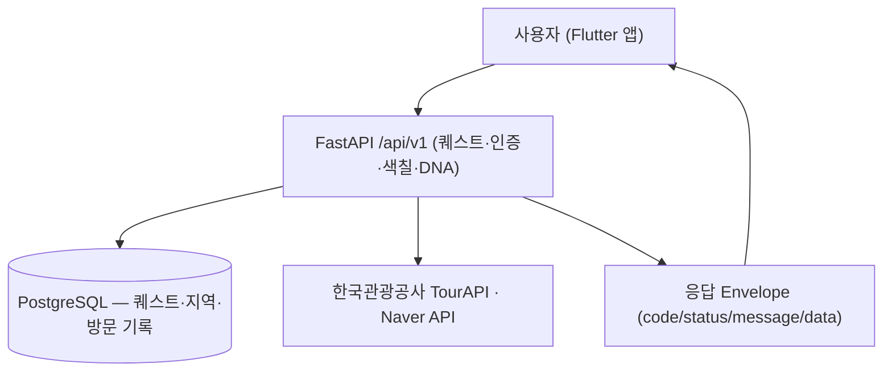

# ColorTrip

**ColorTrip(다채로울지도)** 는 충청북도 11개 시·군의 여행 퀘스트를 수행하고 방문한 지역을 지도에 색칠해가며 즐기는 게이미피케이션 관광 서비스입니다. **backend(Python) + frontend(Flutter)** 를 함께 관리하는 모노레포입니다.

> AI 코딩 에이전트로 작업한다면 먼저 [docs/AGENT_GUIDE.md](docs/AGENT_GUIDE.md)를 읽으세요.

## 주요 기능

### 🎯 핵심 기능

<!-- 사용자/도메인 관점의 핵심 기능 -->
- **여행 DNA별 퀘스트**: 설문으로 파악한 여행 성향(자연탐험·미식·역사문화·액티비티·힐링 5종)에 맞춰 충북 11개 시·군의 퀘스트를 추천
- **GPS·사진 기반 퀘스트 인증**: 퀘스트 완료 시 GPS로 현재 위치를 확인하고, 사진 인증으로 실제 방문 여부를 검증
- **지도 색칠 / 방문 기록 시각화**: 퀘스트를 완료한 지역을 지도에 색칠하고, 방문 깊이에 따라 색의 채도가 진해지는 수집형 경험
- **여행 결과 공유**: 색칠한 지도와 여행 DNA 결과를 타임라인으로 기록하고 이미지로 공유

### 🏗️ 아키텍처 특징

- **모노레포**: backend(Python)와 frontend(Flutter)를 한 저장소에서 관리
- **관광 공공데이터 기반**: 한국관광공사 TourAPI로 관광지·행사·운영정보를 받아 퀘스트로 가공 ([docs/conventions/external-apis.md](docs/conventions/external-apis.md))

## 요구사항

- **Python**: 3.13 ([docs/conventions/backend.md](docs/conventions/backend.md))
- **Flutter / Dart**: 최신 안정 버전 — 구체 버전 미정 ([docs/conventions/frontend.md](docs/conventions/frontend.md))
- **패키지 매니저**: uv(백엔드) / pub(프론트엔드)
- **외부 의존**: PostgreSQL · 한국관광공사 TourAPI 키 · Naver API 키 · Kakao 로그인 키 ([external-apis](docs/conventions/external-apis.md) · [auth-security](docs/conventions/auth-security.md))

> `backend/`·`frontend/` 디렉토리는 아직 생성 전입니다(첫 도메인 작업에서 생성 — [docs/specs/000-quest/](docs/specs/000-quest/) 참고). 아래 설치·실행·의존성은 [docs/conventions/](docs/conventions/)에서 확정한 도구·스택 기준이며, 코드 생성 시 버전·경로 등 세부값을 갱신합니다.

## 설치 및 설정

### 백엔드 (`backend/`)

```bash
cd backend
uv sync                # 의존성 설치
uv sync --group dev    # 개발 의존성 포함
```

### 프론트엔드 (`frontend/`)

```bash
cd frontend
flutter pub get        # 의존성 설치
```

### 환경 변수 설정

백엔드는 pydantic-settings로 `.env`에서 설정을 읽습니다([backend.md](docs/conventions/backend.md)). 운영 시크릿·API 키는 GCP Secret Manager로 관리합니다([auth-security.md](docs/conventions/auth-security.md)). 아래 키 이름은 예시이며, backend 구현 시 확정합니다.

```bash
# 핵심 인프라
DATABASE_URL=        # PostgreSQL 접속 URL

# 외부 API 키
TOUR_API_KEY=        # 한국관광공사 TourAPI
NAVER_API_KEY=       # Naver 지도/지역 API
KAKAO_API_KEY=       # Kakao 로그인

# 인증
JWT_SECRET=          # JWT(Access/Refresh) 서명 키
```

## 실행 방법

### 백엔드

```bash
docker compose up      # PostgreSQL + FastAPI(Uvicorn) 로컬 구동
```

- **용도**: FastAPI 백엔드 API 서버. 로컬은 Docker Compose로 PostgreSQL과 함께 구동합니다([infra-deploy.md](docs/conventions/infra-deploy.md)).

### 프론트엔드

```bash
flutter run            # 실기기는 같은 Wi-Fi LAN IP로 로컬 API에 접속
```

- **용도**: Flutter 모바일 앱(iOS 16+ / Android 10(API 29)+).

## 프로젝트 구조

frontend(Flutter 앱) → REST API(`/api/v1`) → backend(FastAPI) → PostgreSQL · 외부 API(TourAPI·Naver·Kakao)

```text
.
├── AGENTS.md       # Codex 등 에이전트 진입점 → docs/AGENT_GUIDE.md
├── CLAUDE.md       # Claude Code 진입점 → docs/AGENT_GUIDE.md
├── README.md       # 프로젝트 개요·구조·실행 (이 문서)
├── backend/        # FastAPI API 서버 — 퀘스트 등 도메인, TourAPI 연동 (실행: backend/README.md)
├── frontend/       # Flutter 모바일 앱 — 퀘스트 수행·지도 색칠·여행 DNA·공유 (생성 예정)
└── docs/           # 문서
    ├── AGENT_GUIDE.md   # AI 에이전트 공통 가이드 (작업 워크플로우·문서 동기화 규칙)
    ├── conventions/     # 팀 컨벤션 (영역별 기술 스택·규약 결정의 단일 출처)
    ├── specs/           # 기능 스펙 (진행 중·예정 기능)
    └── template/        # 문서 템플릿 (README·conventions·specs)
```

> 새 기능 스펙은 `docs/specs/{NNN}-{기능}/`에 [`docs/template/specs/`](docs/template/specs/) 템플릿을 복사해 작성합니다. 자세한 규칙은 [docs/AGENT_GUIDE.md](docs/AGENT_GUIDE.md#기능-스펙-docsspecs)를 참고하세요.

## 실행 파이프라인 / 핵심 흐름

사용자가 Flutter 앱에서 퀘스트를 탐색·수행하면, 백엔드(`/api/v1`)가 DB와 한국관광공사 TourAPI를 조회해 공통 Envelope로 응답합니다. 퀘스트 완료(GPS·사진 인증)는 방문 기록으로 쌓여 지도 색칠과 여행 DNA에 반영됩니다.



## 주요 기능과 위치

기능을 수정할 때 **어느 폴더를 건드려야 하는지**를 정리합니다. `frontend/`는 아직 생성 전이며, 기능이 구현되는 대로 위치를 갱신합니다.

| 기능 | 설명 | 위치 |
|------|------|------|
| **퀘스트(Quest)** | 충북 시·군 관광 퀘스트 목록·상세·카테고리 조회 | `backend/app/quests/` · 스펙 [docs/specs/000-quest/](docs/specs/000-quest/) |
| **시·군(regions)** | 충북 11개 시·군 마스터·시드 | `backend/app/regions/` |

> 위 표는 기능이 **어디 있는지**를 가리킵니다. 개별 기능의 **상세 설명**은 이 README에 중복해 적지 않고, 해당 기능 스펙의 `description.md`를 단일 출처(SOT)로 둡니다. 인증·지도 색칠·여행 DNA·공유 등은 별도 도메인으로 진행 예정이며, 스펙이 만들어지면 이 표에 추가합니다.

## 패키지 의존성

> 버전은 `backend/`·`frontend/` 의존성 파일(`pyproject.toml`·lock / `pubspec.yaml`·lock) 확정 시 채웁니다. 스택 결정의 단일 출처는 [docs/conventions/](docs/conventions/)입니다.

### 백엔드 주요 의존성

| 패키지 | 버전 | 설명 |
| ------ | ---- | ---- |
| `fastapi` | 미정 | 웹 프레임워크 |
| `sqlalchemy` | 2.0 | ORM |
| `alembic` | 미정 | DB 마이그레이션 |
| `pydantic-settings` | 미정 | 설정·환경변수 |
| `uvicorn` | 미정 | ASGI 앱 서버 |

### 프론트엔드 주요 의존성

| 패키지 | 버전 | 설명 |
| ------ | ---- | ---- |
| `flutter_riverpod` | 미정 | 상태 관리(전역·서버) |
| `dio` | 미정 | HTTP 클라이언트 |
| `go_router` | 미정 | 라우팅 |
| `flutter_form_builder` | 미정 | 폼 관리 |
| `flutter_secure_storage` | 미정 | 토큰 보안 저장 |

## 코드 스타일

### 백엔드 (Python)

```bash
uv run ruff format    # 포맷
uv run ruff check     # 린트
uv run pyright        # 타입 체크
```

설정은 백엔드 설정 파일과 루트 `.pre-commit-config.yaml`에 있습니다. 커밋 전 pre-commit이 Ruff·Pyright를 자동 검사합니다([code-quality.md](docs/conventions/code-quality.md)).

### 프론트엔드 (Flutter/Dart)

```bash
dart format .         # 포맷
flutter analyze       # 린트/분석
```

### 자주 쓰는 라이브러리·패턴

- **백엔드**: async/await 전면 적용, 응답 Envelope(`code/status/message/data`), UUID v7 PK, Soft Delete — 상세는 [backend.md](docs/conventions/backend.md) · [database.md](docs/conventions/database.md) · [api-design.md](docs/conventions/api-design.md)
- **프론트엔드**: Riverpod(상태)·Dio(통신)·GoRouter(라우팅), 지도는 이미지 기반 색칠 — [frontend.md](docs/conventions/frontend.md)

## 유지 관리 사항

### 보안

- 시크릿·API 키는 코드/깃에 두지 않고 GCP Secret Manager로 관리하며, 로컬은 `.env`로 주입합니다. 클라이언트 토큰은 `flutter_secure_storage`에 저장하고, 인증은 Kakao + JWT(Access/Refresh), CORS는 허용 도메인 화이트리스트로 제한합니다. 상세는 [auth-security.md](docs/conventions/auth-security.md).

### 의존성 업데이트

```bash
uv lock --upgrade      # 백엔드 (uv)
flutter pub upgrade    # 프론트엔드 (pub)
```
