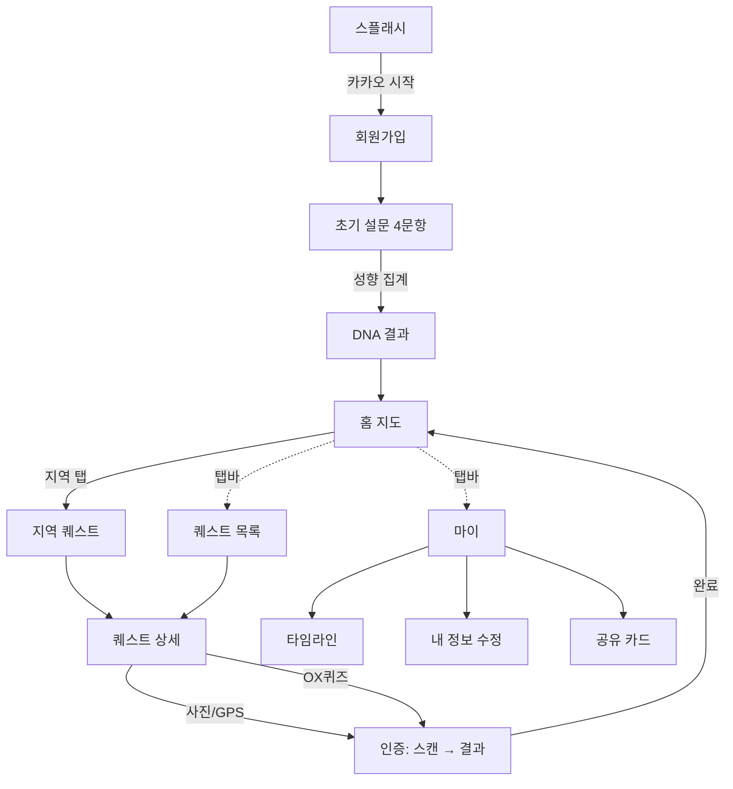

# [설명] 다채로울지도 프론트엔드 앱 (Flutter)

## 개요

충청북도 11개 시·군을 **여행 퀘스트**로 탐험하고, 완료한 지역을 **지도 위에 색칠**해 나가는 모바일 앱이다. 사용자는 카카오로 시작해 여행 성향 설문으로 **여행 DNA**를 진단받고, 지역별 퀘스트(자연/미식/역사/액티비티/힐링)를 **사진·GPS·OX퀴즈**로 인증한다. 인증할수록 해당 시·군이 더 진하게 칠해지고, 완료 기록은 타임라인과 공유 카드로 남는다.

이 앱은 [프론트엔드 스택 컨벤션](../../conventions/frontend.md)을 따르는 Flutter로 구현하며, 백엔드·실제 외부 연동 전까지는 정적 데이터와 메모리 상태로 동작한다(상세 결정은 [plan.md](./plan.md)).

## 동작 방식

**전체 플로우 (화면 전이)**

**핵심 인터랙션**
- **여행 DNA**: 4문항 설문에서 각 선택지가 5개 유형(자연/미식/역사/액티비티/힐링) 중 하나에 매핑되고, 최다 선택 유형이 DNA가 된다.
- **퀘스트 인증**: 사진(등록→제출→분석 스캔→결과)·GPS(제출→스캔→결과)·OX퀴즈(정답 시 완료). 완료하면 `completed`/지역 `progress`/`timeline`/리워드 포인트가 갱신된다.
- **지도 색칠**: 지역 진행도 n에 따라 색이 단계적으로 변한다 — 0 회색, 1 라이트그린(#97C459), 2+ 진그린(#2D6A4F).
- **데이터 흐름**: 화면 → Riverpod 상태(Notifier) → Repository(정적 데이터). 외부 네트워크 호출 없음.

## 주요 구성 요소 / 위치

| 구성 요소 | 역할 | 위치 |
|-----------|------|------|
| 앱 진입·라우팅·테마 | MaterialApp.router, GoRouter 라우트, 디자인 토큰 테마 | `frontend/lib/app/` |
| 공용 인프라·위젯 | Dio 클라이언트(설정), 상수, 폰 프레임/상태바·토스트·칩 등 공용 위젯 | `frontend/lib/core/` |
| 도메인 데이터·모델·저장소 | 지역(11)·퀘스트(18)·DNA(5)·설문(4) 정적 데이터, 모델, Repository | `frontend/lib/data/` |
| 온보딩 | 스플래시·회원가입 | `frontend/lib/features/onboarding/` |
| 설문·DNA | 초기 설문, DNA 결과 | `frontend/lib/features/survey/` |
| 홈 지도 | 색칠 지도(CustomPainter), 통계, 지역 진입 | `frontend/lib/features/home/` |
| 퀘스트 | 목록·지역별·상세·인증(사진/GPS/퀴즈) | `frontend/lib/features/quests/` |
| 타임라인 | 완료 기록 월별/유형 필터 | `frontend/lib/features/timeline/` |
| 프로필 | 마이·내정보수정·공유카드 | `frontend/lib/features/profile/` |

## 설정 / 사용법

- 실행: `cd frontend && flutter pub get && flutter run` (상세는 구현 후 [README.md](../../../README.md)에 반영).
- 환경변수: 이번 범위에선 외부 키 불필요(스텁·정적 데이터). 후속 연동 시 [인증·보안](../../conventions/auth-security.md)·[외부 API](../../conventions/external-apis.md) 컨벤션을 따른다.

## 예시

- 스플래시에서 "카카오로 시작하기" → 설문 4문항 응답 → "자연탐험형 여행자" DNA 결과 → 홈 지도.
- 홈에서 단양군 탭 → "도담삼봉에서 인생샷 남기기" 퀘스트 → 사진 등록·제출 → 인증 완료 → 단양군 지도가 라이트그린으로 칠해지고 +80P.

## 관련 문서

- [plan.md](./plan.md) · [implementation.md](./implementation.md)
- [프론트엔드 스택 컨벤션](../../conventions/frontend.md) · [인증·보안 컨벤션](../../conventions/auth-security.md) · [외부 API 컨벤션](../../conventions/external-apis.md)
- 디자인 참고(프로토타입): `다채로울지도.dc.html` (저장소 보관 위치는 구현 시 확정)
