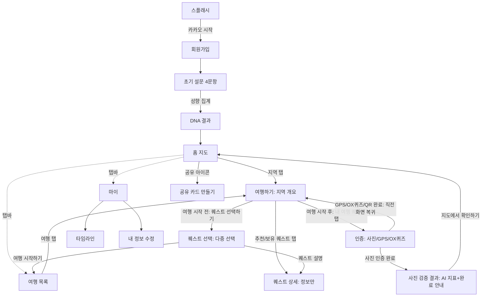

# [설명] 다채로울지도 프론트엔드 앱 (Flutter)

## 개요

충청북도 11개 시·군을 **여행 퀘스트**로 탐험하고, 완료한 지역을 **지도 위에 색칠**해 나가는 모바일 앱이다. 사용자는 카카오로 시작해 여행 성향 설문으로 **여행 DNA**를 진단받고, 지역별 퀘스트(자연/미식/역사/액티비티/힐링)를 **사진·GPS·OX퀴즈**로 인증한다. 인증할수록 해당 시·군이 더 진하게 칠해지고, 완료 기록은 타임라인과 공유 카드로 남는다.

이 앱은 [프론트엔드 스택 컨벤션](../../conventions/frontend.md)을 따르는 Flutter로 구현하며, 백엔드·실제 외부 연동 전까지는 정적 데이터와 메모리 상태로 동작한다(상세 결정은 [plan.md](./plan.md)).

## 동작 방식

**전체 플로우 (화면 전이)**

**하단 탭바(2026-07-08 Figma 반영, 2026-07-09 확정)**: **여행 · 홈 · 마이** 3탭. 유형별 전체 퀘스트 평면 목록은 여행 목록 화면 상단 "전체 퀘스트" 버튼으로 남겨뒀다. 퀘스트 화면은 별도 탭이 아니라 **지도(홈)나 여행 목록에서 지역을 골라야 들어갈 수 있다**.

**"여행 시작하기" 흐름(2026-07-09 사용자 확정 — 최종 버전)**: "여행"은 더 이상 지역 퀘스트 완료 현황만으로 정해지지 않는다. 지도/여행 목록에서 지역을 탭하면 **"여행하기"(지역 개요) 화면**이 뜬다.
- **여행 시작 전**: 지역 이미지, DNA 요약, 추천 퀘스트 2건(탭하면 퀘스트 상세로 — 정보만, 수행 버튼 없음), "퀘스트 선택하기" 버튼.
- "퀘스트 선택하기" → **"퀘스트" 선택 화면**(검색·유형 필터, 카드 탭으로 **다중 선택**, 카드의 "퀘스트 설명"으로 퀘스트 상세 진입). "여행 시작하기"를 누르면 **선택한 퀘스트를 그 자리에서 수행하는 게 아니라**, 그 지역의 "여행"으로 등록하고 **여행 탭**으로 이동한다 — 이 시점부터 해당 지역이 여행 탭의 **"진행중인 여행"**에 들어간다(완료 퀘스트가 0개여도).
- **여행 시작 후**: 같은 지역의 "여행하기" 화면은 추천 퀘스트 대신 **"내 여행 퀘스트"** 목록을 보여준다. 미완료 퀘스트를 탭하면 **퀘스트 상세를 거치지 않고 곧바로 인증 화면**으로 이동한다. "퀘스트 더 선택하기"로 같은 여행에 퀘스트를 추가할 수 있다.
- **퀘스트 상세 화면은 어디서 들어가든 순수 정보 화면**이다 — 인증/수행 버튼이 없다(추천 퀘스트 탭, "퀘스트 설명" 링크, `/quests` 전체 목록 어디서 들어가도 동일).
- 여행 목록의 **진행중/지난** 분류는 서버 여정 상태(`Journey.status`)를 그대로 쓴다 — 진행중 = `in_progress`, 지난 = `completed`. 완료 판정 규칙(전부 완료 / 여행 기간 경과 + 완료 퀘스트 1개 이상)의 SOT는 [010-journey](../010-journey/description.md#여정-완료-판정)다.

**핵심 인터랙션**
- **여행 DNA**: 4문항 설문에서 각 선택지가 5개 유형(자연/미식/역사/액티비티/힐링) 중 하나에 매핑되고, 최다 선택 유형이 DNA가 된다.
- **퀘스트 인증**: 사진(사진 선택→인증 요청 중에는 **화면을 덮는 "사진 확인 중" 모달**을 띄우고→**사진 검증 결과 화면**(AI 지표·완료 안내)→"지도에서 확인하기"로 홈 이동)·GPS(위치 확인 UI→완료 후 직전 화면 복귀)·OX퀴즈(정답 시 완료 후 직전 화면 복귀)·QR(스캔 성공 시 완료 후 직전 화면 복귀). 완료하면 `completed`/지역 `progress`/`timeline`이 갱신된다.
- **지도 색칠**: 채색 기준(집계 단위·채도 계산·서버 동기화)의 SOT는 [055-journey-map-coloring](../055-journey-map-coloring/description.md)다. 회색(`#CCCCCC`)→진초록(`primaryDark` `#2D6A4F`) 단일 색조 보간과 지역별 팔레트·5단계 양자화는 `chungbuk_map.dart`가 담당한다(KAN-44·KAN-51).
- **데이터 흐름**: 화면 → Riverpod 상태(Notifier) → Repository(정적 데이터). 외부 네트워크 호출 없음.

## 주요 구성 요소 / 위치

| 구성 요소 | 역할 | 위치 |
|-----------|------|------|
| 앱 진입·라우팅·테마 | MaterialApp.router, GoRouter 라우트, 디자인 토큰 테마 | `frontend/lib/app/` |
| 공용 인프라·위젯 | Dio 클라이언트(설정), 상수, 폰 프레임/상태바·토스트·칩 등 공용 위젯 | `frontend/lib/core/` |
| 도메인 데이터·모델·저장소 | 지역(11)·퀘스트(18)·DNA(5)·설문(4) 정적 데이터, 모델, Repository | `frontend/lib/data/` |
| 온보딩 | 스플래시·회원가입 | `frontend/lib/features/onboarding/` |
| 설문·DNA | 초기 설문, DNA 결과 | `frontend/lib/features/survey/` |
| 홈 지도 | 색칠 지도(CustomPainter, 연속 채도 그라데이션+범례), 스탯, 진행중 여행+DNA 카드, 최근 완료, 공유 진입 | `frontend/lib/features/home/` |
| 여행 목록 | 진행중/지난 여행(지역 단위) 목록, 지역 개요 진입 | `frontend/lib/features/travel/` |
| 퀘스트 | 지역 개요("여행하기")·퀘스트 선택(검색·필터)·상세·인증(사진/GPS/퀴즈), 유형별 전체 목록(보조) | `frontend/lib/features/quests/` |
| 타임라인 | 완료 기록 월별/유형 필터 | `frontend/lib/features/timeline/` |
| 프로필 | 마이·내정보수정 | `frontend/lib/features/profile/` |

## 설정 / 사용법

- 실행: `cd frontend && flutter pub get && flutter run` (상세는 구현 후 [README.md](../../../README.md)에 반영).
- 환경변수: 이번 범위에선 외부 키 불필요(스텁·정적 데이터). 후속 연동 시 [인증·보안](../../conventions/auth-security.md)·[외부 API](../../conventions/external-apis.md) 컨벤션을 따른다.

## 예시

- 스플래시에서 "카카오로 시작하기" → 설문 4문항 응답 → "자연탐험형 여행자" DNA 결과 → 홈 지도.
- 홈에서 단양군 탭 → "도담삼봉에서 인생샷 남기기" 퀘스트 → 사진 등록·제출 → 인증 완료 → 단양군 지도가 한 단계 더 진하게 칠해지고 +80P.

## 관련 문서

- [plan.md](./plan.md) · [implementation.md](./implementation.md)
- [프론트엔드 스택 컨벤션](../../conventions/frontend.md) · [인증·보안 컨벤션](../../conventions/auth-security.md) · [외부 API 컨벤션](../../conventions/external-apis.md)
- 디자인 참고(프로토타입): `다채로울지도.dc.html` (저장소 보관 위치는 구현 시 확정)
