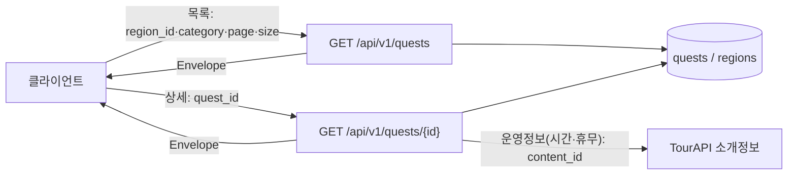

# [설명] 퀘스트 (Quest)

## 개요

퀘스트 도메인은 충북 11개 시·군의 관광지를 **퀘스트**로 제공한다. 각 퀘스트는 한 지역(`regions`)에 속하고, 카테고리 5종(`nature`·`food`·`history`·`activity`·`healing`) 중 하나로 분류되며, 한국관광공사 TourAPI의 `content_id`와 연결된다. 사용자는 지역·카테고리로 퀘스트를 탐색하고 상세(위치·운영정보·미션)를 조회한다.

본 범위는 **조회 중심**이다. 퀘스트 인증(완료 처리)·색칠은 별도 도메인이며, 이 도메인은 그들이 참조할 마스터 데이터를 제공한다.

## 동작 방식

**데이터 적재 (배치)** — TourAPI에서 시·군별 관광지를 받아 `quests`로 적재한다. `regions`는 충북 11개 시·군 마스터로 시드한다.

**조회 (런타임)**



- **목록**(QST-02/04): `region_id`·`category`로 필터, `page`/`size` offset 페이지네이션.
- **상세**(QST-03): 퀘스트 기본정보 + 운영정보(`content_id`로 TourAPI 소개정보 조회).
- 모든 응답은 공통 Envelope로 감싼다([api-design.md](../../conventions/api-design.md), 형식은 plan 의사결정 2에서 확정).

## 주요 구성 요소 / 위치

> 경로는 제안이며 `backend/` 기본 구조 확정 시 갱신한다(plan 리스크 참고).

| 구성 요소 | 역할 | 위치(예정) |
|-----------|------|------|
| `regions` 테이블/모델 | 충북 11개 시·군 마스터 | `backend/.../regions/` |
| `quests` 테이블/모델 | 지역별 퀘스트 | `backend/.../quests/` |
| 퀘스트 라우터 | `regions`·`quests` 조회 API | `backend/.../quests/router` |
| TourAPI 클라이언트 | 지역기반·소개정보·분류코드 호출 | `backend/.../integrations/tour_api` |

## 설정 / 사용법

| 메서드 | 경로 | 설명 | 쿼리 |
|--------|------|------|------|
| GET | `/api/v1/regions` | 충북 시·군 목록 | — |
| GET | `/api/v1/quests` | 퀘스트 목록 | `region_id`, `category`(5종), `page`, `size` |
| GET | `/api/v1/quests/{quest_id}` | 퀘스트 상세 + 운영정보 | — |

- 카테고리 값: `nature`(자연탐험)·`food`(미식)·`history`(역사문화)·`activity`(액티비티)·`healing`(힐링)
- TourAPI 키는 환경변수 + Secret Manager로 관리([external-apis.md](../../conventions/external-apis.md))

## 예시

```http
GET /api/v1/quests?region_id={청주시_id}&category=nature&page=1&size=20
```

```jsonc
// Envelope 형식은 plan 의사결정 2 확정 후 반영 (아래는 api-design.md 기준안)
{
  "code": "SUCCESS",
  "status": 200,
  "message": "요청이 성공했습니다.",
  "data": {
    "items": [
      { "id": "0190...", "title": "상당산성 둘레길", "category": "nature",
        "region_id": "0190...", "lat": 36.63, "lng": 127.50, "thumbnail_url": "..." }
    ],
    "page": 1, "size": 20, "total": 7
  }
}
```

## 관련 문서

- [plan.md](plan.md) · [implementation.md](implementation.md)
- [database.md](../../conventions/database.md) · [api-design.md](../../conventions/api-design.md) · [external-apis.md](../../conventions/external-apis.md) · [backend.md](../../conventions/backend.md)
