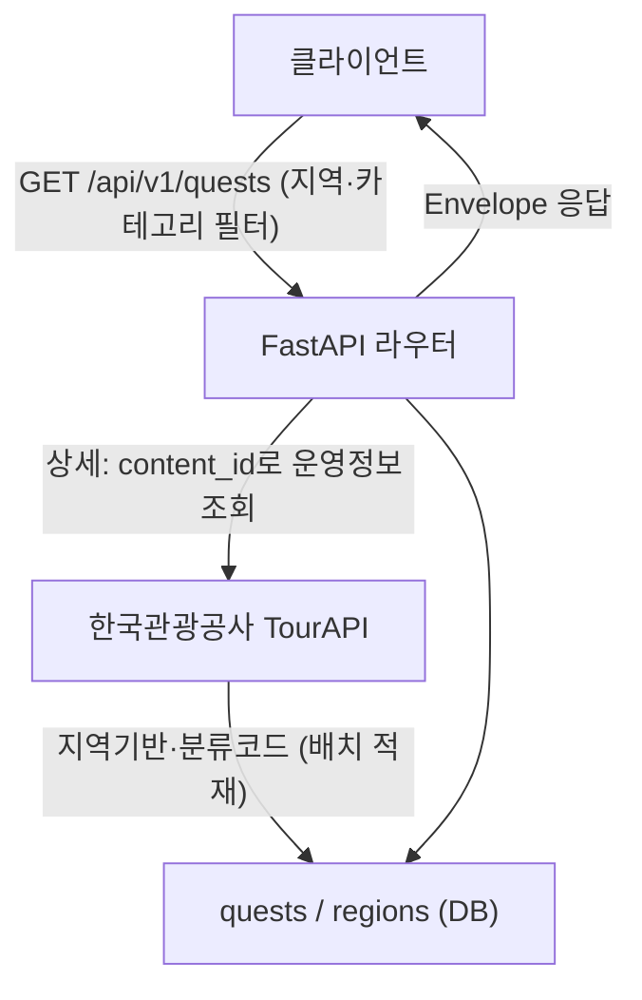

# [계획] 퀘스트 (Quest)

| 항목 | 내용 |
|------|------|
| 기능명 | 퀘스트 (Quest) — 충북 시·군 관광 퀘스트 |
| Spec 폴더 | `docs/specs/000-quest/` |
| 영역 | backend (테이블·API). 테이블 물리 설계는 Notion에서 관리 |
| 작성자 | 퀘스트 도메인 담당 |
| 작성일 | 2026-06-25 |
| 상태 | 계획 |

## 배경 / 목적

> Flutter 정적 220개 퀘스트와 서버 UUID의 stable key 계약 및 실제 클라이언트 연동은
> [040 서버 영속화](../040-domain-state-persistence/)에서 확장한다. 본 문서는 백엔드
> 퀘스트 조회 도메인의 최초 계획 기록이다.

ColorTrip(다채로울지도)은 충북 지역 관광을 게임화한 서비스다. **퀘스트 도메인**은 충북 11개 시·군의 관광지를 "퀘스트"로 제공하고, 사용자가 지역·카테고리별로 탐색·조회하게 한다. 퀘스트 인증(VRF)·지도 색칠(MAP)·추천(REC)이 모두 이 데이터를 기반으로 동작하므로, 퀘스트는 코어 도메인의 출발점이다.

기능 리스트의 **4. 퀘스트(QST-01~05)** 를 범위로 한다.

## 목표 (Goals)

| ID | 목표 |
|----|------|
| QST-01 | 충북 11개 시·군 퀘스트 데이터셋 구성 (`regions`·`quests`) |
| QST-02 | 퀘스트 목록 조회 (지역별/카테고리별, 페이지네이션) |
| QST-03 | 퀘스트 상세 조회 (위치·운영정보·미션 설명) |
| QST-04 | 카테고리 분류 (자연/미식/역사문화/액티비티/힐링 5종 태깅) |
| QST-05 | 미션 생성/보강 (관광지 데이터 + 재미요소: 퀴즈·지정구도 촬영 등) |

## 비목표 (Non-Goals)

- 퀘스트 **인증**(VRF: 진행상태·GPS·사진·완료 처리) — 별도 담당/별도 spec
- 지도 **색칠**(MAP), **추천**(REC), **DNA/설문**, **인증·회원/타임라인** — 별도 도메인
- **프론트엔드** 구현 — 본 spec은 백엔드(테이블·API)에 한정. 지역 색칠용 폴리곤/SVG 에셋은 프론트 관리([frontend.md](../../conventions/frontend.md))
- 테이블 물리 설계 문서 자체 — Notion에서 관리하고, 본 spec은 그 결정을 동기화·요약

## 요구사항

**기능**
- `regions` 마스터(충북 11개 시·군) 조회
- `quests` 목록 조회(지역·카테고리 필터, 페이지네이션) / 상세 조회(운영정보 포함)
- 한국관광공사 OpenAPI(TourAPI) 연동: 지역기반 관광정보(퀘스트 적재) · 소개정보(운영정보) · 분류코드(카테고리)

**비기능** (전부 [conventions](../../conventions/) 준수)
- 응답 Envelope·공통 에러코드([api-design.md](../../conventions/api-design.md))
- PK UUID v7 · snake_case · 공통 타임스탬프 · Soft Delete · KST 저장([database.md](../../conventions/database.md))
- async/await · pydantic-settings([backend.md](../../conventions/backend.md))
- API 키는 환경변수 + Secret Manager([external-apis.md](../../conventions/external-apis.md))

## 설계 개요 / 접근 방식

- **테이블**: `regions`(시·군 마스터, 11행) ─< `quests`(지역별 퀘스트). 상세는 [description.md](description.md).
- **API**: FastAPI 라우터 — `GET /api/v1/regions`, `GET /api/v1/quests`, `GET /api/v1/quests/{quest_id}`
- **OpenAPI 적재**: TourAPI에서 시·군별 관광지를 받아 `quests`로 적재(배치). 운영정보(시간·휴무·입장료)는 변동 데이터라 `content_id`로 조회.

## 의사결정 (함께 논의 · 근거 필수)

> 전 항목 합의 완료(2026-06-25 컨펌). 아래는 확정 내역이다.

| 결정할 항목 | 선택지 | 결정 / 근거 | 상태 |
|------|--------|------------|------|
| 1. PK 전략 | UUID v7 / BIGINT | **UUID v7** — [database.md](../../conventions/database.md)가 UUID v7로 확정(SOT). 클라이언트 노출 안전·분산생성. 앱에서 생성(`uuid-utils`) | 합의됨 |
| 2. 응답 Envelope | `code/status/message/data` / `code/message/data` | **`code/status/message/data` 유지** — [api-design.md](../../conventions/api-design.md) 그대로. HTTP status와 별개로 처리코드 명시. (api-design.md 수정 불필요) | 합의됨 |
| 3. Soft Delete 표현 | `deleted_at`만 / `is_deleted`+`deleted_at` | **`deleted_at` 단일** — [database.md](../../conventions/database.md) 규약. 조회는 `deleted_at IS NULL` | 합의됨 |
| 4. quests 적재 방식 | OpenAPI 배치 선적재 / 호출 시 캐싱 | **배치 선적재** — 11개 시·군 한정·퀘스트 수가 적어 사전 적재가 조회 성능·안정성↑, 쿼터 절약 | 합의됨 |
| 5. 운영정보(시간·휴무·입장료) | `quests`에 저장 / `content_id`로 조회 | **`content_id`로 조회** — 변동 데이터라 DB 중복 저장 시 신선도 문제. TourAPI 소개정보 사용 | 합의됨 |
| 6. 카테고리 표현 | 문자열 enum(5종) / 별도 테이블 | **문자열 enum** `nature/food/history/activity/healing` — 고정 5종이라 테이블은 과함. `VARCHAR(20)` + 앱 enum 검증 | 합의됨 |
| 7. mission_meta 구조 | JSONB / 정규화 | **JSONB** — 미션 타입별 부가데이터가 가변. 초기엔 JSONB 유연성 우선 | 합의됨 |

## 영향 범위

- `backend/` **신규 생성** — FastAPI 앱 기본 구조 + `quests`·`regions` 모듈 + TourAPI 클라이언트 (현재 레포에 backend 코드 없음)
- **테이블 설계(Notion)** — 본 spec의 결정과 동기화 (regions·quests)
- **OpenAPI 연동** — [external-apis.md](../../conventions/external-apis.md) 참조
- **문서** — 기능 안정화 후 루트 `README.md` `주요 기능과 위치`에 반영([AGENT_GUIDE 문서 동기화](../../AGENT_GUIDE.md#문서-동기화-필수))

## 작업 단계

- [ ] 테이블 확정(`regions`·`quests`) — Notion + 본 spec 동기화 (의사결정 1·3·6·7 반영)
- [ ] `backend/` FastAPI 기본 구조(앱·설정·DB 세션·공통 Envelope) — ※ 공통 기반(CMN/AUTH) 선행 여부 확인 필요
- [ ] `regions` 마스터 시드(충북 11개 시·군, `area_code`)
- [ ] TourAPI 클라이언트(지역기반 관광정보·소개정보·분류코드)
- [ ] `quests` 배치 적재
- [ ] `GET /api/v1/regions`
- [ ] `GET /api/v1/quests` (지역·카테고리 필터, page/size 페이지네이션)
- [ ] `GET /api/v1/quests/{quest_id}` (상세 + 운영정보)

## 리스크 / 미해결 질문

- **공통 기반 의존**: 퀘스트 API는 공통 Envelope·에러핸들러(CMN-01·02)·토큰 미들웨어(CMN-06)에 의존하는데, 이들은 M1 선행 항목이다. 퀘스트 조회 API의 인증 필요 여부(공개/보호)와 공통 기반 준비 상태를 확인해야 한다.
- **OpenAPI 키·쿼터**: TourAPI 키 발급·쿼터 상태([external-apis.md](../../conventions/external-apis.md)).
- **지역 코드**: 충북 11개 시·군의 `area_code`(sigunguCode) 확보 필요.
- **backend 디렉토리 구조**: FastAPI 레이어 구조(도메인별 모듈 등)가 아직 정해지지 않음 — 첫 도메인이라 구조도 함께 정해야 함.
