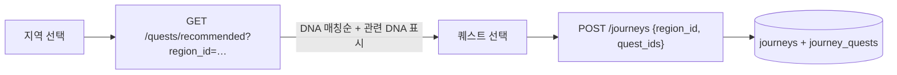
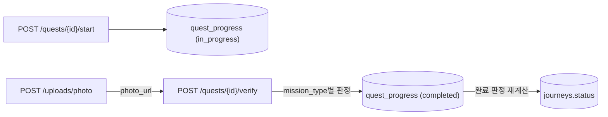
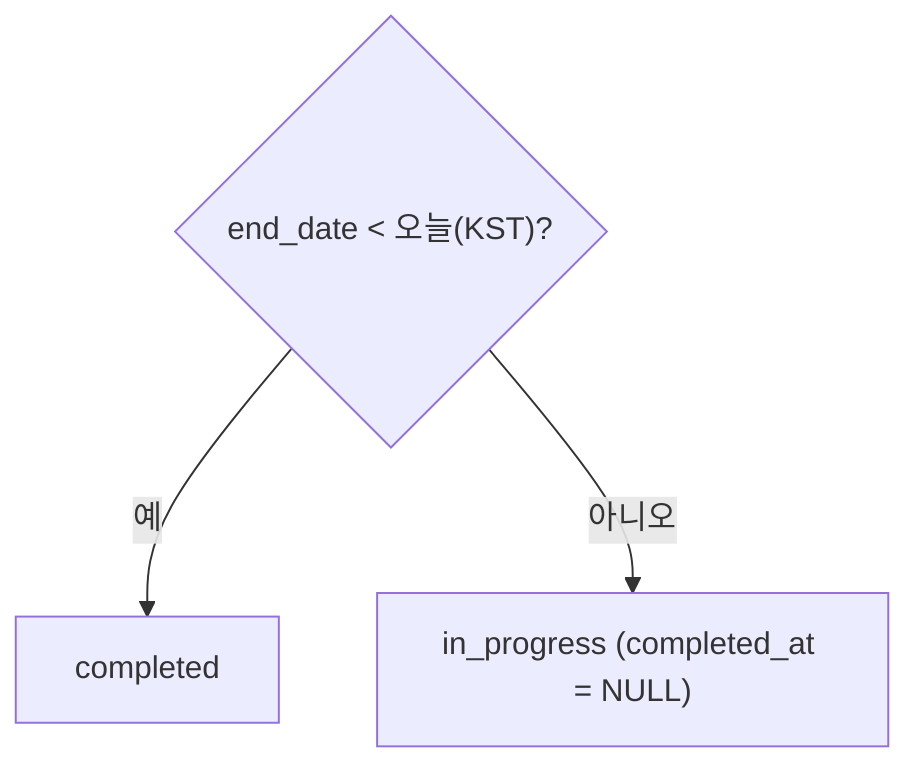

# [설명] 여정·퀘스트 인증 (Journey & Quest Verification)

## 개요

**여정(Journey)** 은 사용자가 한 지역(충북 시·군)을 여행하며 수행할 퀘스트 묶음이다.
사용자는 지도에서 지역을 고르고, 본인 **여행 DNA**(카테고리 5종)에 맞게 추천된 퀘스트 중에서
원하는 것을 골라 여정을 만든다. 여정 안에서 퀘스트를 관리(추가·제거)하고, 각 퀘스트를
방식별(GPS+사진 / 퀴즈)로 **인증**하면 완료 처리된다. 여정은 여행 종료일 23:59:59 KST까지
진행중이고, 종료일 다음날 00:00 KST부터 완료된다(아래 [여정 완료 판정](#여정-완료-판정)).

퀘스트 마스터 데이터(지역·카테고리·미션)는 [000-quest](../000-quest/)가, 사용자·토큰은
[005-auth-member](../005-auth-member/)가 제공한다. 완료 기록(`quest_progress`)은 지도 색칠(MAP)·
타임라인(SHR) 도메인이 소비할 원천 데이터다.

## 동작 방식

**여정 생성**



- 추천은 룰 기반: `users.dna`의 대표 카테고리와 같은 카테고리 퀘스트를 앞에 정렬한다.
  `category` 쿼리로 명시하면 사용자 DNA보다 우선하며, DNA가 없으면
  `?category=` 쿼리 파라미터를 대신 사용한다.
- 여정 생성 시 `quest_ids`는 모두 해당 `region_id` 소속이어야 한다(교차 지역 불가).
- 여행 시작일·종료일은 필수이며, 종료일이 시작일보다 빠르거나 이미 지난 기간은 생성할 수 없다.
- 같은 사용자의 삭제되지 않은 여정과 날짜 범위가 겹치면 생성·수정을 거부한다. 범위는 양 끝을 포함해
  `[start_date, end_date]`로 비교한다.

**퀘스트 인증 → 완료**



- `gps_photo`: 요청의 `lat`/`lng`가 퀘스트 좌표에서 `verify_radius`(m) 이내(하버사인 거리)이고,
  업로드한 사진이 비전 판정을 통과하면 성공(반경을 벗어나면 판정을 생략한다).
- `photo`: 업로드한 사진(`photo_url`)을 스토리지에서 읽어 비전 판정한다 — 판정 상세는 응답의
  `photo_verdict`(passed·confidence·reason·provider)로 함께 내려간다. 판정 계약의 SOT는
  [050-quest-verification](../050-quest-verification/)이다(KAN-73).
- `quiz`: 요청의 `answer`를 `mission_meta.quiz.answer`와 비교(공백·대소문자 정규화). OX/객관식 공용.
- 인증 성공 시 `status=completed`·`completed_at` 기록. 같은 퀘스트 재인증은 409(CONFLICT).
- 진행 레코드는 사용자×퀘스트당 1개(UNIQUE). `journey_id`는 어느 여정에서 수행했는지 추적(선택).

### 여정 완료 판정

`journeys.status`는 저장된 값이지만 **판정 규칙에서 파생**된다. 재계산(`recalculate_status`)은 퀘스트
인증·여정 퀘스트 변경 시점, 그리고 **여정 목록·상세 조회 시점**에 실행되고, 값이 실제로 바뀔 때만 저장한다.
조회 시점에도 재계산하는 이유는 "여행 기간이 지났다"는 조건이 시간 경과만으로 성립해 이벤트가 없기 때문이다
(스케줄러·배치는 도입하지 않는다 — plan 의사결정 8).



- 퀘스트 완료 수는 여정 완료 판정에 영향을 주지 않는다. 모든 퀘스트를 완료해도 종료일 당일까지는
  `in_progress`다.
- `end_date`가 없는 레거시 여정은 완료로 판정하지 않는다.
- 완료 조건이 깨지면(예: 종료일을 오늘 이후로 수정) `in_progress`로 되돌리고 `completed_at`을 비운다.
- 사용자가 직접 여행을 끝내는 완료 버튼·API는 이번 범위에서 만들지 않는다(plan 의사결정 9 — 보류).
- 여정 완료는 지도 채색과 **독립**이다 — 채색은 "완료 퀘스트가 1개 이상인 여행 수"로 집계한다([055-journey-map-coloring](../055-journey-map-coloring/)).

## 테이블

> 공통 컬럼(created_at/updated_at/deleted_at)·UUID v7 PK는 [database.md](../../conventions/database.md) 규약 — 표에서 생략.

**journeys — 여정**

| 컬럼 | 타입 | NULL | 키 | 기본값 | 설명 |
|------|------|------|-----|--------|------|
| user_id | UUID | N | FK→users | | 소유 사용자 |
| region_id | UUID | N | FK→regions | | 여정 지역(1개) |
| title | VARCHAR(100) | Y | | | 여정 이름(미입력 시 지역명 기반) |
| start_date | DATE | Y | | | 여행 시작일(생성 시 필수 입력, 레거시 NULL 가능) |
| end_date | DATE | Y | | | 여행 종료일(생성 시 필수 입력, start_date ≤ end_date·지난 기간·중복 기간 검증) |
| status | VARCHAR(20) | N | | 'in_progress' | in_progress / completed (판정 규칙에서 파생·저장) |
| completed_at | TIMESTAMP | Y | | | 완료 시각 |

인덱스: (user_id, status)

**journey_quests — 여정-퀘스트**

| 컬럼 | 타입 | NULL | 키 | 기본값 | 설명 |
|------|------|------|-----|--------|------|
| journey_id | UUID | N | FK→journeys | | 여정 |
| quest_id | UUID | N | FK→quests | | 퀘스트 |
| sort_order | INT | N | | 0 | 표시 순서 |

제약: UNIQUE(journey_id, quest_id)

**quest_progress — 퀘스트 진행/인증** (Notion 설계 + journey_id·quiz_answer 추가)

| 컬럼 | 타입 | NULL | 키 | 기본값 | 설명 |
|------|------|------|-----|--------|------|
| user_id | UUID | N | FK→users | | 사용자 |
| quest_id | UUID | N | FK→quests | | 퀘스트 |
| journey_id | UUID | Y | FK→journeys | | 수행한 여정(선택) |
| status | VARCHAR(20) | N | | 'in_progress' | in_progress / completed |
| verified_lat | DECIMAL(10,7) | Y | | | GPS 인증 위도 |
| verified_lng | DECIMAL(10,7) | Y | | | GPS 인증 경도 |
| photo_url | VARCHAR(500) | Y | | | 인증 사진 |
| quiz_answer | VARCHAR(200) | Y | | | 제출한 퀴즈 답안 |
| completed_at | TIMESTAMP | Y | | | 완료 시각 |

제약: UNIQUE(user_id, quest_id) · 인덱스: (user_id, status)

## 주요 구성 요소 / 위치

| 구성 요소 | 역할 | 위치 |
|-----------|------|------|
| Journey·JourneyQuest 모델 | 여정·여정-퀘스트 테이블 | `backend/app/journeys/models.py` |
| 여정 라우터/서비스 | 생성·목록·상세·퀘스트 관리 | `backend/app/journeys/router.py` · `service.py` |
| QuestProgress 모델 | 진행/인증 테이블 | `backend/app/quests/models.py` |
| 추천·진행·인증 API | recommended · start · verify · progress | `backend/app/quests/router.py` · `service.py` |
| 인증 판정 | GPS 거리·퀴즈 정답 룰 | `backend/app/quests/verification.py` |
| 사진 업로드 | POST /uploads/photo + 스토리지 추상화 | `backend/app/uploads/` |

## 설정 / 사용법

| 환경변수 | 기본값 | 설명 |
|----------|--------|------|
| `GCS_UPLOAD_BUCKET` | (빈 값) | 인증 사진 GCS 버킷명. **설정 시 GCS 사용(운영 기본)** |
| `UPLOAD_DIR` | `./uploads` | 버킷 미설정 시 로컬 저장 경로(개발·테스트) |

GCS 사용 시 애플리케이션 SA에 버킷 `roles/storage.objectAdmin`(쓰기)이 필요하고,
반환 URL(`https://storage.googleapis.com/{bucket}/{object}`)로 읽으려면 버킷 공개 읽기 또는 별도 서빙이 필요하다(IaC 후속).

모든 API는 보호 엔드포인트 — `Authorization: Bearer <accessToken>` 필요([005-auth-member](../005-auth-member/)).
엔드포인트 목록은 [plan.md](plan.md#api) 표 참고.

## 예시

```http
POST /api/v1/journeys
{ "region_id": "0190…", "quest_ids": ["0190…", "0190…"], "title": "단양 힐링 여행",
  "start_date": "2026-07-20", "end_date": "2026-07-22" }
```

```jsonc
// GET /api/v1/journeys/{id}
{
  "code": "SUCCESS", "status": 200, "message": "요청이 성공했습니다.",
  "data": {
    "id": "0190…", "region_id": "0190…", "title": "단양 힐링 여행",
    "status": "in_progress", "progress": { "completed": 1, "total": 3 },
    "quests": [
      { "quest_id": "0190…", "title": "도담삼봉", "category": "nature",
        "mission_type": "gps_photo", "progress_status": "completed" }
    ]
  }
}
```

```http
POST /api/v1/quests/{id}/verify
{ "journey_id": "0190…", "lat": 36.9852, "lng": 128.3645, "photo_url": "/uploads/2026/07/abc.jpg" }
```

## 관련 문서

- [plan.md](plan.md) · [implementation.md](implementation.md)
- [000-quest](../000-quest/description.md) — 퀘스트 마스터 · [005-auth-member](../005-auth-member/) — 사용자/토큰
- [api-design.md](../../conventions/api-design.md) · [database.md](../../conventions/database.md) · [external-apis.md](../../conventions/external-apis.md)
