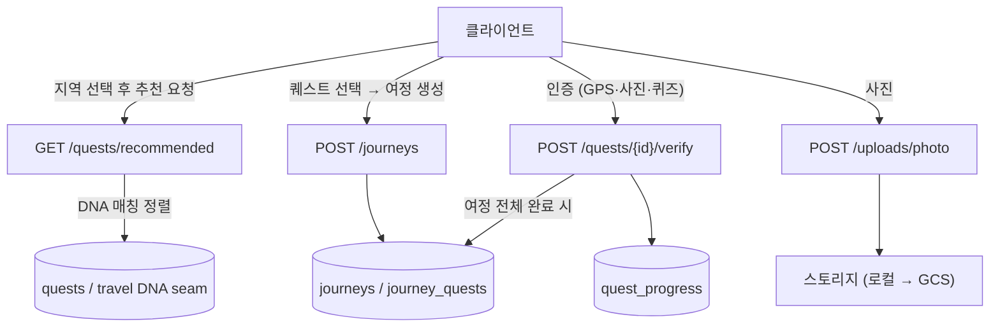

# [계획] 여정·퀘스트 인증 (Journey & Quest Verification)

| 항목 | 내용 |
|------|------|
| 기능명 | 여정·퀘스트 인증 — 여정 생성 · DNA 추천 · 퀘스트 인증(퀴즈/사진/GPS) |
| Spec 폴더 | `docs/specs/010-journey/` |
| 영역 | backend (테이블·API) |
| 작성자 | 퀘스트 도메인 담당 |
| 작성일 | 2026-07-05 |
| 상태 | 계획 |

## 배경 / 목적

퀘스트 조회 도메인([000-quest](../000-quest/))은 충북 11개 시·군의 관광지를 퀘스트로 제공한다.
사용자가 실제로 서비스를 사용하는 흐름은 **여정(Journey)** 단위로 이루어진다:

> 지도에서 지역 선택 → 여정 생성 시작 → 본인 여행 DNA에 맞는 퀘스트 추천 → 퀘스트 선택 → 여정 생성
> → 여정에서 퀘스트 관리 → 퀘스트 인증(퀴즈·사진·GPS) → 퀘스트 완료

이 spec은 그 흐름을 지탱하는 백엔드(여정 생성·관리, DNA 기반 추천, 퀘스트 진행·인증)를 다룬다.
API 명세서·테이블 설계(Notion)의 REC-01, VRF-01~04, UX-근처를 범위로 하되, Notion 문서는
**초안**이므로 필요한 수정(여정 테이블 신설 등)을 이 spec에서 결정하고 Notion에 역동기화한다.

## 목표 (Goals)

| ID | 목표 |
|----|------|
| JRN-01 | 여정 생성 (지역 1개 + 선택한 퀘스트 목록) / 내 여정 목록·상세 조회 |
| JRN-02 | 여정 내 퀘스트 관리 (추가·제거) 및 진행률 조회 |
| REC-01 | DNA 기반 퀘스트 추천 (지역 필터, 룰 기반 — 카테고리 매칭) |
| VRF-01 | 퀘스트 시작(진행 생성) / 내 진행·완료 목록 |
| VRF-02~04 | 퀘스트 인증 — GPS(반경 검증)·사진(업로드+룰 기반)·퀴즈(정답 검증) → 완료 처리 |

## 비목표 (Non-Goals)

- **인증·회원**(AUTH/USER) — [005-auth-member](../005-auth-member/) 담당. 본 spec은 그 `CurrentUser` 의존성을 사용만 한다.
- **DNA 설문/산출**(DNA-01·02) — 별도 도메인. 추천은 "사용자의 DNA 값을 읽는 seam"만 정의한다.
- **지도 색칠**(MAP, `map_progress`)·**타임라인**(SHR)·**행사**(EVT) — 별도 도메인. 단, 완료 이벤트가 이들의 입력이 되므로 확장 지점을 명시한다.
- 사진 인증의 **LLM 판정** — [external-apis.md](../../conventions/external-apis.md) 결정대로 초기엔 룰 기반. LLM 연동은 후속.
- 프론트엔드 구현.

## 요구사항

**기능**
- 여정 생성: `region_id` 1개 + `quest_ids[]`(해당 지역 퀘스트만 허용). 생성 후 퀘스트 추가/제거.
- 추천: 지역 필터 + 사용자 DNA(카테고리 5종) 매칭 순 정렬. 각 항목에 관련 DNA(=category) 노출.
- 진행: 퀘스트 시작 시 진행 레코드 생성(사용자×퀘스트 1개). 인증 성공 시 완료 처리·완료 시각 기록.
- 인증 방식은 퀘스트의 `mission_type`이 결정: `gps_photo`(GPS 반경 + 사진), `quiz`(정답 비교).
- 여정의 모든 퀘스트가 완료되면 여정도 완료 상태가 된다.

**비기능** (전부 [conventions](../../conventions/) 준수)
- 응답 Envelope·에러코드([api-design.md](../../conventions/api-design.md)), Offset 페이지네이션
- PK UUID v7 · snake_case · 공통 타임스탬프 · Soft Delete · KST([database.md](../../conventions/database.md))
- 보호 API — Access Token(JWT) 필요([auth-security.md](../../conventions/auth-security.md))
- 사진 인증·추천은 룰 기반으로 시작([external-apis.md](../../conventions/external-apis.md))

## 설계 개요 / 접근 방식

### 테이블 (신규 3개)

> 물리 설계 상세는 [description.md](description.md). Notion 테이블 설계에 없는 `journeys`·`journey_quests`가 신설되고
> `quest_progress`에 `journey_id`가 추가된다 → **Notion 역동기화 필요** (아래 의사결정 5).

- `journeys` — 여정. `user_id`(FK→users) · `region_id`(FK→regions) · `title` · `status`(in_progress/completed) · `completed_at`
- `journey_quests` — 여정에 담은 퀘스트. `journey_id`·`quest_id`·`sort_order`, UNIQUE(journey_id, quest_id)
- `quest_progress` — 퀘스트 진행/인증(Notion 설계 기반). `user_id`·`quest_id`·`journey_id`(nullable)·`status`·`verified_lat/lng`·`photo_url`·`quiz_answer`·`completed_at`, UNIQUE(user_id, quest_id)

### API

| 기능 | Method | Path | 인증 | 설명 |
|------|--------|------|------|------|
| JRN-01 | POST | `/journeys` | Y | 여정 생성 (region_id + quest_ids[]) |
| JRN-01 | GET | `/journeys` | Y | 내 여정 목록 (status 필터, page/size) |
| JRN-01 | GET | `/journeys/{id}` | Y | 여정 상세 (퀘스트별 진행상태 + 진행률) |
| JRN-02 | POST | `/journeys/{id}/quests` | Y | 여정에 퀘스트 추가 |
| JRN-02 | DELETE | `/journeys/{id}/quests/{quest_id}` | Y | 여정에서 퀘스트 제거 |
| REC-01 | GET | `/quests/recommended` | Y | DNA 기반 추천 (region_id 필터) |
| VRF-01 | POST | `/quests/{id}/start` | Y | 퀘스트 시작 (journey_id 선택 전달) |
| VRF-02~04 | POST | `/quests/{id}/verify` | Y | 인증 (mission_type별 payload) → 완료 |
| VRF-03 | POST | `/uploads/photo` | Y | 인증 사진 업로드 → photo_url 반환 |
| VRF-01 | GET | `/users/me/progress` | Y | 내 진행/완료 목록 |

### 인증(verify) 판정 규칙 (룰 기반 MVP)

- `gps_photo`: `verify_radius`(m, 기본 200) 내 GPS 좌표(하버사인 거리) **and** `photo_url` 존재 → 성공.
  `mission_meta.judgement_prompt`(LLM 판정 프롬프트)는 저장만 하고 판정은 후속(비목표).
- `quiz`: 제출 답안 == `mission_meta.quiz.answer` (대소문자·공백 정규화) → 성공. OX·객관식 공용.

## 의사결정 (함께 논의 · 근거 필수)

| 결정할 항목 | 선택지 | 제안 / 근거 | 상태 |
|------|--------|------------|------|
| 1. 인증·회원 의존 | A) PR #13(feat/005-auth-member) 위에 스택 / B) dev 기준 + 임시 인증 스텁 | **A 제안** — users FK·`CurrentUser`(JWT)가 필요한데 dev에는 없다. B는 버릴 코드(헤더 스텁)와 FK 없는 스키마를 만들고 뒤에 마이그레이션을 또 요구한다. A는 #13 머지 후 PR diff가 본 작업만 남는다 | 논의 중 |
| 2. 진행 모델 | A) `quest_progress` 글로벌(user×quest 유니크) + `journey_quests` 연결 / B) 여정 안에만 진행 저장 | **A 제안** — Notion 설계(quest_progress·UNIQUE(user_id, quest_id)) 유지. 지도 색칠(MAP)·타임라인이 여정과 무관하게 "사용자가 이 퀘스트를 완료했는가"를 소비하므로 진행은 사용자 단위가 자연스럽다. 여정 진행률은 join으로 파생. `journey_id`(nullable)로 어느 여정에서 완료했는지 추적 | 논의 중 |
| 3. 사진 저장소 | A) 로컬 디스크(볼륨) + 정적 서빙, 추상화로 GCS 후속 / B) 처음부터 GCS | **A 제안** — 현재 배포가 GCE 단일 인스턴스 + docker-compose라 볼륨으로 충분. GCS는 버킷·권한(IaC) 작업이 선행돼야 하므로 스토리지 인터페이스만 분리해 후속 전환 비용을 낮춤 | 논의 중 |
| 4. 추천의 DNA 소스 | A) DNA 도메인 seam(미구현 시 category 파라미터 fallback) / B) DNA 도메인 선행 대기 | **A 제안** — DNA(설문) 도메인은 미착수. 추천 로직(카테고리 매칭·정렬)은 지금 완성하고, DNA 조회만 함수 하나로 격리(`get_user_primary_category`). DNA 도메인이 생기면 그 함수만 교체. 그 전까지는 `?category=` 파라미터로 동작 | 논의 중 |
| 5. Notion 테이블과의 차이 | A) 본 spec대로 수정·신설하고 Notion 역동기화 / B) Notion 초안 그대로 | **A 제안** — 사용자 지시: Notion은 미완성 초안, 필요한 수정은 반드시 한다. 차이: ① `journeys`·`journey_quests` 신설(여정 플로우에 필수) ② `quest_progress.journey_id`·`quiz_answer` 추가 ③ quests의 `content_id`·`content_type_id`·`verify_radius`는 **유지**(토글 초안엔 없지만 TourAPI 운영정보 조회·재적재 dedup·GPS 반경에 필요 — 각주도 content_id 조회를 전제) | 논의 중 |
| 6. 여정 완료 처리 | A) 마지막 퀘스트 인증 시 자동 완료 / B) 명시적 완료 API | **A 제안** — "모든 퀘스트 완료 = 여정 완료"가 도메인 정의라 별도 사용자 액션이 불필요(오버엔지니어링 방지). 퀘스트를 나중에 추가하면 in_progress로 되돌림 | 논의 중 |
| 7. 퀴즈 정답 위치 | A) `mission_meta.quiz`(JSONB) / B) 별도 quiz 테이블 | **A 제안** — 000-quest 의사결정 7(mission_meta JSONB)과 일관. 퀘스트당 퀴즈 1개 수준이라 테이블은 과함 | 논의 중 |

## 영향 범위

- `backend/app/journeys/` **신규** — models·schemas·repository·service·router
- `backend/app/quests/` — QuestProgress 모델, 추천·시작·인증 라우터/서비스 추가
- `backend/app/uploads/` **신규** — 사진 업로드 라우터·스토리지 추상화
- `backend/alembic/` — journeys·journey_quests·quest_progress 마이그레이션 (005-auth-member의 users 마이그레이션에 체인)
- `backend/app/core/` — 에러코드 추가(CONFLICT 등), 설정(upload 경로)
- **문서** — 루트 [README.md](../../../README.md) `주요 기능과 위치` 표, 본 spec 3종, **Notion**(테이블 설계·API 명세서) 역동기화

## 작업 단계

- [ ] 테이블·모델·마이그레이션 — journeys · journey_quests · quest_progress
- [ ] 여정 API — 생성/목록/상세/퀘스트 추가·제거 (JRN-01·02)
- [ ] 추천 API — GET /quests/recommended (REC-01, DNA seam)
- [ ] 진행·인증 API — start / verify(GPS·사진·퀴즈) / users/me/progress (VRF-01~04)
- [ ] 사진 업로드 — POST /uploads/photo + 스토리지 추상화 (VRF-03)
- [ ] 테스트·검증 (ruff·pyright·API 동작) 및 문서 동기화 (README·implementation.md·Notion)

## 리스크 / 미해결 질문

- **PR #13 변동**: 스택 기반이라 #13이 리뷰로 크게 바뀌면 리베이스 필요. 인터페이스(`CurrentUser`)만 사용해 결합을 최소화한다.
- **GET /quests/nearby(UX-근처)**: 근처 퀘스트 조회는 추천과 별개 UX 항목 — 이번 범위에 넣을지 미정(기본 제외).
- **사진 검증 신뢰도**: 룰 기반(존재 확인)이라 실제 방문 검증력은 낮음. LLM 판정(후속)의 프롬프트는 `mission_meta.judgement_prompt`로 데이터만 준비.
- **Notion 역동기화**: 개인 워크스페이스 페이지라 에이전트 자동 수정이 불가할 수 있음 — 구현 완료 후 차이 목록을 정리해 수동 반영 요청.
