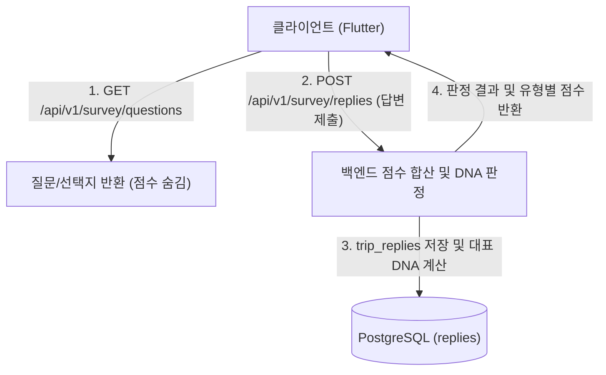

# [설명] 여행 DNA (Travel DNA)

## 개요
여행 DNA 도메인은 사용자가 가입 후 진행하는 초기 성향 진단 설문을 담당합니다. 
질문지 목록을 조회하고 사용자의 답변을 수집하여 **자연탐험, 미식, 역사문화, 액티비티, 힐링** 중 어떤 카테고리가 가장 잘 맞는지 가중치 합산을 통해 대표 DNA 유형을 판정해줍니다.

## 동작 방식



1. **질문 조회**: 사용자가 설문 화면에 진입하면 `GET /api/v1/survey/questions`를 통해 질문과 선택지 텍스트를 불러옵니다. 이 때 선택지가 가진 가중치 점수는 클라이언트에 노출하지 않습니다.
2. **답변 제출**: 사용자가 설문을 마친 후 답변을 전송하면, 서버는 데이터베이스에 각 선택지별 점수(`score_value` JSONB)를 확인하여 합계를 구합니다.
3. **결과 산출**: 합산 점수가 가장 높은 카테고리가 해당 사용자의 최종 `travel_dna`로 결정됩니다.

## 주요 구성 요소 / 위치

| 구성 요소 | 역할 | 위치 |
|-----------|------|------|
| `trip_questions` 테이블 | 설문 질문 마스터 | `backend/app/survey/models.py` |
| `trip_question_options` 테이블 | 질문별 선택지 및 성향 점수 매핑 | `backend/app/survey/models.py` |
| `trip_replies` 테이블 | 사용자가 제출한 설문 답변 기록 | `backend/app/survey/models.py` |
| 설문 도메인 API 라우터 | 설문 및 DNA 조회/제출 API | `backend/app/survey/router.py` |
| 데이터 시드 스크립트 | 초기 설문 문항 및 카테고리 데이터 적재 | `backend/app/core/seeds/survey.py` |

## 설정 / 사용법

### 카테고리 식별값
- `NATURE` (자연탐험)
- `FOOD` (미식)
- `HISTORY` (역사문화)
- `ACTIVITY` (액티비티)
- `HEALING` (힐링)

### 선택지 가중치 (`score_value`) 예시
각 선택지는 JSON 형식으로 여러 카테고리의 가중치 점수를 복합적으로 가질 수 있습니다.
```json
{
  "nature": 3,
  "eat": 0,
  "history": 1,
  "activity": 2,
  "healing": 0
}
```

## 관련 문서
- [plan.md](plan.md)
- [implementation.md](implementation.md)
- [database.md](../../conventions/database.md)
- [api-design.md](../../conventions/api-design.md)
