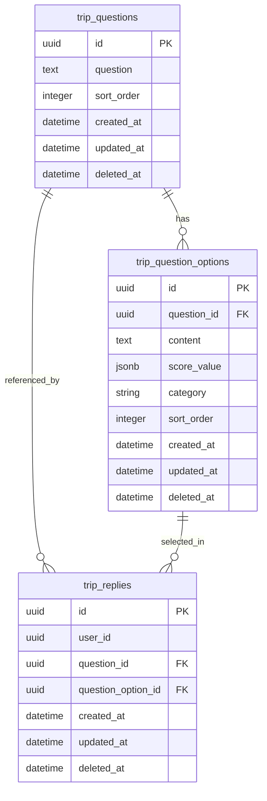

# [계획] 여행 DNA (Travel DNA)

| 항목 | 내용 |
|------|------|
| 기능명 | 여행 DNA (Travel DNA) — 성향 설문 및 판정 |
| Spec 폴더 | `docs/specs/010-travel-dna/` |
| 영역 | backend (테이블 설계 · API 구현) |
| 작성자 | AI 에이전트 (Antigravity) |
| 작성일 | 2026-07-09 |
| 상태 | 진행중 |

## 배경 / 목적
- ColorTrip 앱 진입 시 사용자의 여행 DNA를 진단(자연탐험, 미식, 역사문화, 액티비티, 힐링 5대 성향)하여 개인화된 퀘스트 추천과 지도를 수집형으로 색칠하는 기반 데이터를 마련하고자 합니다.
- 이를 위해 질문지 및 선택지 데이터 구조를 정의하고, 답변 제출 시 가중치를 합산해 최종 성향을 도출하는 도메인 테이블 및 API를 신설합니다.

## 목표 (Goals)
- [x] 여행 DNA 설문 데이터를 위한 테이블 3종 생성 (`trip_questions`, `trip_question_options`, `trip_replies`) 및 Alembic 마이그레이션 적용.
- [x] 질문지 및 선택지 데이터를 편리하게 초기화할 수 있는 데이터 시드(Seed) 스크립트 작성 (가중치 키 `"food"`로 일치화).
- [ ] 3대 핵심 API 연동 및 공통 Envelope 응답 처리:
  - [x] `GET /api/v1/trip_dna/questions` (질문/선택지 리스트 조회)
  - [x] `POST /api/v1/trip_dna/replies` (답변 제출 및 DNA 성향 진단 완료)
  - [ ] `GET /api/v1/users/me/travel-dna` (내 DNA 결과 조회 - 예정)

## 비목표 (Non-Goals)
- 프론트엔드(Flutter) UI 화면 구현 (본 작업은 백엔드 설계 및 API 구현에 한정).
- 카카오 로그인 및 회원관리(`users` 테이블) 연동. 본 작업은 `user_id`를 임시 Mocking 또는 JWT 토큰 파싱 스텁(Stub) 처리하고, 차후 User 도메인이 완성되는 시점에 FK 연동을 진행합니다.

## 요구사항
- **데이터 모델링**:
  - 질문지(`trip_questions`)와 선택지(`trip_question_options`)의 1:N 분리 관계 구현.
  - 선택지별 성향 가중치 점수(`score_value` JSONB) 및 카테고리(`category` VARCHAR) 저장.
  - 사용자별 답변을 기록하는 `trip_replies` 테이블 구성.
- **비즈니스 로직**:
  - 설문 답변 제출(`POST`) 시 카테고리별 `score_value` 점수를 모두 합산하여 가장 높은 카테고리를 대표 DNA 유형으로 결정.
- **공통 규약**:
  - 모든 응답은 `code/status/message/data` 형태의 Envelope를 준수할 것.
  - 모든 테이블은 UUID v7 PK (`UUIDPKMixin`) 및 시간대(`TimestampMixin`) 믹스인을 상속할 것.

## 설계 개요 / 접근 방식

### 데이터베이스 ERD 구조 (Mermaid)

### API 라우팅 경로
- `GET /api/v1/trip_dna/questions` (질문 및 선택지 조회)
- `POST /api/v1/trip_dna/replies` (답변 제출 및 진단)
- `GET /api/v1/users/me/travel-dna` (내 결과 조회)

## 의사결정 (함께 논의 · 근거 필수)

| 결정할 항목 | 선택지 | 제안 / 근거 | 상태 |
|------|--------|------------|------|
| **1. user_id 매핑 전략** | 1) 임시 UUID (FK 없음) 2) users 테이블 생성 및 FK 적용 | **2) users 테이블 생성 및 FK 적용** 마이그레이션 `a4f2c8d1e9b0`에 따라 `users` 테이블과의 관계 및 FK 제약 조건을 정상 바인딩하고 `User.dna` 컬럼을 갱신하도록 처리합니다. | 합의됨 |
| **2. 설문 중복 제출 처리** | 1) 이력 누적 2) Soft Delete 후 신규 저장 | **2) Soft Delete 후 신규 저장** 사용자 재진단 시 중복 적재를 방지하기 위해 기존 해당 사용자의 활성 답변들을 Soft Delete(deleted_at 갱신)한 뒤 신규 답변을 벌크 삽입합니다. | 합의됨 |

## 영향 범위
- `backend/app/` 하위에 신규 도메인 패키지 `trip_dna/` 추가 (`models.py`, `schemas.py`, `repository.py`, `service.py`, `router.py`).
- `backend/alembic/` 마이그레이션 파일 `a4f2c8d1e9b0` 내 스키마 구성 완료.
- `README.md` 내 주요 기능 테이블 및 패키지 구조 업데이트.

## 작업 단계
- [x] 1) `docs/specs/010-travel-dna/` 설계 문서 작성 및 컨펌
- [x] 2) Alembic을 통한 데이터베이스 마이그레이션 및 ORM 모델 구성 (`trip_questions`, `trip_question_options`, `trip_replies`, `User.dna`)
- [x] 3) 시드(Seed) 스크립트 구현 및 가중치 키 `food` 변경/적재
- [x] 4) Service 및 Repository 레이어 구현 (합산 및 판정 로직 포함)
- [x] 5) Router 레이어 및 2대 API 구현 (questions, replies)
- [x] 6) 정상/예외 시나리오 통합 테스트 및 검증 완료

## 리스크 / 미해결 질문
- 사용자의 대표 DNA 성향 결과를 `User` 테이블에 직접 캐싱하기로 결정했으므로, 차후 User 도메인이 추가될 때 마이그레이션으로 `users.travel_dna` 컬럼을 뚫고 연동해 주어야 합니다. 현 단계에서는 답변 제출 시 계산된 결과를 리턴해주는 로직에 집중합니다.
