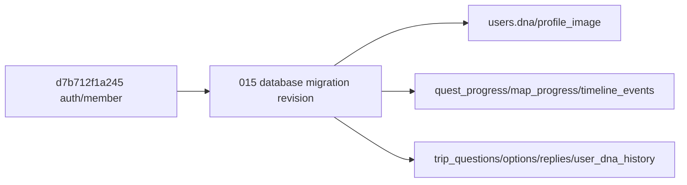

# [설명] PR #15 Database.md Alembic 마이그레이션

## 개요

이 스펙은 PR #15의 `database.md`에 담긴 ColorTrip 핵심 DB 모델을 현재 백엔드의 Alembic/ORM 구조로 이관하는 작업을 설명한다. 대상은 여행 DNA 설문, 퀘스트 진행/인증, 지역 지도 진행, 타임라인 기록을 위한 데이터 기반이다.

이번 범위는 DB 기반 준비에 한정된다. 새 테이블을 사용하는 API는 구현하지 않으며, 필요한 API 작업은 `api-followups.md`에 분리해 GitHub Issue로 연결한다.

## 동작 방식

마이그레이션은 `backend/alembic`의 기존 revision 체인 뒤에 새 revision을 추가한다. `upgrade head`는 기존 `regions`, `quests`, `users`, `refresh_tokens`를 보존하면서 필요한 컬럼과 신규 테이블을 생성하고, `downgrade d7b712f1a245`는 이번 revision에서 추가한 구조만 되돌린다.



신규 테이블은 모두 UUID v7 PK와 `created_at`, `updated_at`, `deleted_at` 감사 컬럼을 사용한다. 앱 코드에서 직접 생성되는 row는 SQLAlchemy `UUIDPKMixin`과 `TimestampMixin` 기본값을 따른다.

## 주요 구성 요소 / 위치

| 구성 요소 | 역할 | 위치 |
|-----------|------|------|
| `DnaType` | 여행 DNA 5종 enum | `backend/app/core/enums.py` |
| `users.dna`, `users.profile_image` | 사용자 현재 DNA와 프로필 이미지 | `backend/app/auth/models.py` |
| `quest_progress` | 사용자별 퀘스트 시작/완료/인증 기록 | `backend/app/quests/models.py` |
| `map_progress` | 사용자별 지역 진행 집계 | `backend/app/progress/models.py` |
| `timeline_events` | 사용자 활동 타임라인 이벤트 | `backend/app/timeline/models.py` |
| `trip_questions` | 여행 성향 설문 질문 | `backend/app/trip_dna/models.py` |
| `trip_question_options` | 설문 선택지와 점수 JSON | `backend/app/trip_dna/models.py` |
| `trip_replies` | 사용자 설문 응답 | `backend/app/trip_dna/models.py` |
| `user_dna_history` | 사용자 DNA 산출 이력 | `backend/app/trip_dna/models.py` |
| Alembic revision | DB 스키마 upgrade/downgrade | `backend/alembic/versions/` |
| API 후속 기록 | migration 이후 구현할 API 후보 | `docs/specs/015-database-migration/api-followups.md` |

## 설정 / 사용법

마이그레이션 검증은 백엔드 디렉터리에서 수행한다.

```bash
cd backend
uv run alembic heads
uv run alembic upgrade head
uv run alembic downgrade d7b712f1a245
uv run alembic upgrade head
uv run pytest
```

로컬 검증은 테스트 DB(`colortrip_test`)를 사용해야 한다. `backend/tests/conftest.py`는 테스트 시작 시 Alembic `upgrade head`로 테스트 DB를 재구성한다.

## 예시

`quest_progress`는 사용자가 퀘스트를 시작하거나 완료할 때 단일 row로 유지된다.

```text
users.id + quests.id
  -> quest_progress(user_id, quest_id) unique
  -> completed 상태가 되면 verified_lat/lng, photo_url, completed_at 기록
  -> 후속 API에서 map_progress와 timeline_events 갱신
```

## 관련 문서

- [plan.md](plan.md) · [implementation.md](implementation.md) · [api-followups.md](api-followups.md)
- PR #15 기준 문서: `origin/feature/KAN-20:docs/template/specs/database.md`
  - 위 값은 PR #15의 원격 브랜치 출처이며, 이번 작업의 Jira 키는 `KAN-24`이다.
- [database.md](../../conventions/database.md) · [backend.md](../../conventions/backend.md) · [api-design.md](../../conventions/api-design.md)
