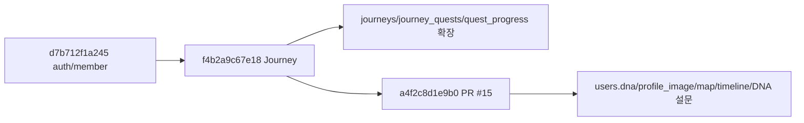
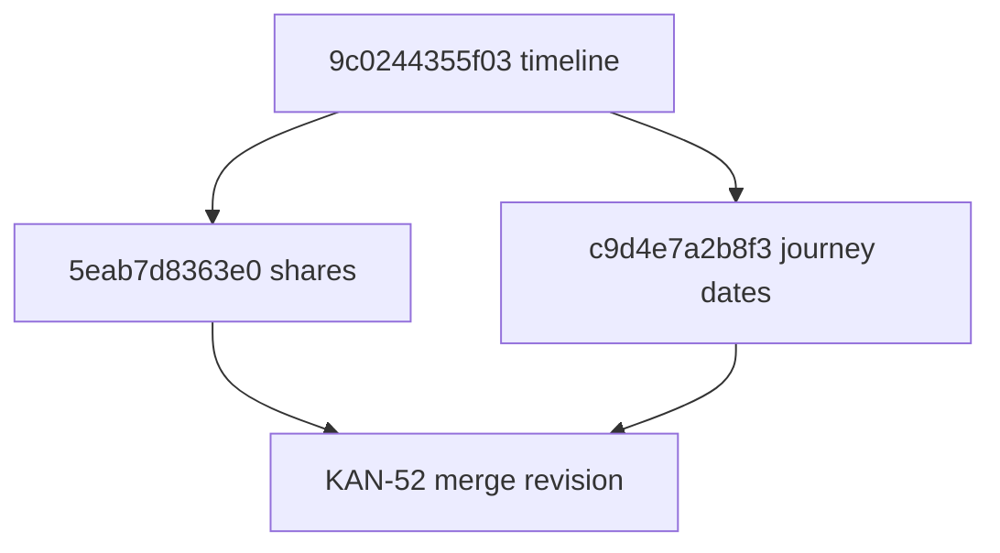

# [설명] PR #15 Database.md Alembic 마이그레이션

## 개요

이 스펙은 PR #15의 `database.md`에 담긴 ColorTrip 핵심 DB 모델과 PR #17의 Journey 스키마를 현재 백엔드의 Alembic/ORM 구조에 맞춰 설명한다. 대상은 여정, 퀘스트 진행/인증, 여행 DNA 설문, 지역 지도 진행, 타임라인 기록을 위한 데이터 기반이다.

이번 정합화 PR은 DB 기준 문서와 migration 검증에 한정된다. PR #17에서 이미 구현된 Journey API는 변경하지 않으며, 남은 API 작업은 `api-followups.md`에 분리해 추적한다.

## 동작 방식

마이그레이션은 `d7b712f1a245` 뒤에 Journey revision `f4b2a9c67e18`을 적용하고, 그 위에 PR #15 revision `a4f2c8d1e9b0`을 적용하는 단일 체인이다. `upgrade head`는 기존 테이블을 보존하면서 Journey 및 PR #15 모델을 생성하고, `downgrade d7b712f1a245`는 두 revision에서 추가한 구조만 되돌린다.



신규 테이블은 모두 UUID v7 PK와 `created_at`, `updated_at`, `deleted_at` 감사 컬럼을 사용한다. 앱 코드에서 직접 생성되는 row는 SQLAlchemy `UUIDPKMixin`과 `TimestampMixin` 기본값을 따른다.

## 주요 구성 요소 / 위치

| 구성 요소 | 역할 | 위치 |
|-----------|------|------|
| `DnaType` | 여행 DNA 5종 enum | `backend/app/core/enums.py` |
| `users.dna`, `users.profile_image` | 사용자 현재 DNA와 프로필 이미지 | `backend/app/auth/models.py` |
| `journeys`, `journey_quests` | 여정과 여정별 퀘스트 묶음 | `backend/app/journeys/models.py` |
| `quest_progress` | 사용자별 퀘스트 시작/완료/인증 기록 | `backend/app/quests/models.py` |
| `map_progress` | 사용자별 지역 진행 집계 | `backend/app/progress/models.py` |
| `timeline_events` | 사용자 활동 타임라인 이벤트 | `backend/app/timeline/models.py` |
| `trip_questions` | 여행 성향 설문 질문 | `backend/app/trip_dna/models.py` |
| `trip_question_options` | 설문 선택지와 점수 JSON | `backend/app/trip_dna/models.py` |
| `trip_replies` | 사용자 설문 응답 | `backend/app/trip_dna/models.py` |
| `user_dna_history` | 사용자 DNA 산출 이력 | `backend/app/trip_dna/models.py` |
| `f4b2a9c67e18` | Journey·quest_progress migration | `backend/alembic/versions/f4b2a9c67e18_add_journey_and_quest_progress_tables.py` |
| `a4f2c8d1e9b0` | PR #15 나머지 DB 모델 migration | `backend/alembic/versions/a4f2c8d1e9b0_add_pr15_database_spec_tables.py` |
| API 후속 기록 | migration 이후 구현할 API 후보 | `docs/specs/015-database-migration/api-followups.md` |

## 설정 / 사용법

마이그레이션 검증은 백엔드 디렉터리에서 수행한다.

```bash
cd backend
uv run alembic heads
uv run alembic upgrade head
uv run alembic downgrade d7b712f1a245
uv run alembic upgrade head
uv run pytest
```

로컬 검증은 테스트 DB(`colortrip_test`)를 사용해야 한다. `backend/tests/conftest.py`는 테스트 시작 시 Alembic `upgrade head`로 테스트 DB를 재구성한다.

## 복수 head 정합화

`9c0244355f03` 이후 공유 API와 여행 기간 변경 migration이 병렬로 추가되어
`5eab7d8363e0`, `c9d4e7a2b8f3` 두 head가 생겼다. KAN-52는 기존 revision을
수정하지 않고 두 revision을 부모로 갖는 빈 merge revision을 추가한다.



merge revision의 `upgrade()`와 `downgrade()`는 DDL을 실행하지 않는다. 이 revision은
두 migration 분기가 모두 적용됐음을 Alembic version graph에 기록하고, 이후 migration이
따를 단일 head를 제공한다.

회귀 테스트는 DB에 연결하지 않고 Alembic `ScriptDirectory`에서 head 개수를 읽어
정확히 하나인지 확인한다. 구현 검증에서는 PostgreSQL 테스트 DB를 공통 부모까지
내린 뒤 각 sibling만 적용한 상태와 두 sibling을 모두 적용한 상태를 각각 구성하고,
모든 경우 `upgrade head`가 같은 merge revision으로 수렴하는지 확인한다.

현재 dev 배포 스크립트는 migration을 자동 실행하지 않는다. merge revision이 포함된
이미지가 배포되더라도 dev Cloud SQL 반영에는 별도의 `alembic upgrade head` 실행이 필요하다.
배포 migration 자동화는 KAN-52 범위에 포함하지 않는다.

## 예시

`quest_progress`는 사용자가 퀘스트를 시작하거나 완료할 때 단일 row로 유지되며, 수행 여정은 선택적으로 연결한다.

```text
users.id + quests.id
  -> quest_progress(user_id, quest_id) unique
  -> journey_id (nullable)로 journeys.id 연결
  -> quiz 인증이면 quiz_answer 기록
  -> completed 상태가 되면 verified_lat/lng, photo_url, completed_at 기록
  -> 후속 API에서 map_progress와 timeline_events 갱신
```

## 관련 문서

- [plan.md](plan.md) · [implementation.md](implementation.md) · [api-followups.md](api-followups.md)
- PR #15 기준 문서: `origin/feature/KAN-20:docs/template/specs/database.md`
  - 위 값은 PR #15의 원격 브랜치 출처이며, 이번 작업의 Jira 키는 `KAN-24`이다.
- PR #17 구현: `docs/specs/010-journey/` · Alembic `f4b2a9c67e18`
- [database.md](../../conventions/database.md) · [backend.md](../../conventions/backend.md) · [api-design.md](../../conventions/api-design.md)
