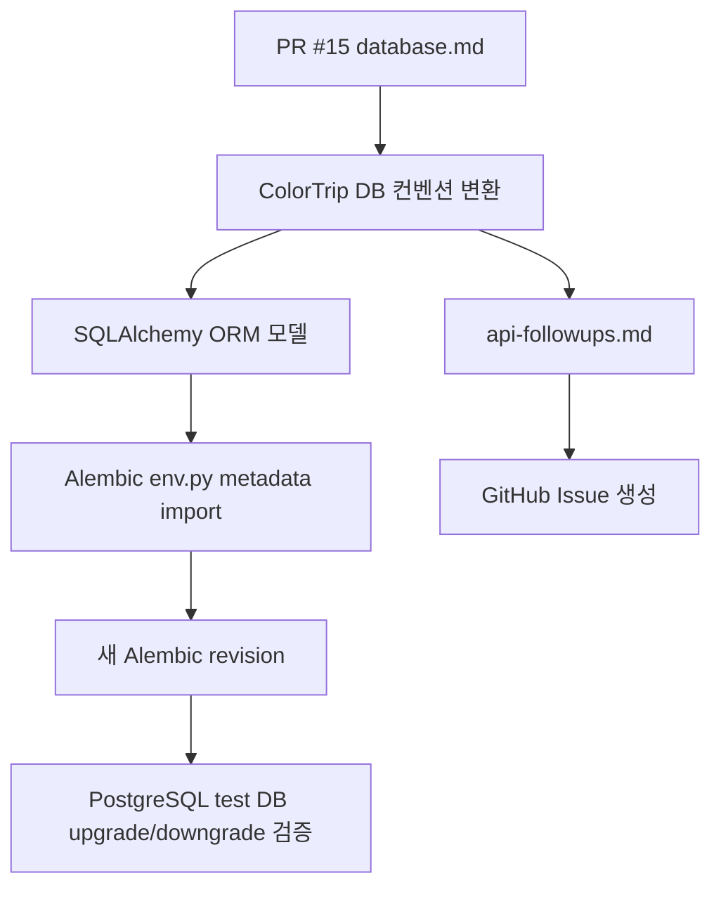

# [계획] PR #15 Database.md Alembic 마이그레이션

| 항목 | 내용 |
|------|------|
| 기능명 | PR #15 Database.md Alembic 마이그레이션 |
| Spec 폴더 | `docs/specs/015-database-migration/` |
| 영역 | backend |
| 작성자 | Database Migration 담당 |
| 작성일 | 2026-07-08 |
| 상태 | 구현 완료 / PR 준비 중 |

## 배경 / 목적

PR #15의 `docs/template/specs/database.md`에는 여행 DNA, 퀘스트 진행, 지도 진행, 타임라인까지 이어지는 ColorTrip 핵심 데이터 모델이 정리되어 있다. 현재 `dev`에는 `regions`, `quests`, `users`, `refresh_tokens`까지만 Alembic으로 반영되어 있으므로, PR #15의 DB 범위를 현재 백엔드 규약에 맞춰 안정적으로 반영한다.

이번 작업의 우선순위는 **API 동작 변경 없이 DB/ORM/Alembic 기반을 준비하는 것**이다. PR #15의 literal DDL은 현재 저장소 규약과 일부 다르므로 그대로 적용하지 않고, UUID v7 PK, SQLAlchemy ORM 기본값, `deleted_at` soft delete, 기존 auth/quest 필드 보존 원칙에 맞춰 이관한다.

## 목표 (Goals)

| ID | 목표 |
|----|------|
| DB-01 | Alembic 단일 head `d7b712f1a245` 뒤에 PR #15 DB 범위를 반영하는 새 revision 추가 |
| DB-02 | 기존 테이블 `users`, `refresh_tokens`, `regions`, `quests`의 현재 기능 필드를 유지하면서 필요한 컬럼만 보강 |
| DB-03 | 신규 테이블 `quest_progress`, `map_progress`, `timeline_events`, `trip_questions`, `trip_question_options`, `trip_replies`, `user_dna_history` 추가 |
| DB-04 | `dna_type` PostgreSQL enum 추가 및 관련 ORM 타입 정렬 |
| DB-05 | 신규 FK, unique, index를 migration과 ORM에 명시 |
| DB-06 | 테스트 fixture가 신규 테이블까지 Alembic reset을 안전하게 수행하도록 갱신 |
| DB-07 | API 후속 작업 후보를 문서화하고 구현 완료 후 GitHub Issue로 연결 |

## 비목표 (Non-Goals)

- DNA/설문, 퀘스트 인증, 지도 진행, 타임라인 API 구현.
- PR #17의 journey/quest 인증 구현 병합.
- PR #15의 `BIGINT IDENTITY`, `gen_random_uuid()`, `is_deleted` 설계를 그대로 적용.
- 운영 데이터 마이그레이션이나 seed 데이터 확정.
- 프론트엔드 화면/상태 연동.

## 요구사항

**기능**
- PR #15 `database.md`의 테이블 범위를 현재 `dev`의 Alembic 체인에 추가한다.
- `users.dna`, `users.profile_image` 컬럼을 추가하되, 기존 `withdrawal_grace_until`, `anonymized_at`을 유지한다.
- `refresh_tokens.token_hash` unique index를 유지한다.
- `regions.center_lat`, `regions.center_lng`, `quests.content_type_id`, `quests.lat`, `quests.lng`, `quests.verify_radius`를 유지한다.
- 신규 진행/설문/타임라인 테이블은 UUID PK와 공통 감사 컬럼을 가진다.

**비기능**
- 모든 테이블/컬럼명은 snake_case를 따른다.
- PK는 앱 레벨 UUID v7 기본값을 따른다.
- 삭제 상태는 `deleted_at`으로 통일하고 `is_deleted`는 추가하지 않는다.
- 시간 컬럼은 기존 KST 저장 규약과 `TimestampMixin`을 따른다.
- Alembic upgrade/downgrade가 `d7b712f1a245` 기준으로 왕복 가능해야 한다.

## 설계 개요 / 접근 방식

- 기존 테이블은 additive migration만 수행한다.
- 신규 테이블은 현재 API에서 즉시 사용하지 않더라도 ORM과 migration을 함께 추가해 autogenerate 기준과 런타임 모델 기준이 어긋나지 않게 한다.
- `quest_progress`, `map_progress`, `timeline_events`는 퀘스트 인증과 지도/타임라인 API의 기반으로 둔다.
- `trip_questions`, `trip_question_options`, `trip_replies`, `user_dna_history`는 설문과 DNA 산출 API의 기반으로 둔다.
- API 후속 작업은 이번 PR에서 구현하지 않고, 생성된 DB 기반과 실제 필요 범위를 재검토한 뒤 GitHub Issue로 분리한다.

## 의사결정 (함께 논의 · 근거 필수)

| 결정할 항목 | 선택지 | 결정 / 근거 | 상태 |
|------|--------|------------|------|
| PR #15 DDL 적용 방식 | literal 적용 / 현 컨벤션 변환 | **현 컨벤션 변환** — 현재 `dev`는 UUID v7, `TimestampMixin`, `deleted_at` soft delete를 단일 규약으로 사용한다. BIGINT와 `is_deleted`를 섞으면 기존 모델과 테스트가 흔들린다. | 합의됨 |
| DNA 값 저장 | uppercase enum / lowercase enum | **lowercase enum** — 기존 `Category` 값과 API/퀘스트 카테고리 값이 `nature`, `food`, `history`, `activity`, `healing`으로 통일되어 있다. | 합의됨 |
| 진행 테이블명 | `quest_progress` / PR #17 journey 계열 | **`quest_progress`** — 이번 기준은 PR #15이며 PR #17은 참고만 한다. API 후속 구현에서 journey 개념이 필요하면 별도 이슈에서 재검토한다. | 합의됨 |
| soft delete 표시 | `deleted_at`만 / `is_deleted` 병행 | **`deleted_at`만** — DB 컨벤션과 기존 mixin을 따른다. 중복 상태값은 정합성 비용이 커진다. | 합의됨 |
| API 구현 포함 여부 | migration과 함께 구현 / 후속 이슈화 | **후속 이슈화** — 기존 auth/regions/quests API 안정성을 유지하고, DB 기반이 확정된 뒤 API를 작은 단위로 구현한다. | 합의됨 |

## 영향 범위

- `backend/app/core/enums.py`: DNA enum 추가.
- `backend/app/auth/models.py`: `users.dna`, `users.profile_image` 추가.
- `backend/app/quests/models.py`: `quest_progress` 모델 추가.
- `backend/app/progress/`: `map_progress` 모델 추가.
- `backend/app/timeline/`: `timeline_events` 모델 추가.
- `backend/app/trip_dna/`: 설문/DNA 모델 추가.
- `backend/alembic/env.py`: 신규 모델 metadata import 추가.
- `backend/alembic/versions/`: `d7b712f1a245` 뒤 새 revision 추가.
- `backend/tests/`: migration schema 검증과 DB reset 대상 갱신.
- `docs/specs/015-database-migration/`: 계획/설명/구현/API 후속 기록.
- `docs/specs/README.md`, `README.md`: 새 스펙과 주요 기능 위치 반영.

## 작업 단계

- [x] PR #15 `database.md`와 현재 `dev`의 DB 컨벤션 차이 분석.
- [x] `docs/specs/015-database-migration/` 문서 작성.
- [x] `api-followups.md`에 API 후속 후보 기록.
- [x] 스키마 regression 테스트 추가.
- [x] ORM 모델 추가/수정.
- [x] Alembic env import 추가.
- [x] `d7b712f1a245` 뒤 새 Alembic revision 작성.
- [x] 테스트 fixture DB reset 로직 갱신.
- [x] Alembic upgrade/downgrade와 품질 게이트 검증.
- [x] API 후속 GitHub Issue 생성 및 문서 반영.

## 리스크 / 미해결 질문

- PR #15의 API 문서 일부는 `users.dna` 값을 uppercase로 설명한다. 이번 DB는 lowercase enum으로 정렬하므로 API 구현 시 응답 값 정책을 다시 확정해야 한다.
- `quest_progress`가 PR #17의 journey 기반 진행 모델과 충돌할 가능성이 있다. 이번 migration은 PR #15를 우선 반영하고, journey 도입 여부는 후속 이슈에서 별도 결정한다.
- 설문 seed 데이터는 아직 확정되지 않았다. 컨벤션상 seed는 migration에 포함할 수 있으나, 이번 작업에서는 구조만 준비한다.
- 운영 DB에 이미 데이터가 있는 경우 신규 non-null 테이블 생성은 문제가 없지만, 기존 테이블에 non-null 컬럼을 추가하지 않는 원칙을 유지해야 한다.
