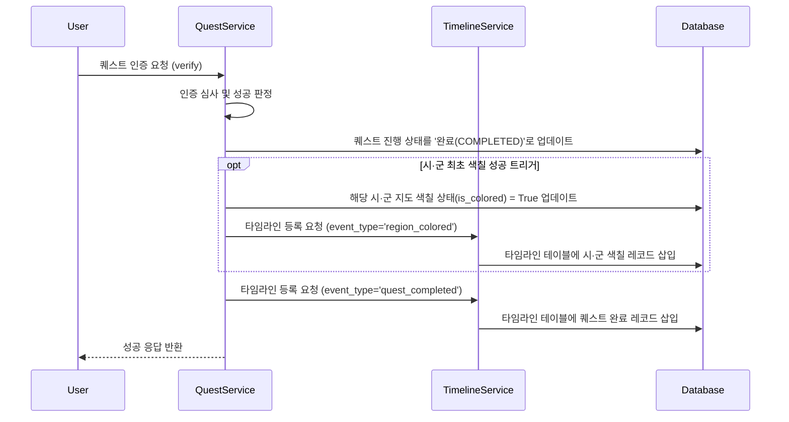

# [설명] 여행 타임라인 API

## 개요
* 여행 타임라인(Timeline) API는 사용자가 충청북도 시·군에서 완료한 퀘스트 이력과, 이로 인해 지도가 색칠된 이벤트를 발생 시각순(`occurred_at DESC`)으로 저장하고 보여주는 기능입니다.
* 사용자는 자신이 언제, 어느 지역에서, 어떤 퀘스트를 달성하여 지도를 색칠해 나갔는지를 시각적으로 추적할 수 있습니다.

## 동작 방식
### 1. 타임라인 기록 적재 흐름


### 2. 타임라인 목록 조회 흐름
* 클라이언트(프론트엔드)가 `GET /api/v1/users/me/timeline`을 호출합니다.
* 서버는 사용자 식별 후 `occurred_at DESC` 조건으로 `timeline` 테이블의 데이터를 조회합니다.
* 이때 시·군 테이블(`regions`)과 퀘스트 진행/상세 테이블(`quest_progress`, `quests`)을 조인하여 **지역명(예: 단양군)** 및 **퀘스트 타이틀(예: 도담삼봉에서 인생샷 남기기)**을 포함한 Envelope JSON 데이터 구조를 반환합니다.

## 주요 구성 요소 / 위치

| 구성 요소 | 역할 | 위치 |
|-----------|------|------|
| **Timeline Model** | 데이터베이스 `timeline` 테이블 매핑 정의 | `backend/app/timeline/models.py` |
| **Timeline Schemas** | API 입출력 데이터 유효성 검증 및 직렬화 정의 | `backend/app/timeline/schemas.py` |
| **Timeline Repository** | DB 직접 조회 및 삽입 쿼리 분리 처리 | `backend/app/timeline/repository.py` |
| **Timeline Service** | 타임라인 이벤트 적재 및 조회 비즈니스 로직 처리 | `backend/app/timeline/service.py` |
| **Timeline Router** | `/users/me/timeline` 등의 라우터 등록 및 핸들러 정의 | `backend/app/timeline/router.py` |

## 설정 / 사용법
* **엔드포인트**: `GET /api/v1/users/me/timeline` (인증 필수)
* **쿼리 파라미터**:
  * `year` (Optional, INT): 필터링할 연도
  * `month` (Optional, INT): 필터링할 월 (1~12)
* **응답 예시**:
  ```json
  {
    "code": "SUCCESS",
    "status": 200,
    "message": "타임라인 조회에 성공했습니다.",
    "data": [
      {
        "id": 1,
        "event_type": "quest_completed",
        "title": "도담삼봉에서 인생샷 남기기",
        "region_name": "단양군",
        "occurred_at": "2026-05-20T14:30:00Z"
      },
      {
        "id": 2,
        "event_type": "region_colored",
        "title": "단양군 색칠 성공!",
        "region_name": "단양군",
        "occurred_at": "2026-05-20T14:30:05Z"
      }
    ]
  }
  ```

## 관련 문서
* [080-timeline-journey-grouping](../080-timeline-journey-grouping/) — 이 API가 반환하는 타임라인을 화면(`/timeline`)에서 여행(journey) 단위로 그룹핑해 보여주는 프론트엔드 UI 스펙(이 문서의 비목표였던 프론트 화면 범위를 다룬다).
