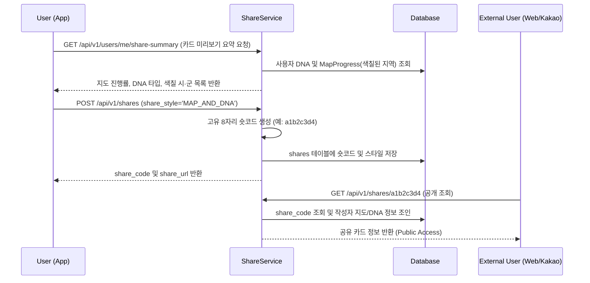

# [설명] 여행 공유 카드 API

## 개요
* 여행 공유 카드(Share Card) API는 사용자가 지금까지 색칠한 충청북도 지역 지도 현황과 여행 DNA 정보를 종합하여 카드로 시각화하고, 외부로 공유할 수 있도록 지원하는 백엔드 시스템입니다.
* 로그인한 사용자가 카드 미리보기를 조회하고 공유 숏링크를 생성할 수 있으며, 링크를 받은 외부 사용자는 로그인 없이 해당 공유 카드 정보를 열람할 수 있습니다.

## 동작 방식
### 공유 링크 생성 및 공개 조회 흐름

## 주요 구성 요소 / 위치

| 구성 요소 | 역할 | 위치 |
|-----------|------|------|
| **Share Model** | `shares` 데이터베이스 테이블 매핑 | `backend/app/shares/models.py` |
| **Share Schemas** | Pydantic 입출력 데이터 규격 (`ShareCreate`, `ShareRead`, `ShareSummaryResponse`) | `backend/app/shares/schemas.py` |
| **Share Repository** | 숏코드 생성 및 공유 DB 쿼리 처리 | `backend/app/shares/repository.py` |
| **Share Service** | 요약 데이터 조립 및 공유 숏링크 비즈니스 로직 | `backend/app/shares/service.py` |
| **Share Router** | `/shares` 및 `/users/me/share-summary` 라우터 정의 | `backend/app/shares/router.py` |

## 설정 / 사용법
1. **공유 카드 미리보기 요약 조회**: `GET /api/v1/users/me/share-summary` (JWT Auth)
2. **공유 코드 생성**: `POST /api/v1/shares` (JWT Auth, Body: `{"share_style": "MAP_AND_DNA"}`)
3. **공개 공유 카드 조회**: `GET /api/v1/shares/{share_code}` (Public, No Auth)
