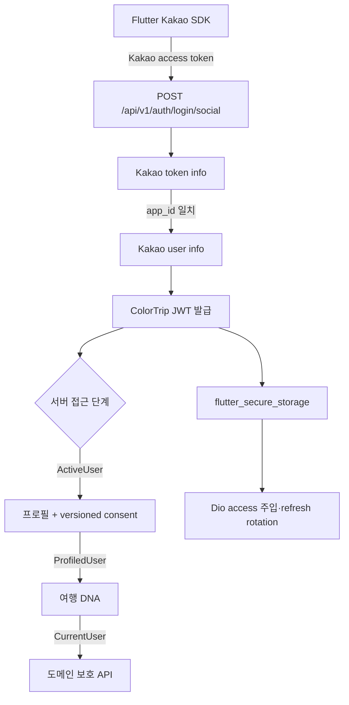

# [계획] Kakao 통합 인증

| 항목 | 내용 |
|------|------|
| 기능명 | Kakao 통합 인증 |
| Spec 폴더 | `docs/specs/035-kakao-auth-integration/` |
| 영역 | backend / deployment (Flutter는 KAN-54 후속 PR) |
| 작성자 | KAN-53 담당 |
| 작성일 | 2026-07-25 |
| 상태 | 백엔드·배포 구현 완료 / Flutter·Android E2E 후속 예정 |

## 배경 / 목적

[005-auth-member](../005-auth-member/)의 Kakao·JWT 기반을 확장해 Flutter Kakao SDK부터 백엔드 앱 소유권 검증, 온보딩 접근 제어, secure storage 세션, 즉시 익명화 탈퇴까지 하나의 인증 흐름으로 연결한다. 005의 7일 복구 정책은 035의 즉시 익명화·복구 불가 정책으로 대체한다.

이 기능은 기존 백엔드 인증 기반을 폐기하지 않고 통합 경로로 확장한다. Android emulator에서 Kakao Flutter SDK로 받은 access token을 백엔드가 Kakao `app_id`까지 검증하고, 프로필·현재 필수 동의·여행 DNA를 모두 마친 사용자만 일반 도메인 API에 접근하게 한다. 또한 JWT refresh, 로그아웃, 프로필, 즉시 익명화 탈퇴까지 Flutter와 백엔드에서 한 흐름으로 연결하고 dev 배포 시 Alembic을 자동 적용한다.

> 분리 적용: KAN-53은 백엔드 인증·프로필·동의·탈퇴·migration·배포를 제공한다. 기존 Flutter 설문 흐름의 회귀를 막기 위해 Trip DNA API의 `ProfiledUser` 전환은 Flutter 세션 연동과 함께 KAN-54에서 적용한다.

## 목표 (Goals)

| ID | 목표 |
|----|------|
| AUTH-INT-01 | Flutter Kakao SDK 로그인 결과를 정식 백엔드 `/api/v1` 인증 흐름과 연결 |
| AUTH-INT-02 | Kakao access token의 유효성, 사용자 ID, `app_id`를 서버에서 검증 |
| AUTH-INT-03 | 닉네임·이메일·생년월일 프로필과 서버 상수 기반 versioned consent 온보딩 제공 |
| AUTH-INT-04 | `ActiveUser` → `ProfiledUser` → `CurrentUser` 단계별 서버 접근 제어 |
| AUTH-INT-05 | access/refresh JWT를 secure storage에 저장하고 refresh rotation·인증 실패 처리를 Flutter 네트워크 계층에 연결 |
| AUTH-INT-06 | 프로필 조회·수정, 로그아웃, 즉시 익명화·복구 불가 탈퇴를 앱에서 완료 |
| AUTH-INT-07 | dev 배포가 애플리케이션 교체 전 Alembic `upgrade head`를 자동 실행하고 실패 시 배포 중단 |
| AUTH-INT-08 | Android emulator에서 로그인부터 탈퇴까지 실제 통합 흐름 검증 |

## 비목표 (Non-Goals)

- 추천·퀘스트 ruleset 변경.
- PR 생성·머지 여부 결정.
- 기존 authorization code 로그인 경로 제거.
- 실기기 또는 iOS의 실제 Kakao 로그인 검증.
- HTTPS 도입.
- Kakao unlink 결과를 수신하는 외부 webhook.
- 이용약관·개인정보처리방침 등 법률 문서의 문안 제작.
- 탈퇴한 사용자의 여행·퀘스트·지도·타임라인·공유 등 도메인 기록 물리 삭제.

## 요구사항

### 로그인·토큰

- Flutter는 Kakao Flutter SDK로 로그인하고 Kakao access token을 `POST /api/v1/auth/login/social`에 전달한다.
- Flutter 요청 body는 `{"provider":"kakao","access_token":"..."}`이며 `authorization_code`와 동시에 보내지 않는다. 기존 code 경로는 `{"provider":"kakao","authorization_code":"..."}`를 유지한다.
- 백엔드는 Kakao token info API로 token 유효성과 `app_id == KAKAO_APP_ID`를 먼저 확인한 뒤 Kakao user info를 조회한다. 클라이언트가 보낸 사용자 식별자나 프로필을 신뢰하지 않는다.
- 기존 authorization code 입력은 호환성을 위해 유지한다.
- 백엔드는 access JWT 15분, refresh token 14일 정책과 DB hash 저장·rotation을 유지한다.
- Flutter는 ColorTrip access/refresh token을 `flutter_secure_storage`에만 저장한다. 앱 메모리에는 요청에 필요한 access token만 짧게 유지한다.
- API가 access token 만료를 반환하면 refresh를 한 번만 수행하고 원 요청을 한 번 재시도한다. 동시 만료 요청은 하나의 refresh 작업을 공유한다.
- refresh 실패·재사용·만료 시 저장 토큰을 삭제하고 로그인 화면으로 전환한다.

### 프로필·동의 온보딩

- 수집하는 인증/프로필 개인정보는 닉네임, 이메일, 생년월일로 제한한다.
- Kakao가 제공한 값은 백엔드가 검증한 응답만 초기값으로 사용하고, 누락 값은 사용자가 온보딩에서 입력한다.
- 동의 버전은 클라이언트 입력을 받지 않고 서버 상수 `terms-v1`, `privacy-v1`, `marketing-v1`를 기록한다.
- `PUT /api/v1/users/me/onboarding-profile`은 닉네임·이메일·생년월일과 필수·선택 동의를 하나의 DB 트랜잭션으로 저장하고 최신 `UserProfile`을 반환한다. 필수 동의가 `false`이면 아무것도 저장하지 않으며, 동일 요청과 응답 유실 후 재전송은 중복 consent 행 없이 같은 결과로 수렴한다.
- 요청 JSON은 `nickname: string`, `email: string`, `birth_date: YYYY-MM-DD`, `terms_agreed: boolean`, `privacy_agreed: boolean`, `marketing_agreed: boolean`의 flat 구조다. 성공 응답은 기존 API Envelope의 `data`에 최신 `UserProfile`을 담고, validation 실패는 422, 필수 동의 거부는 저장 없이 400을 반환한다.
- 닉네임은 trim 후 1~30자, 이메일은 정규화된 유효 형식·최대 255자, 생년월일은 유효한 과거 또는 오늘 날짜로 검증한다.
- `PATCH /api/v1/users/me`는 닉네임·생년월일만 수정하고 이메일 변경은 허용하지 않으며 최신 `UserProfile`을 반환한다.
- 이용약관과 개인정보 동의는 필수이며 현재 서버 버전에 동의해야 여행 DNA를 시작할 수 있다. 마케팅 동의는 선택이며 접근을 막지 않는다.
- 서버는 동의 종류, 버전, 동의 여부, 동의 시각을 저장해 버전 변경 시 재동의를 판단할 수 있어야 한다.
- `user_consents`는 `id`, `user_id`, `consent_type`, `version`, `agreed`, `decided_at`, `created_at`, `updated_at`을 가지며 `(user_id, consent_type, version)` unique constraint와 사용자 조회 index를 둔다. 유형은 `terms`·`privacy`·`marketing`이고 마케팅 미동의도 `agreed=false` 행으로 upsert한다. 새 version은 이전 행을 덮지 않고 별도 이력으로 공존한다. 탈퇴 시 consent의 개인정보 삭제 요구 때문에 이 테이블은 일반 soft-delete 규칙의 명시적 예외로 물리 삭제한다.
- `UserProfile`은 `id`, `email`, `nickname`, `birth_date`, `profile_image`, `dna`, `social_provider`, `onboarding_step`, 호환 필드 `is_restored`를 제공한다. 즉시 탈퇴 정책 적용 후 `is_restored`는 항상 `false`다.
- `onboarding_step`은 별도 DB 상태가 아니라 현재 프로필·필수 consent·DNA로 `profile`·`trip_dna`·`complete` 중 하나를 계산한다. 필수 consent version이 바뀌면 기존 사용자도 `profile`로 되돌아간다.
- Kakao 프로필은 신규 사용자 초기값으로만 적용하며 기존 ColorTrip 프로필을 재로그인 때 덮어쓰지 않는다.

### 단계별 접근

- `ActiveUser`: 유효한 access JWT를 가지고 탈퇴·익명화되지 않은 사용자. 내 프로필 조회, 프로필·동의 온보딩, 로그아웃, 탈퇴에 접근할 수 있다.
- `ProfiledUser`: `ActiveUser`이면서 닉네임·이메일·생년월일과 현재 `terms-v1`, `privacy-v1` 동의가 완료된 사용자. 여행 DNA 질문 조회·답변 제출에 접근할 수 있다.
- `CurrentUser`: `ProfiledUser`이면서 DNA가 완료된 사용자. 여행·퀘스트·지도·타임라인·공유·업로드 등 일반 보호 API에 접근할 수 있다.
- 단계가 부족하면 HTTP 403 `ONBOARDING_REQUIRED`를 반환한다. 클라이언트는 `/users/me`를 다시 조회해 `onboarding_step`에 맞는 화면으로 이동한다.
- `GET /api/v1/trip_dna/questions`와 답변 제출은 모두 `ProfiledUser`를 요구한다. 기존 `CurrentUser` 호출부는 일반 보호 API의 최종 단계 의미를 유지한다.
- refresh는 만료된 access JWT를 전제로 하므로 access-JWT dependency 단계 밖에 둔다. refresh token 자체를 검증하고 연결된 사용자가 탈퇴·익명화되지 않았는지 DB에서 확인한 뒤에만 rotation한다.

| Endpoint | 인증 경계 |
|----------|-----------|
| `POST /api/v1/auth/login/social` | public + Kakao token/code 검증 |
| `POST /api/v1/auth/refresh` | refresh token 자체 인증 + active user 조회 |
| `POST /api/v1/auth/logout` | `ActiveUser` + 해당 refresh token |
| `GET /api/v1/users/me` | `ActiveUser` |
| `PUT /api/v1/users/me/onboarding-profile` | `ActiveUser` |
| `PATCH /api/v1/users/me` | `CurrentUser` |
| `DELETE /api/v1/users/me` | `ActiveUser` |
| `GET /api/v1/trip_dna/questions`, DNA 답변 제출 | `ProfiledUser` |
| 여행·퀘스트·지도·타임라인·공유·업로드 | `CurrentUser` |

### 프로필·로그아웃·탈퇴

- 프로필 조회와 수정은 서버 데이터를 SOT로 사용한다. 수정 가능 필드는 닉네임·생년월일이며 이메일은 읽기 전용이다.
- 로그아웃은 제한 횟수만큼 백엔드 refresh token 폐기를 재시도한 뒤 Kakao logout을 best-effort로 호출하고 Flutter secure storage·메모리 삭제를 수행한다. 백엔드 또는 Kakao logout이 실패해도 기기 로컬 로그아웃은 완료한다.
- 탈퇴 순서는 다음과 같다.
  1. Flutter가 Kakao SDK unlink를 실행한다.
  2. Flutter가 ColorTrip access JWT로 `DELETE /api/v1/users/me`를 호출한다.
  3. 백엔드 성공 후에만 Flutter가 secure storage와 로컬 사용자 상태를 삭제한다.
- Kakao unlink 성공 후 백엔드 탈퇴가 실패하면 ColorTrip JWT를 유지하고 백엔드 탈퇴를 재시도한다. 이미 unlink된 Kakao 상태도 정상 재시도 경로로 처리한다.
- 백엔드는 한 성공 트랜잭션에서 모든 refresh token 폐기, consent 삭제, 닉네임·이메일·생년월일·프로필 이미지·DNA 제거, `social_id = deleted:{user_id}` 치환, `deleted_at`·`anonymized_at` 기록을 수행한다.
- 탈퇴는 즉시 익명화되며 복구할 수 없다. 같은 Kakao 사용자의 이후 로그인은 새 user를 만든다.
- 도메인 기록은 참조 무결성과 서비스 기록을 위해 보존하되 익명화된 user에 연결한다.

### 배포·검증

- backend와 deploy 환경 템플릿에는 실제 값 없이 `KAKAO_APP_ID`, `KAKAO_TOKEN_INFO_URL`, `KAKAO_CLIENT_SECRET` 키를 명시한다. `KAKAO_APP_ID`는 비밀이 아닌 환경 설정이고 REST API key와 활성화된 client secret은 Secret Manager에서 주입한다.
- Kakao token-info의 정수 `app_id`와 동일한 타입으로 비교할 수 있도록 `KAKAO_APP_ID`는 양의 정수 설정으로 검증·정규화한다.
- dev 배포는 새 API 컨테이너로 교체하기 전에 같은 이미지·설정으로 Alembic `upgrade head`를 자동 실행한다. 실패하면 애플리케이션 교체를 중단한다.
- Android emulator는 개발 API 주소를 사용할 수 있어야 하며, 개발 환경에 한해 필요한 cleartext 설정을 제한적으로 적용한다.
- 백엔드는 Kakao HTTP를 가짜 client로 대체한 자동 테스트를, Flutter는 repository/network/secure storage를 대체한 위젯·통합 테스트를 제공한다.
- 실제 Kakao 개발 앱과 dev 백엔드를 사용한 Android emulator 수동 E2E 체크리스트를 통과한다.

## 설계 개요 / 접근 방식

- 005는 현재 백엔드 인증 primitive와 API 기반의 구현 기록으로 유지한다.
- 035는 Flutter SDK부터 백엔드 검증·온보딩·접근 단계·탈퇴·배포·E2E까지의 통합 변경을 정의하며, 구현되면 005의 7일 복구 정책을 대체한다.
- 인증 상태의 판정은 서버가 수행한다. Flutter 라우팅은 서버가 반환한 완료 상태를 표시하는 역할만 한다.
- Kakao access token은 ColorTrip의 장기 세션 토큰으로 저장하지 않는다. ColorTrip JWT가 앱 세션을 담당한다.

## 의사결정 (함께 논의 · 근거 필수)

| 결정할 항목 | 선택지 | 제안 / 근거 | 상태 |
|------|--------|------------|------|
| Flutter 로그인 | WebView 직접 OAuth / Kakao Flutter SDK | **Kakao Flutter SDK** — 플랫폼 로그인·unlink 동작을 공식 SDK에 맡기고 Flutter 앱의 실제 로그인 경로를 검증한다. | 합의됨 |
| Kakao token 신뢰 경계 | user info만 조회 / token info의 `app_id`까지 검증 | **`app_id`까지 서버 검증** — 다른 Kakao 앱에서 발급된 정상 token의 오용을 차단한다. | 합의됨 |
| 기존 authorization code | 제거 / 유지 | **유지** — 제거는 이번 범위가 아니며 기존 백엔드 호환성을 보존한다. | 합의됨 |
| 온보딩 접근 | 클라이언트 상태만 사용 / 서버 단계별 dependency | **`ActiveUser`·`ProfiledUser`·`CurrentUser`** — 우회 요청도 서버에서 동일하게 차단하고 endpoint 요구 수준을 드러낸다. | 합의됨 |
| consent 버전 | 클라이언트 전달 / 서버 상수 | **서버 상수** — 조작과 오래된 버전 제출을 막는다. 현재 버전은 `terms-v1`, `privacy-v1`, `marketing-v1`이다. | 합의됨 |
| 토큰 저장 | 일반 preferences / secure storage | **`flutter_secure_storage`** — OS 보호 저장소를 사용하고 평문 preferences 노출을 피한다. | 합의됨 |
| 탈퇴 | 7일 복구 / 즉시 익명화 | **즉시 익명화·복구 없음** — 승인된 제품 정책을 적용하며 새 로그인은 새 user로 처리한다. | 합의됨 |
| Kakao unlink 순서 | 백엔드 탈퇴 후 unlink / unlink 후 백엔드 탈퇴 | **클라이언트 unlink 후 백엔드 탈퇴** — Kakao 연결 해제를 먼저 완료한다. 백엔드 실패 시 JWT를 보존해 재시도하고 이미 unlink된 상태를 정상 처리한다. | 합의됨 |
| 도메인 기록 | 탈퇴 시 삭제 / 익명 user에 보존 | **보존** — 인증 PII와 DNA는 제거하되 FK 무결성과 도메인 기록은 유지한다. | 합의됨 |
| dev migration | 운영자 수동 실행 / 배포 전 자동 실행 | **자동 `alembic upgrade head`** — 앱과 schema의 불일치를 줄이고 migration 실패 시 배포를 중단한다. | 합의됨 |
| E2E 플랫폼 | Android emulator / 실기기+iOS 포함 | **Android emulator** — 이번 범위에서 실제 Flutter SDK 통합을 검증하되 실기기와 iOS는 제외한다. | 합의됨 |

## 영향 범위

- `backend/app/auth/`: Kakao token info 검증, 프로필·consent, 접근 단계, 즉시 익명화 탈퇴.
- `backend/app/core/`: Kakao app ID·consent version 설정, 인증 오류와 dependency 지원.
- `backend/alembic/versions/`: 프로필·consent와 즉시 익명화 정책에 필요한 additive migration.
- `backend/tests/`: 로그인, app ID 불일치, 단계별 접근, refresh, 로그아웃, 탈퇴 재시도·익명화 테스트.
- `frontend/lib/`: Kakao SDK adapter, auth repository, secure token storage, Dio refresh, onboarding/profile/탈퇴 화면과 라우팅.
- `frontend/android/`: Kakao SDK callback과 emulator 개발 설정.
- `frontend/test/`, `frontend/integration_test/`: 상태·저장소·네트워크·Android emulator 통합 검증.
- `deploy/`: dev Alembic 자동 적용과 Kakao 설정 전달.
- `.github/workflows/deploy-dev.yml`: migration 실패 시 배포 중단 검증.
- `README.md`, `backend/.env.example`, `deploy/.env.example`, `docs/conventions/auth-security.md`, `docs/conventions/database.md`, `docs/specs/README.md`: 문서·환경 템플릿 동기화.

## 작업 단계

- [x] 승인된 범위와 현재 005 구현의 경계를 문서화한다.
- [x] 사용자에게 035 문서 변경안을 확인받는다.
- [x] 백엔드 인증·프로필·consent·접근 단계와 migration을 구현한다.
- [x] dev 배포의 Alembic 자동 적용과 Kakao 설정 주입을 구현한다.
- [ ] KAN-54에서 Flutter Kakao SDK·secure storage·JWT refresh·온보딩·프로필·탈퇴를 구현한다.
- [ ] KAN-54에서 Flutter 자동 테스트와 실제 Android emulator E2E를 완료한다.
- [x] KAN-53 백엔드·배포 구현 결과에 맞춰 문서를 갱신한다.

## 리스크 / 미해결 질문

- Kakao 개발 앱의 Android package name, key hash, 동의 항목 설정이 emulator 빌드와 일치해야 한다. 실제 값은 저장소 문서나 env 예시에 기록하지 않는다.
- Kakao 이메일·생년월일 권한이 없거나 값이 비어 있으면 프로필 온보딩 입력으로 보완해야 한다.
- unlink 뒤 백엔드 장애가 발생한 중간 상태를 앱 재시작 후에도 복구할 수 있도록 “백엔드 탈퇴 대기” 상태와 ColorTrip JWT 보존이 필요하다.
- 백엔드 commit 뒤 성공 응답만 유실되는 경우까지 완전히 판별하려면 별도 탈퇴 operation ID 또는 확인 API가 필요하지만 이는 승인된 API 범위 밖이다. 이번 구현은 unlink 완료 상태와 JWT를 보존해 즉시 재시도하며, 이 한계는 Android E2E의 부분 실패 시나리오에서 기록한다.
- consent 버전이 바뀌면 기존 `CurrentUser`가 `profile` 온보딩 단계로 돌아가 재동의를 완료하기 전 DNA·도메인 API가 차단된다.
- dev migration 자동 적용은 단일 Alembic head를 전제로 한다. 복수 head 또는 migration 실패는 배포 실패로 명확히 노출해야 한다.
