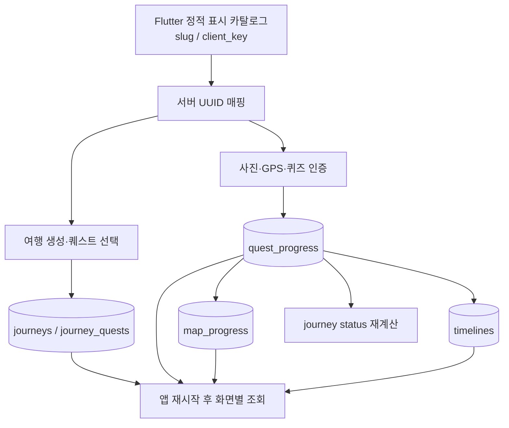

# [계획] 여행·퀘스트·타임라인 서버 영속화

| 항목 | 내용 |
|------|------|
| 기능명 | 여행·퀘스트·타임라인 서버 영속화 |
| Spec 폴더 | `docs/specs/040-domain-state-persistence/` |
| 영역 | backend / frontend / 공통 |
| 작성자 | Codex |
| 작성일 | 2026-07-28 |
| 상태 | 구현 중 |

## 배경 / 목적

작업 전 Flutter의 여행 선택, 완료 퀘스트, 타임라인은 `ProgressNotifier`의 메모리 상태를
단일 출처로 사용한다. 앱 프로세스를 종료하면 `ProgressState.empty()`로 다시 시작하므로,
사용자가 만든 여행과 완료 기록이 모두 사라진다. 반면 백엔드에는 이미 여정,
퀘스트 진행, 지도 진행도, 타임라인 테이블과 보호 API가 구현되어 있지만 Flutter가
이를 호출하지 않는다.

이 작업은 기존 백엔드 도메인을 재사용해 서버를 사용자 도메인 상태의 단일 출처로
만들고, 앱 재시작·로그아웃 후 재로그인에도 같은 여행 기록을 복원하는 것을 목적으로 한다.
PR #47(KAN-53)의 Kakao/JWT 세션과 `CurrentUser` 접근 단계를 전제로 한다.

## 목표 (Goals)

- Flutter 정적 지역·퀘스트 ID와 백엔드 UUID 사이에 안정적인 공개 식별자를 둔다.
- 현재 Flutter에 노출되는 11개 지역·220개 퀘스트가 서버에서도 선택 가능하게 한다.
- 여행 생성·퀘스트 선택 변경·사진/GPS/퀴즈 인증을 서버 트랜잭션으로 저장한다.
- 동시·재시도 요청에도 여정, 지도 count, 타임라인 이벤트가 중복되지 않게 한다.
- 여행 목록, 완료 상태, 지도, 타임라인을 서버에서 다시 조회해 앱 재시작 후 복원한다.
- 계정 전환 시 이전 사용자의 도메인 상태가 메모리에 남지 않게 한다.
- 백엔드·Flutter 자동 검사와 Android emulator E2E로 복원 흐름을 검증한다.

## 비목표 (Non-Goals)

- Flutter 정적 카탈로그를 서버 렌더링 카탈로그로 전면 교체
- 이미 앱 메모리에서 사라져 서버에 저장되지 않은 과거 기록 복구
- 오프라인 영속 캐시, 쓰기 큐, 충돌 병합
- 타임라인 페이지네이션·공유 기능 재설계
- LLM 사진 내용 판정과 GCS 신규 IaC
- iOS 실제 로그인/E2E, 앱 스토어 배포, GitHub ruleset 변경

## 요구사항

### 데이터·API

- `regions.slug`는 Flutter 지역 ID(`danyang` 등)와 일치하고 고유해야 한다.
- `quests.client_key`는 Flutter 퀘스트 ID(`dy1` 등)와 일치하고 고유해야 한다.
- 기존 UUID와 응답 필드는 유지하고 `slug`, `client_key`만 additive하게 노출한다.
- 정적 카탈로그 snapshot은 Alembic migration에 포함하고 기존 TourAPI·사용자 데이터를
  삭제하거나 임의로 덮어쓰지 않는다.
- `POST /api/v1/journeys`는 `client_request_id`로 사용자별 멱등성을 보장한다.
- `PUT /api/v1/journeys/{journey_id}/quests`는 최종 `quest_ids`를 한 트랜잭션으로 반영한다.
- 인증 성공 트랜잭션에서 진행도, 여정 상태, 지도 count, 타임라인 이벤트를 함께 확정한다.

### Flutter

- 기존 Dio/JWT refresh interceptor를 모든 신규 Repository에서 재사용한다.
- 여행·진행·타임라인·지도 응답은 하나의 `DomainSnapshot`으로 묶어
  `DomainController`에서 갱신하고, 화면별 파생 상태만 분리한다. 서버 쓰기 성공 뒤 전체를
  다시 조회해 서로 다른 화면이 서로 다른 갱신 시점의 상태를 표시하지 않게 한다.
- 화면은 서버 성공 전에 완료 또는 저장 성공으로 표시하지 않는다.
- 네트워크 실패를 빈 목록으로 위장하지 않고 loading/empty/error/retry를 구분한다.
- 로그아웃·탈퇴·계정 전환 시 사용자별 Provider를 폐기한다.

### 비기능

- API는 공통 Envelope, `/api/v1`, `page/size`, ISO 8601 KST 규약을 따른다.
- 보호 API는 KAN-53의 `CurrentUser`를 사용하고 JWT를 도메인 계층에서 직접 해석하지 않는다.
- 로그에 Authorization, token, 업로드 원문이나 비밀값을 남기지 않는다.
- PostgreSQL migration은 현재 단일 head를 직접 계승하고 기존 데이터와 구버전 앱에
  하위 호환되어야 한다.

## 설계 개요 / 접근 방식

카탈로그의 화면 문구·배치는 현재 Dart 정적 데이터를 유지한다. 서버는 동일한
`client_key`를 가진 불변 migration snapshot으로 선택·검증·진행 상태를 저장한다.
정적 Dart ID와 migration snapshot ID가 달라지면 CI 계약 테스트가 실패한다.

### 공개 API·스키마 변경

| 구분 | 변경 |
|------|------|
| `RegionRead` | `slug: str` 추가 |
| `QuestListItem` 및 파생 응답 | `client_key: str` 추가 |
| `MissionType` | `photo`, `gps` 추가, 기존 `gps_photo`, `quiz` 유지 |
| `JourneyCreateRequest` | `client_request_id: UUID` 추가 |
| `JourneyListItem` | `quest_client_keys: list[str]` 추가 — 목록 복원 시 여정별 상세 N+1 방지 |
| `PUT /journeys/{id}/quests` | `{ "quest_ids": [UUID, ...] }` → 최신 `JourneyDetail` |

인증 규칙은 `photo=허용된 업로드 경로`, `gps=목표 반경 내 위치`,
`gps_photo=둘 다`, `quiz=서버 정답 비교`로 고정한다. GPS 목표 좌표가 확인되지 않은
퀘스트는 서버 seed에 활성 항목으로 넣지 않는다.

여행 목록은 서버의 여정 레코드 단위로 표시한다. 지도에서 지역으로 진입할 때는
그 지역의 최신 여정을 기본 대상으로 사용하되, 여행 목록에서 선택한 경우 route의
`journey_id`가 우선한다. 앱 부팅 snapshot은 페이지네이션된 여정 요약의
`quest_client_keys`를 사용하며, 여정마다 상세 API를 다시 호출하지 않는다.

## 의사결정 (함께 논의 · 근거 필수)

| 결정할 항목 | 선택지 | 제안 / 근거 | 상태 |
|------|--------|------------|------|
| 영속화 위치 | 로컬 DB / 서버 | **서버**. 사용자 계정과 여러 화면이 같은 기록을 소비하고 기존 백엔드 도메인이 있으므로 로컬 DB는 중복 SOT가 된다. | 합의됨 |
| 카탈로그 표시 | 서버 전면 전환 / Flutter 정적 유지 | **정적 유지**. 220개 화면 콘텐츠 재설계를 피하고 stable key 계약만 추가해 범위를 제한한다. | 합의됨 |
| 오프라인 | 쓰기 큐 / 오류+재시도 | **오류+재시도**. 충돌 해결과 보안 검증을 추가하지 않고 서버 확정 상태만 표시한다. | 합의됨 |
| 선택 변경 | 기존 단건 API 반복 / 원자적 PUT | **원자적 PUT**. 현재 UI가 최종 선택 집합을 한 번에 제출하므로 부분 성공을 허용하면 화면과 DB가 어긋난다. | 합의됨 |
| Provider 구조 | 화면별 독립 조회 / 도메인 snapshot controller | **도메인 snapshot controller**. 여행·진행·지도·타임라인은 한 쓰기 결과에 함께 변하므로 한 번에 재조회하고, 기존 `ProgressState`는 화면 호환 projection으로만 유지한다. 인증 사용자 상태는 KAN-53 Provider와 분리한다. | 구현 반영 |
| PR 전략 | PR #47 대기 후 시작 / KAN-53 위 stacked 작업 | **stacked 작업**. KAN-53 HEAD에서 격리 개발하고 #47 squash merge 후 KAN-55 커밋만 `dev`로 옮긴다. | 합의됨 |

## 영향 범위

- `backend/app/regions/`, `backend/app/quests/`, `backend/app/journeys/`,
  `backend/app/timeline/`, `backend/alembic/`
- `frontend/lib/data/`, `frontend/lib/state/`, 여행·퀘스트·홈·타임라인 화면,
  Android 위치 권한 설정
- `backend/tests/`, `frontend/test/`, `frontend/integration_test/`
- `README.md`, `docs/specs/000-frontend-app/`, `000-quest/`, `010-journey/`,
  `025-travel-timeline/`, 본 040 스펙

## 작업 단계

- [x] KAN-53 HEAD에서 KAN-55 전용 worktree 생성 및 기준선 테스트
- [x] 040 스펙과 관련 문서 갱신 후 사용자 승인
- [x] 카탈로그 식별자·snapshot migration을 테스트 우선으로 구현
- [x] 여정 멱등 생성·원자적 선택 변경·동시 인증 안전성 구현
- [x] Flutter Repository·Provider·화면 연동
- [ ] 백엔드·Flutter 전체 품질 검사와 Android E2E
- [ ] PR #47 병합 후 KAN-55 커밋만 최신 `dev`로 재배치
- [ ] `dev` 대상 Draft PR 생성

## 리스크 / 미해결 질문

- PR #47이 변경되면 KAN-55를 최신 KAN-53 HEAD에 먼저 맞춘 뒤 재배치한다.
- 기존 환경에 동일 지역·제목의 TourAPI 행이 있으면 자동 추정 병합하지 않고 migration
  preflight로 중단해 잘못된 UUID 연결을 방지한다.
- Android 위치 권한 거부·영구 거부·서비스 비활성화는 각각 복구 안내를 제공한다.
- 사진 판정은 현재 프로젝트 결정대로 업로드 존재 확인 수준이며 내용 진위 판정은 하지 않는다.
