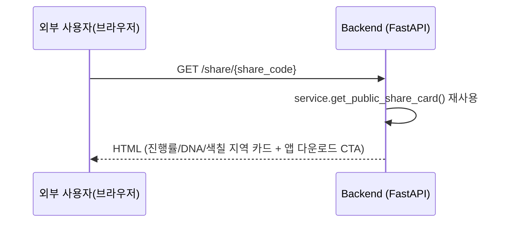

# [계획] 공유 카드 실사용화 (지도 미리보기·네이티브 공유 시트·공유 랜딩 페이지)

| 항목 | 내용 |
|------|------|
| 기능명 | 공유 카드 실사용화 |
| Spec 폴더 | `docs/specs/060-share-native-experience/` |
| 영역 | frontend(Android/iOS) / backend |
| 작성자 | Claude (AI) |
| 작성일 | 2026-08-02 |
| 상태 | 진행 중 |

> 앱 실행용 커스텀 링크는 안드로이드 기준이며, 공유 카드 이미지 저장은 Android/iOS 사진 보관함을 지원한다.

## 배경 / 목적
* [030-share-card](../030-share-card/)에서 공유 카드 백엔드 API(요약 조회·공유 코드 생성·공개 조회)는 구현했지만, 프론트엔드 UI/UX와 외부 웹 랜딩은 명시적으로 비목표(Non-Goal)로 남겨뒀다.
* 지금 프론트 공유 화면(`share_card_screen.dart`)은 지도 미리보기가 정적 placeholder 텍스트이고, 공유·링크 복사 버튼도 토스트로만 흉내 낸 상태(KAN-048).
* 이번 스펙에서 ① 실제 지도 미리보기, ② 네이티브 OS 공유 시트, ③ 공유 링크 접속 시 보여줄 공개 랜딩 페이지까지 이어서 완성한다.

## 목표 (Goals)
* 공유 화면의 지도 미리보기를 실제 `ChungbukMap` 위젯(사용자의 현재 채도 상태 그대로, 읽기 전용)으로 교체한다.
* `share_plus` 패키지로 안드로이드 표준 네이티브 공유 시트를 연동하고, 링크 복사 버튼도 실제 클립보드 복사로 구현한다(현재는 둘 다 토스트만 뜨는 스텁).
* 공유 링크(`{SHARE_BASE_URL}/share/{share_code}`)에 접속하면 진행률·DNA·색칠된 시·군 목록을 보여주는 공개 정적 랜딩 페이지가 뜨고, 버튼 두 개를 노출한다: **"앱에서 열기"**(커스텀 URL 스킴, 설치돼 있으면 앱 실행)와 **"앱 다운받기"**(Play 스토어 링크, placeholder).
* 공유 카드 미리보기를 PNG로 캡처해 사용자의 사진 보관함에 저장한다.

## 비목표 (Non-Goals)
* 캡처 이미지를 서버에 업로드하거나 랜딩 페이지에 삽입 — 기기 사진 보관함 저장까지만 지원한다.
* **자동 판별형 딥링크(Android App Links)** — `assetlinks.json` 호스팅·`autoVerify` intent-filter 등 도메인 소유권 검증 인프라는 만들지 않는다. 대신 사용자가 직접 탭하는 "앱에서 열기" 버튼(커스텀 URL 스킴)만 둔다. iOS는 대상 아니므로 Universal Links는 고려하지 않는다.
* 앱 실행 시 공유된 콘텐츠로 바로 이동(딥링크 라우팅) — "앱에서 열기"는 앱을 그냥 실행시킬 뿐, 스플래시 이후 어디로 갈지는 기존 로그인 상태 기반 라우팅(`authRedirect()`)에 그대로 맡긴다. 공유 코드를 앱 내부로 전달해 특정 화면으로 라우팅하는 것은 이번 스펙에서 하지 않는다.
* 실제 앱스토어/플레이스토어 등록 및 URL 확보 — CTA의 다운로드 링크는 이번 스펙에서 placeholder로 두고, 앱이 실제 배포되면 교체한다.

## 요구사항
* 랜딩 페이지(`GET /share/{share_code}`)는 기존 `GET /api/v1/shares/{share_code}`와 동일하게 비인증(Public) 접근이 가능해야 한다.
* 랜딩 페이지는 공유 스타일(`MAP_AND_DNA`/`MAP`/`DNA`)에 따라 표시 항목을 동일한 기준으로 필터링한다(기존 `service.get_public_share_card()` 로직 재사용).
* 닉네임 등 사용자 입력 문자열을 HTML에 삽입할 때는 반드시 이스케이프해 XSS를 방지한다.
* 존재하지 않는 `share_code`로 접속하면 404 페이지를 보여준다(JSON 에러가 아니라 사람이 읽는 안내 페이지).

## 설계 개요 / 접근 방식

**프론트엔드**
* `share_card_screen.dart`의 지도 미리보기 영역을 `ChungbukMap(regionSaturation: ..., onRegionTap: null)`로 교체한다(홈 화면과 동일한 위젯 재사용, 탭 비활성화).
* 공유 버튼: `share_plus`의 `Share.share(text: ...)`로 공유 텍스트 + 공유 링크를 네이티브 공유 시트로 전달.
* 링크 복사 버튼: `flutter/services.dart`의 `Clipboard.setData(ClipboardData(text: shareUrl))`로 실제 클립보드에 복사(새 패키지 불필요, SDK 기본 제공).
* 이미지 저장 버튼: 미리보기 `RepaintBoundary`를 PNG로 캡처하고 `gal`로 사진 보관함에 저장한다.

**백엔드**
* `backend/app/shares/router.py`에 `GET /share/{share_code}` 라우트를 추가한다(주의: 기존 JSON API는 복수형 `shares`, 이 라우트는 단수형 `share` — `service.py`가 이미 생성해온 `share_url` 포맷과 일치시킨다).
* `POST /shares`가 반환하는 URL origin은 `SHARE_BASE_URL`로 설정한다. 배포에서는 `https://${API_DOMAIN}`, 로컬 Android 에뮬레이터에서는 `http://10.0.2.2:8000`을 사용한다.
* `app/main.py`에서 이 라우트는 `/api/v1` prefix 없이 최상위로 등록한다(사람이 직접 클릭하는 공개 URL이라 API 버전 prefix가 어울리지 않음).
* 데이터는 기존 `service.get_public_share_card()`를 그대로 재사용하고, `html.escape()`로 이스케이프한 값을 Python 표준 문자열로 조립해 `HTMLResponse`로 반환한다.
* 랜딩 HTML에 일반 `<a href="colortrip://share/{share_code}">앱에서 열기</a>` 링크를 둔다. 앱 미설치 시 안드로이드 브라우저는 별다른 처리 없이 그 페이지에 그대로 머무는 게 기본 동작이라(핸들러 없는 커스텀 스킴 클릭 시 조용히 무시됨), 폴백 URL이나 에러 페이지를 따로 만들 필요가 없다.

**안드로이드**
* `frontend/android/app/src/main/AndroidManifest.xml`에 커스텀 URL 스킴(`colortrip://`) intent-filter를 추가해, 그 스킴으로 들어오면 앱이 실행되게 한다.
* 앱은 이 진입을 별도로 파싱/라우팅하지 않는다 — 그냥 평소처럼 기동해 기존 `authRedirect()` 로직(로그인 상태에 따라 스플래시/홈 등으로 자동 분기)에 맡긴다. 공유 코드를 앱 내부로 전달하는 추가 로직은 없다.

## 의사결정 (함께 논의 · 근거 필수)

| 결정할 항목 | 선택지 | 제안 / 근거 | 상태 |
|------|--------|------------|------|
| 랜딩 페이지에 실제 지도 이미지 포함 여부 | A) 클라이언트가 지도를 PNG로 캡처해 업로드, 랜딩에 표시 B) 텍스트/뱃지 기반 카드만 표시(이미지 없음) | **B 선택** — 사용자 요청대로 범위를 최소화. 이미지 캡처·업로드·스토리지(GCS/로컬) 인프라를 새로 안 만들어도 되고, 프로젝트 규모상 이 정도 스펙에 이미지 파이프라인까지 넣는 건 오버엔지니어링. | 합의됨 |
| 앱 설치 시 앱 실행 방법 | A) Android App Links(자동 판별, `assetlinks.json` 도메인 인증 필요) B) 커스텀 URL 스킴(`colortrip://`) + 랜딩 페이지의 "앱에서 열기" 버튼(사용자가 직접 탭) | **B 선택** — A는 서버에 `assetlinks.json`을 호스팅하고 도메인 소유권을 검증해야 해서 이번 스펙 대비 비용이 큼. B는 `AndroidManifest.xml`에 intent-filter 하나만 추가하면 되고, 앱 미설치 시에도 별도 폴백 처리 없이 브라우저가 그 페이지에 그대로 머무는 게 기본 동작이라 에러 화면 걱정도 없다. 안드로이드만 대상이라 iOS Universal Links는 고려 대상 아님. | 합의됨 |
| 앱 실행 후 이동 화면 | A) 공유 코드를 앱에 전달해 해당 공유 콘텐츠 화면으로 딥링크 라우팅 B) 그냥 앱을 실행시키고 기존 로그인 상태 기반 라우팅(스플래시 등)에 맡김 | **B 선택** — 범위를 단순하게 유지. 공유 코드 전달·인앱 라우팅 로직을 새로 안 만들어도 됨. | 합의됨 |
| 랜딩 페이지 HTML 렌더링 방식 | A) `Jinja2Templates` 도입 B) 표준 라이브러리로 문자열 조립(`html.escape`) | **B 선택** — 페이지가 1개뿐이라 템플릿 엔진 의존성을 새로 추가하는 건 과함. 페이지 수가 늘어나면 그때 Jinja2 도입을 재검토한다. | 합의됨 |
| 공유 액션에 이미지 첨부 여부 | A) 텍스트+링크만 공유 B) 지도 캡처 이미지도 함께 공유 | **A로 시작** — 랜딩 이미지 배제 결정과 일관되게 범위를 좁힌다. 이미지 첨부는 후속 검토. | 합의됨 |

## 영향 범위
* `frontend/lib/features/home/share_card_screen.dart`: 지도 미리보기 위젯 교체, 공유/링크 복사 버튼 실제 구현
* `frontend/pubspec.yaml`: `share_plus` 의존성 추가
* `frontend/android/app/src/main/AndroidManifest.xml`: 커스텀 URL 스킴(`colortrip://`) intent-filter 추가
* `backend/app/shares/router.py`: `GET /share/{share_code}` HTML 라우트 추가(앱에서 열기/다운로드 버튼 포함)
* `backend/app/main.py`: 신규 라우트 등록(prefix 없이)
* `docs/specs/030-share-card/plan.md`: 비목표였던 "프론트 UI/UX", "웹 랜딩" 항목에 이 스펙으로 이어졌다는 링크 추가
* `docs/specs/README.md`: 이 스펙 등록

## 작업 단계
- [x] 1. 문서 작성 및 사용자 컨펌
- [x] 2. 프론트: 지도 미리보기를 실제 `ChungbukMap` 위젯으로 교체
- [x] 3. 프론트: `share_plus` 네이티브 공유 시트 연동 + 링크 복사 실제 구현
- [x] 4. 안드로이드: `AndroidManifest.xml`에 커스텀 URL 스킴 intent-filter 추가
- [x] 5. 백엔드: `GET /share/{share_code}` HTML 랜딩 라우트 구현("앱에서 열기"/"다운받기" 버튼 + 404 페이지 포함)
- [ ] 6. 로컬에서 백엔드+프론트 실제 연동 검증(공유 생성 → 링크 접속 → 랜딩 페이지 → 앱에서 열기 버튼 확인)
- [x] 7. `030-share-card` 비목표 문구 정리 및 상호 링크

## 리스크 / 미해결 질문
* 배포 공개 origin은 `API_DOMAIN`에서 파생한다. 현재 dev 기준은 `colortrip.p-e.kr`이며, 도메인을 바꿀 때도 `API_DOMAIN`만 변경해 공유 링크와 HTTPS 라우팅이 함께 바뀌어야 한다.
* 앱스토어/플레이스토어 URL이 아직 없음 — CTA 버튼 링크는 placeholder(`#` 또는 안내 문구)로 두고, 배포 후 실제 URL로 교체 필요.
