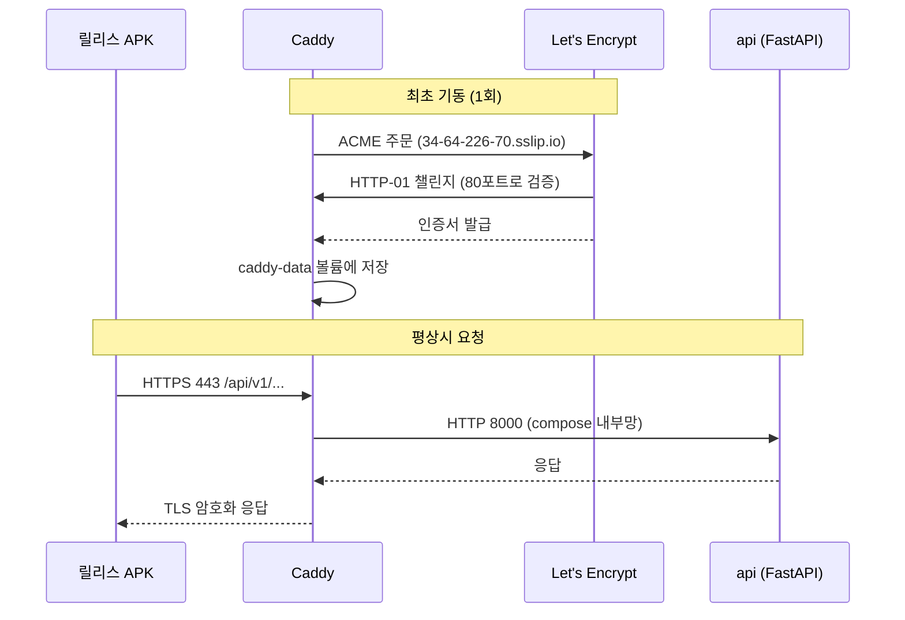

# [설명] dev 서버 HTTPS 적용

## 개요

dev API 앞에 **Caddy 리버스 프록시**를 두어 TLS를 종단한다. Caddy가 Let's Encrypt에서 인증서를 자동 발급·갱신하므로 수동 갱신 작업이 없다.

도메인을 구매하지 않고 **sslip.io 와일드카드 DNS**(`34-64-226-70.sslip.io`)를 호스트명으로 쓴다. sslip.io는 호스트명에 박힌 IP를 그대로 A 레코드로 돌려주는 공개 DNS라, 별도 등록 없이 서버 IP에 대응하는 이름을 얻을 수 있다.

이 작업의 직접적인 목적은 **안드로이드 릴리스 APK가 dev 서버에 접속할 수 있게 하는 것**이다. 릴리스 빌드는 평문 HTTP가 차단되어 있어 HTTPS 없이는 연동 자체가 불가능했다.

## 동작 방식



1. **인증서 발급** — Caddy가 처음 뜰 때 ACME HTTP-01 챌린지로 도메인 소유권을 증명하고 인증서를 받는다. 만료 30일 전 자동 갱신하며, 갱신에 실패해도 기존 인증서로 계속 서빙한다.
2. **TLS 종단** — 외부에서 오는 443 트래픽을 Caddy가 복호화해 `api:8000`으로 평문 프록시한다. 이 구간은 compose 내부 네트워크라 호스트 밖으로 나가지 않는다.
3. **HTTP 리다이렉트** — 80 포트 요청은 Caddy가 자동으로 HTTPS 301 리다이렉트한다(ACME 챌린지 경로는 예외).
4. **API 격리** — `api` 컨테이너는 더 이상 호스트 포트를 점유하지 않는다. 외부에서 평문으로 API에 직접 닿는 경로가 사라진다.

## 주요 구성 요소 / 위치

| 구성 요소 | 역할 | 위치 |
|-----------|------|------|
| Caddyfile | TLS 종단·리버스 프록시·로깅 설정 | `deploy/Caddyfile` |
| caddy 서비스 | 80·443 점유, ACME 처리 | `deploy/docker-compose.yml` |
| `caddy-data` 볼륨 | 인증서·ACME 계정 키 영속화 | `deploy/docker-compose.yml` |
| `API_DOMAIN` | 인증서를 발급받을 호스트명 | `deploy/deploy.sh` · GitHub variable |
| 방화벽 규칙 | 80·443 공개 허용 (기존) | `infra/modules/network/main.tf` |

## 설정 / 사용법

**서버 측** — GitHub 저장소 variable로 주입한다.

| 이름 | 값 | 비고 |
|------|-----|------|
| `API_DOMAIN` | `34-64-226-70.sslip.io` | 정식 도메인이 생기면 이 값만 교체 |

**앱 빌드 측** — 릴리스 APK는 https 주소로 빌드한다.

```bash
flutter build apk --release --dart-define=KAKAO_NATIVE_APP_KEY=<key> --dart-define=API_BASE_URL=https://34-64-226-70.sslip.io/api/v1
```

로컬 백엔드(HTTP)를 볼 때는 **debug 빌드**를 쓴다 — 릴리스는 평문을 차단한다.

## 예시

```bash
curl https://34-64-226-70.sslip.io/health
```

```json
{"code":"SUCCESS","status":200,"message":"요청이 성공하였습니다.","data":{"status":"ok"}}
```

HTTP로 접근하면 HTTPS로 리다이렉트된다.

```bash
curl -I http://34-64-226-70.sslip.io/health
```

## 관련 문서

- [plan.md](plan.md) — 의사결정 근거(왜 Caddy·왜 sslip.io)
- [implementation.md](implementation.md) — 현재 구현 상태
- [docs/conventions/infra-deploy.md](../../conventions/infra-deploy.md) — 인프라 결정 SOT
- [docs/app-run-guide.md](../../app-run-guide.md) — 앱 실행·설치 런북
- [deploy/README.md](../../../deploy/README.md) — 배포 스택 설명
