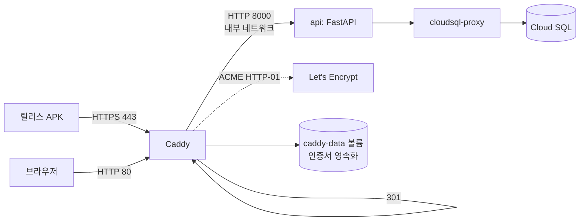

# [계획] dev 서버 HTTPS 적용

| 항목 | 내용 |
|------|------|
| 기능명 | dev 서버 HTTPS 적용 |
| Spec 폴더 | `docs/specs/065-dev-https/` |
| 영역 | 공통 (인프라 · 배포 · frontend 빌드 설정) |
| 작성자 | Claude Code |
| 작성일 | 2026-08-06 |
| 상태 | 계획 |
| Jira | [KAN-64](https://rainbowdev00.atlassian.net/browse/KAN-64) |

## 배경 / 목적

dev 서버(`34.64.226.70`)는 [deploy/docker-compose.yml](../../../deploy/docker-compose.yml)에서 API를 **평문 HTTP 80 포트로 직접 노출**하고 있다. TLS 종단이 아예 없다.

그런데 안드로이드 **릴리스 APK는 평문 HTTP로 통신할 수 없다.** 설치본에서 실측한 값:

```
versionCode=1 minSdk=29 targetSdk=36
pkgFlags=[ HAS_CODE ALLOW_CLEAR_USER_DATA ]     ← USES_CLEARTEXT_TRAFFIC 없음
```

`targetSdk >= 28`이면 cleartext는 기본 차단이고, `usesCleartextTraffic`·`network_security_config`는 [debug 매니페스트에만](../../../frontend/android/app/src/debug/AndroidManifest.xml) 있다. 즉 **HTTPS가 없으면 릴리스 APK로 dev 서버를 검증하는 것 자체가 구조적으로 불가능**하다.

또한 카카오 로그인 세션·토큰이 평문으로 오가는 상태라 보안상으로도 방치할 수 없다.

## 목표 (Goals)

- dev API를 **HTTPS로 제공**하고, 릴리스 APK가 dev 서버에 붙어 로그인까지 성공한다.
- **도메인 구매 없이** 즉시 적용한다.
- 인증서 발급·갱신이 **자동**이어야 한다(수동 갱신 운영 부담 0).
- 기존 배포 파이프라인(GitHub Actions → IAP SSH → `deploy.sh`) 구조를 유지한다.

## 비목표 (Non-Goals)

- 추가 도메인 구매·연결
- 운영(prod) 환경 HTTPS
- HTTP/2·HTTP/3 튜닝, WAF, CDN
- Flutter Web·nginx 도입 (기존 compose 주석의 후속 계획과 별개)

## 요구사항

**기능**
- `https://<host>/health`, `https://<host>/api/v1/*`가 유효한 공인 인증서로 응답한다.
- HTTP(80) 요청은 HTTPS로 리다이렉트한다.
- 인증서 만료 전 자동 갱신된다.

**비기능**
- 컨테이너 재생성·인스턴스 재부팅 후에도 인증서를 **재발급 없이 재사용**한다(Let's Encrypt rate limit 회피).
- 추가 월 비용 0원.
- 배포 실패 시 기존 API를 교체하기 전에 중단한다(현행 `set -e` 동작 유지).

## 설계 개요 / 접근 방식

API 앞에 **Caddy 리버스 프록시**를 두고 TLS를 종단한다. Caddy가 Let's Encrypt ACME로 인증서를 자동 발급·갱신한다.

`colortrip.p-e.kr` 도메인을 고정 퍼블릭 IP `34.64.226.70`에 연결해 쓴다. Let's Encrypt는 이 호스트명에 정상적으로 인증서를 발급한다.



변경 요지:
- `api`의 `ports: ["80:8000"]` 매핑을 **제거**한다. 외부 노출은 Caddy만 담당하고 API는 compose 내부 네트워크로만 접근된다(공격면 축소).
- `caddy` 서비스가 `80:80`, `443:443`을 점유한다.
- 인증서·ACME 계정 키는 `caddy-data` named volume에 영속화한다.
- `deploy.sh`가 `Caddyfile`을 함께 배치하고, health check를 컨테이너 내부(`api:8000`) 기준으로 바꾼다.

## 의사결정 (함께 논의 · 근거 필수)

| 결정할 항목 | 선택지 | 제안 / 근거 | 상태 |
|------|--------|------------|------|
| 호스트명 확보 | A) 실제 연결 도메인 <br> B) sslip.io/nip.io 와일드카드 DNS <br> C) GCP LB + managed cert | **A 적용.** 초기 검증은 sslip.io로 진행했으나, 현재는 `colortrip.p-e.kr`가 고정 퍼블릭 IP `34.64.226.70`에 연결되어 있어 이 값을 `API_DOMAIN`의 기준으로 쓴다. C는 LB 비용이 추가되어 현 dev 인프라 규모에는 과하다 | 합의됨 |
| TLS 종단 방식 | A) Caddy <br> B) nginx + certbot <br> C) Traefik | **A 권장.** B는 certbot 크론·nginx 리로드·초기 발급 chicken-and-egg를 직접 조립해야 한다. C는 라벨 기반 설정이 강력하지만 서비스 2개짜리 compose엔 과하다. Caddy는 Caddyfile 3줄로 ACME 발급·갱신·HTTP 리다이렉트가 전부 기본 동작 — 이 규모에 가장 적은 설정으로 목표 달성 | 합의됨 |
| Caddy 원리·실효성 | — | ACME HTTP-01 챌린지로 80포트에서 소유권을 증명받아 인증서를 발급하고, 만료 30일 전 자동 갱신한다. 갱신 실패 시에도 기존 인증서로 계속 서빙한다. 발급물은 표준 Let's Encrypt 인증서라 안드로이드 시스템 신뢰 저장소에 이미 루트가 있어 **앱 코드 변경이 불필요**하다 | 합의됨 |
| API 80 포트 직접 노출 | A) 유지 <br> B) 제거 | **B 권장.** 유지하면 HTTPS를 우회해 평문으로 API에 접근하는 경로가 남는다. Caddy만 노출하는 게 목적에 부합 | 합의됨 |
| 인증서 영속화 | A) named volume <br> B) 매번 재발급 | **A 필수.** Let's Encrypt는 동일 도메인 주당 발급 횟수 제한이 있어 배포마다 재발급하면 곧 막힌다 | 합의됨 |
| 릴리스 APK 기본 주소 | A) 코드 기본값 변경 <br> B) `--dart-define`으로 주입 | **B 권장.** 현재 `AppConfig`가 이미 `API_BASE_URL`을 필수 주입으로 강제하고 있어([app_config.dart](../../../frontend/lib/core/config/app_config.dart)) 코드에 기본값을 되살리는 건 그 설계를 되돌리는 것. 문서에 표준 빌드 명령을 박아두는 편이 일관적 | 합의됨 |

## 영향 범위

| 파일 | 변경 |
|------|------|
| `deploy/Caddyfile` | **신규** — TLS 종단·리버스 프록시 설정 |
| `deploy/docker-compose.yml` | caddy 서비스 추가, api 포트 매핑 제거, caddy-data/config 볼륨 |
| `deploy/deploy.sh` | `API_DOMAIN` 필수 env 추가, health check 대상 변경 |
| `deploy/.env.example` | `API_DOMAIN` 항목 추가 |
| `deploy/README.md` | HTTPS 구성 설명 |
| `.github/workflows/deploy-dev.yml` | `Caddyfile` scp, `API_DOMAIN` 전달 |
| `docs/conventions/infra-deploy.md` | '도메인 & HTTPS (구축 예정)' 상태 갱신 |
| `docs/app-run-guide.md` | 릴리스 빌드 주소·cleartext 주의 갱신 |
| `frontend/README.md` | 릴리스 빌드 예시 주소 갱신 |
| `README.md` | 실행 파이프라인에 Caddy 반영 |

## 작업 단계

- [x] `deploy/Caddyfile` 작성
- [x] `deploy/docker-compose.yml`에 caddy 추가 · api 포트 제거
- [x] `deploy/deploy.sh`에 `API_DOMAIN` 처리 · health check 변경
- [x] `.github/workflows/deploy-dev.yml`에 Caddyfile 전송 · `API_DOMAIN` 주입
- [x] GitHub 저장소 variable `API_DOMAIN` 등록
- [x] dev 배포 실행 후 `https://colortrip.p-e.kr/health` 검증
- [x] 릴리스 APK를 https 주소로 재빌드 → 에뮬레이터에서 연동 확인
- [x] 문서 갱신 (위 영향 범위 표)
- [x] CodeRabbit 리뷰 반영 (PR [#61](https://github.com/Rainbow-Developer/ColorTrip/pull/61)) — 호스트명 검증 강화, probe 타임아웃·엄격한 200 검사, 외부 HTTPS probe 추가, Caddy 이미지 digest 고정

## 리스크 / 미해결 질문

- **DNS 전파/설정 의존성**: `colortrip.p-e.kr` A 레코드가 `34.64.226.70`을 가리켜야 Caddy 인증서 발급과 공유 링크가 모두 정상 동작한다. 도메인을 바꾸는 경우 `API_DOMAIN` 변수만 바꾸면 되도록 설계했다.
- **Let's Encrypt rate limit**: 발급 실패를 반복하면 일시 차단될 수 있다. 인증서 볼륨 영속화로 완화한다.
- **첫 배포 시 발급 지연**: ACME 챌린지에 수 초~수십 초 걸린다. health check 타임아웃(현행 60초)이 부족하면 늘려야 한다.
- **80 포트 필수**: ACME HTTP-01은 80 포트가 외부에 열려 있어야 한다. 방화벽은 이미 80·443을 허용하고 있어([infra/modules/network/main.tf](../../../infra/modules/network/main.tf)) 추가 작업 없음.
