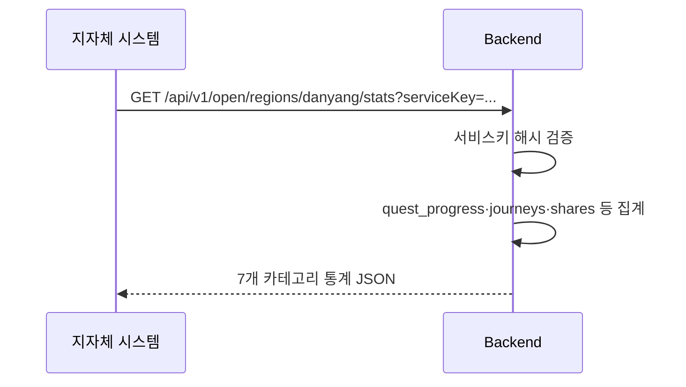

# [설명] 지자체 제공 오픈 API (지역 관광 통계)

## 개요
지자체가 서비스키 하나로 원하는 지역을 골라 관광 활동 통계(방문·인기 관광지·여행자 성향·완주율·인증 방식·월별 추이·공유)를 조회할 수 있는 공개 API. 개인 식별 정보는 전혀 포함하지 않고 전부 집계값만 응답한다.

## 동작 방식
1. 지자체 담당자가 발급받은 `serviceKey`를 쿼리 파라미터로 붙여 `GET /api/v1/open/regions/{region_slug}/stats`를 호출한다.
2. 서버는 `open_api_keys` 테이블에서 해시 비교로 키를 검증한다. 유효하지 않으면 401.
3. 유효하면 해당 지역의 7개 카테고리 통계를 한 JSON으로 묶어 반환한다.
4. 지역 목록은 기존 공개 API `GET /api/v1/regions`를 그대로 안내한다(별도 엔드포인트 없음).



## 주요 구성 요소 / 위치

| 구성 요소 | 역할 | 위치 |
|-----------|------|------|
| 서비스키 모델 | 발급 대상·키 해시·활성 여부 | `backend/app/open_api/models.py` |
| 서비스키 인증 dependency | `serviceKey` 검증, 실패 시 401 | `backend/app/open_api/router.py` (또는 `dependencies.py`) |
| 통계 집계 서비스 | 7개 카테고리 쿼리·계산 | `backend/app/open_api/service.py` |
| 오픈 API 라우터 | `/api/v1/open/regions/{slug}/stats` | `backend/app/open_api/router.py` |
| 키 발급 스크립트 | CLI로 신규 지자체 키 발급 | `backend/scripts/issue_open_api_key.py` |

## 설정 / 사용법
* 신규 지자체에 키를 내주려면 `uv run python scripts/issue_open_api_key.py --name "단양군청"` 같은 스크립트로 발급하고, 원문 키는 그때 한 번만 출력된다(이후 DB에는 해시만 남음).
* 호출 예시: `GET /api/v1/open/regions/danyang/stats?serviceKey=<발급받은키>&months=6`

## 예시
```json
{
  "region": { "id": "...", "name": "단양군", "slug": "danyang" },
  "visit_stats": { "total_completed_quests": 1234, "monthly": [{"month": "2026-07", "count": 210}] },
  "popular_spots": [{"quest_id": "...", "title": "온달산성 전설 OX 퀴즈", "completed_count": 88}],
  "dna_distribution": {"nature": 0.32, "food": 0.18, "history": 0.21, "activity": 0.15, "healing": 0.14},
  "journey_completion": {"started": 340, "completed": 210, "completion_rate": 0.62, "avg_days_to_complete": 3.4},
  "verification_method_breakdown": {"photo": 0.7, "gps": 0.15, "quiz": 0.1, "qr": 0.05},
  "share_stats": {"total_shares": 45, "by_style": {"MAP_AND_DNA": 20, "MAP": 15, "DNA": 10}}
}
```

## 관련 문서
* [030-share-card](../030-share-card/) — 공유 데이터 원본
* [055-journey-map-coloring](../055-journey-map-coloring/) — 여정 완주 개념의 단일 출처
* [conventions/api-design.md](../../conventions/api-design.md), [conventions/auth-security.md](../../conventions/auth-security.md)
