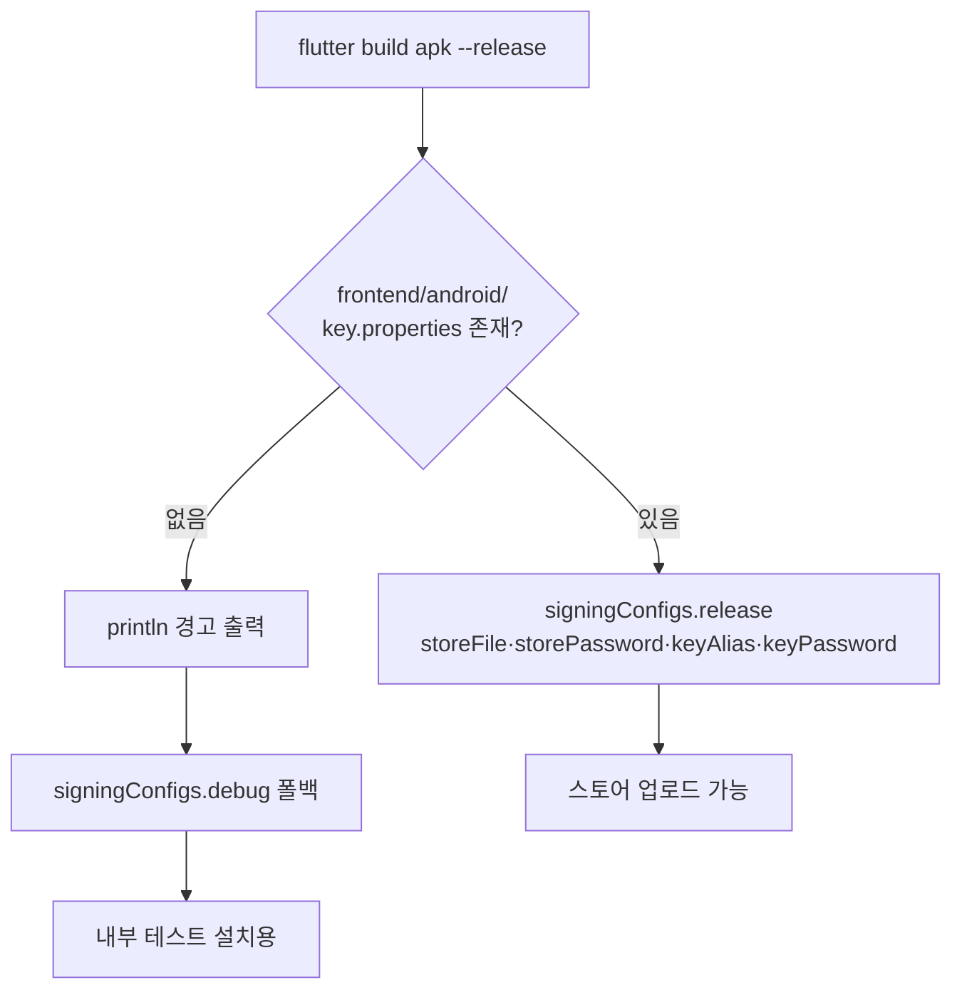

# [설명] Android 릴리스 서명 구성

## 개요

Android 릴리스 APK/AAB의 서명 키를 `android/key.properties`로 주입합니다. 파일이 있으면 그 릴리스 키로, 없으면 debug 키로 폴백해 서명합니다. 폴백은 **스토어 업로드가 불가능**하며 내부 테스트 설치용입니다.

함께, FE 빌드 컨테이너의 디버그 키스토어를 볼륨으로 유지해 **디버그 키 해시가 빌드 간에 고정**되도록 했습니다. 카카오 로그인은 앱 서명의 키 해시로 인증하기 때문에, 키가 매번 바뀌면 로그인이 계속 깨집니다.

## 동작 방식



- 분기는 Gradle **설정 단계**에서 일어납니다(`rootProject.file("key.properties")`).
- `key.properties`가 있는데 항목이 비어 있으면 `key.properties is missing '<이름>'` 으로 즉시 실패합니다 — 잘못된 값으로 조용히 서명되는 것보다 낫습니다.
- debug 폴백 시 `println`으로 경고를 냅니다. `logger.warn`은 flutter가 Gradle 출력을 걸러내며 삼켜서 보이지 않습니다(실측 확인).

디버그 키스토어는 compose 볼륨 `android-config`가 `/root/.android`를 유지합니다. 컨테이너가 `--rm`으로 사라져도 키가 남습니다.

## 주요 구성 요소 / 위치

| 구성 요소 | 역할 | 위치 |
|-----------|------|------|
| 서명 분기 로직 | `key.properties` 존재 여부로 signingConfig 선택 | `frontend/android/app/build.gradle.kts` |
| 설정 템플릿 | 복사해서 값을 채우는 예시 | `frontend/android/key.properties.example` |
| 실제 설정 (커밋 안 됨) | 키스토어 경로·비밀번호·별칭 | `frontend/android/key.properties` |
| 디버그 키 영속화 | `/root/.android` 볼륨 | `frontend/docker-compose.yml` |
| 커밋 차단 | `key.properties`·`*.jks`·`*.keystore` | `frontend/android/.gitignore`, 루트 `.gitignore` |

## 설정 / 사용법

### 릴리스 키로 서명하기

1. 키스토어 생성 (담당자가 직접, **분실하면 앱 업데이트 영구 불가 — 반드시 백업**)

```bash
keytool -genkeypair -v -keystore colortrip-release.jks -alias colortrip -keyalg RSA -keysize 2048 -validity 10000
```

> 비밀번호는 `-storepass`·`-keypass` 인자로 넘기지 말고 **keytool이 물어볼 때 입력**하세요. 명령행 인자로 주면 셸 히스토리와 프로세스 목록(`ps`)에 그대로 남습니다. 여기서 입력한 값을 다음 단계의 `key.properties`에 적습니다.

2. `frontend/android/`에 두고 `key.properties` 작성

```bash
cp frontend/android/key.properties.example frontend/android/key.properties
```

3. 평소처럼 빌드하면 릴리스 키로 서명됩니다.

### 키스토어 없이 빌드하기

아무것도 안 하면 됩니다. debug 키로 서명되고 아래 경고가 뜹니다.

```text
경고: android/key.properties 가 없어 release APK를 debug 키로 서명합니다.
스토어 업로드는 불가하며 내부 테스트 설치용입니다.
```

### 카카오 키 해시 확인

빌드된 APK의 실제 서명에서 뽑는 것이 가장 정확합니다.

```bash
docker compose -f frontend/docker-compose.yml run --rm -u 0:0 frontend bash -c "/opt/android-sdk-linux/build-tools/36.0.0/apksigner verify --print-certs build/app/outputs/flutter-apk/app-release.apk"
```

출력된 SHA-1(16진수)을 base64로 바꾸면 카카오 콘솔에 넣을 키 해시입니다.

```bash
echo "<SHA-1 hex>" | tr -d ':' | xxd -r -p | openssl base64
```

> **Play 배포 시 주의**: Play 앱 서명을 쓰면 기기에서 실행되는 서명은 **구글의 앱 서명 키**입니다. 카카오에는 업로드 키가 아니라 Play Console → 앱 무결성 → 앱 서명 키 인증서의 SHA-1을 등록해야 합니다.

## 예시

릴리스 키 경로가 실제로 동작하는지 임시 키로 검증한 결과:

```text
생성한 키 SHA1 : 50:08:53:09:8A:6C:82:50:6A:DA:AF:16:39:88:C2:8C:8C:2F:05:8C
APK 서명 DN    : C=KR, O=ColorTrip, CN=SigningPathTest
APK SHA-1      : 500853098a6c82506adaaf163988c28c8c2f058c
```

## 관련 문서

- [plan.md](plan.md) — 의사결정 근거
- [implementation.md](implementation.md) — 구현 상태
- [docs/conventions/release.md](../../conventions/release.md) — 출시 경로 SOT
- [frontend/README.md](../../../frontend/README.md) — FE 빌드 명령
