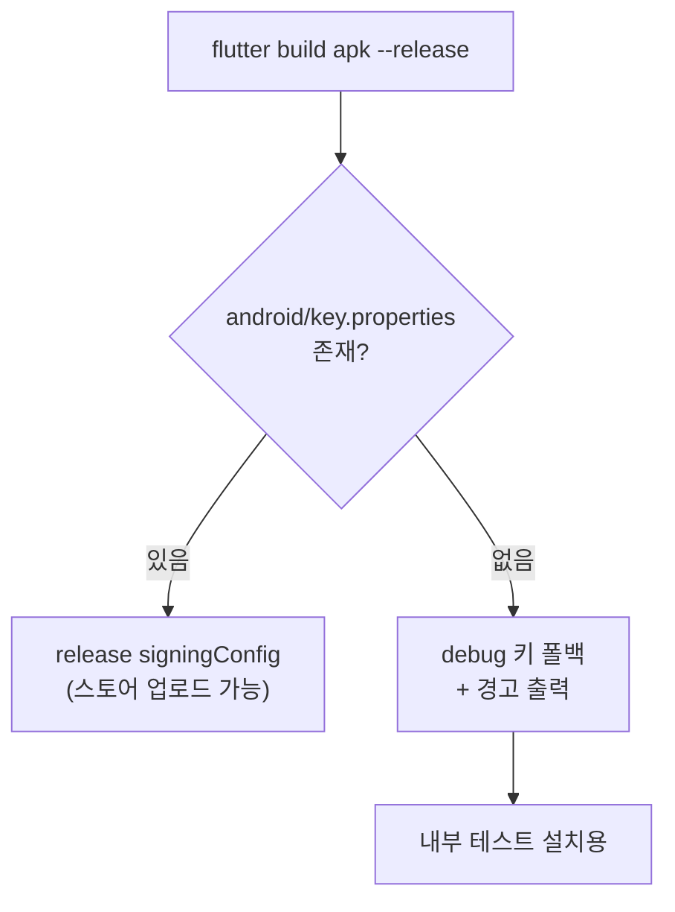

# [계획] Android 릴리스 서명 구성

| 항목 | 내용 |
|------|------|
| 기능명 | Android 릴리스 서명 구성 + 디버그 키 해시 고정 |
| Spec 폴더 | `docs/specs/070-release-signing/` |
| 영역 | frontend (Android 빌드·서명) |
| 작성자 | Claude Code |
| 작성일 | 2026-08-06 |
| 상태 | 계획 |
| Jira | [KAN-67](https://rainbowdev00.atlassian.net/browse/KAN-67) |

## 배경 / 목적

두 가지 문제가 겹쳐 있습니다.

**1. 릴리스 APK가 debug 키로 서명된다.** [build.gradle.kts](../../../frontend/android/app/build.gradle.kts)가 `signingConfig = signingConfigs.getByName("debug")`로 고정돼 있어 스토어 업로드가 불가능합니다.

**2. 디버그 키스토어가 빌드마다 새로 생성된다.** [frontend/docker-compose.yml](../../../frontend/docker-compose.yml)이 `pub-cache`·`gradle-cache`·`android-sdk`만 볼륨으로 잡고 `/root/.android`는 빠뜨렸습니다. 컨테이너를 `--rm`으로 쓰기 때문에 키스토어가 매번 사라집니다. 실측:

```text
1회차 SHA1: 30:2F:3A:CE:E8:59:3F:16:E9:7D:DE:62:14:97:40:25:C6:6E:64:26
2회차 SHA1: 91:4A:69:EE:65:8D:A8:8D:4D:0D:52:1F:64:EE:3F:28:10:9E:A4:2A
```

결과적으로 **빌드할 때마다 카카오 로그인용 키 해시가 바뀌고**, 재설치 시 `INSTALL_FAILED_UPDATE_INCOMPATIBLE`이 납니다.

## 목표 (Goals)

- 릴리스 키스토어가 준비되면 그 키로 서명되는 경로를 만든다.
- **키스토어가 없는 개발 머신에서도 `flutter build apk --release`가 계속 동작**한다.
- 디버그 키 해시가 빌드 간에 고정된다.
- 서명 키가 실수로 커밋되지 않는다.

## 비목표 (Non-Goals)

- **릴리스 키스토어 생성·보관** — 분실하면 앱 업데이트가 영구 불가라 담당자가 직접 만들고 백업해야 한다.
- Play Console·카카오 개발자 콘솔 등록
- Codemagic 파이프라인 구성
- 팀 공용 debug 키스토어 도입 (아래 의사결정 참고)

## 요구사항

- `android/key.properties`가 있으면 릴리스 키로, 없으면 debug 키로 서명한다.
- debug 폴백 시 **조용히 넘어가지 않고 경고를 출력**한다.
- `key.properties`에 항목이 빠져 있으면 명확한 메시지로 실패한다.
- 키스토어·`key.properties`는 git에 올라가지 않는다.

## 설계 개요 / 접근 방식

Flutter 공식 서명 가이드의 `key.properties` 패턴을 따릅니다. Gradle 설정 단계에서 `rootProject/key.properties`(= `frontend/android/key.properties`) 존재 여부로 분기합니다.



디버그 키 고정은 compose에 `android-config:/root/.android` 볼륨을 추가하는 것으로 해결합니다.

## 의사결정 (함께 논의 · 근거 필수)

| 결정할 항목 | 선택지 | 제안 / 근거 | 상태 |
|------|--------|------------|------|
| 키스토어 없을 때 동작 | A) 빌드 실패 <br> B) debug 폴백 + 경고 | **B 권장.** A로 하면 키스토어 없는 팀원·CI가 릴리스 빌드로 동작 확인을 못 한다. 현재 릴리스 APK는 이미 내부 테스트 배포용으로 쓰이고 있어(에뮬레이터·실기기 설치) 그 경로를 끊으면 개발이 막힌다. 다만 조용한 폴백은 "스토어에 못 올리는 APK"를 모르고 만들게 하므로 경고를 반드시 출력 | 합의됨 |
| 경고 출력 방법 | A) `logger.warn` <br> B) `println` | **B.** A로 먼저 구현했으나 flutter가 Gradle 출력을 걸러내며 삼켜서 화면에 뜨지 않는 것을 실측 확인했다. 경고가 안 보이면 없는 것과 같아 `println`으로 교체 | 합의됨 |
| 디버그 키 고정 방법 | A) `/root/.android` 볼륨 <br> B) 팀 공용 debug 키스토어 커밋 | **A 권장.** B는 팀·CI 전체가 키 해시 하나로 통일되는 장점이 있으나, 현재 release 빌드도 debug 키로 서명되는 상태라 그 키를 커밋하면 누구나 이 앱 이름으로 서명된 APK를 만들 수 있다. A는 커밋하는 비밀값이 없고 한 줄 변경이다. 대신 개발자마다 키 해시가 달라 각자 카카오에 등록해야 하는데, 카카오는 키 해시 복수 등록을 지원하므로 감당 가능 | 합의됨 |
| `.gitignore` 위치 | A) 루트에 추가 <br> B) 하위 것만 사용 | **양쪽 다.** `frontend/android/.gitignore`가 이미 `key.properties`·`**/*.jks`·`**/*.keystore`를 막고 있다(Flutter 템플릿). 루트에는 그 디렉토리 **밖에** 키를 두는 사고만 막는 안전망으로 `*.jks`·`*.keystore`만 둔다(중복 아님) | 합의됨 |

## 영향 범위

| 파일 | 변경 |
|------|------|
| `frontend/android/app/build.gradle.kts` | `key.properties` 기반 릴리스 서명 + debug 폴백·경고 |
| `frontend/android/key.properties.example` | **신규** — 설정 템플릿 |
| `frontend/docker-compose.yml` | `android-config:/root/.android` 볼륨 |
| `.gitignore` | 저장소 전체 서명 키 안전망 |
| `docs/conventions/release.md` | 서명 방식 결정 반영 |
| `frontend/README.md` | 릴리스 빌드·서명 설명 |

## 작업 단계

- [ ] `build.gradle.kts` 서명 분기 구현
- [ ] `key.properties.example` 작성
- [ ] compose에 `android-config` 볼륨 추가
- [ ] `.gitignore` 안전망 추가
- [ ] debug 폴백 경로 빌드 검증
- [ ] 릴리스 키 경로 빌드 검증 (임시 키스토어로)
- [ ] 디버그 키 해시 고정 검증
- [ ] 문서 갱신

## 리스크 / 미해결 질문

- **키 해시가 한 번 더 바뀐다.** `android-config` 볼륨이 새로 생기면서 키스토어가 재생성되므로, 기존에 카카오에 등록한 해시는 무효가 된다. 새 해시를 등록해야 하고 **그 이후로는 고정**된다.
- **릴리스 키스토어 분실 = 앱 업데이트 영구 불가.** 생성 후 안전한 곳에 백업하는 절차를 팀이 정해야 한다.
- **Play 앱 서명**을 쓰면 기기에서 실행되는 서명은 구글의 앱 서명 키다. 카카오에는 업로드 키가 아니라 **Play Console의 앱 서명 키 SHA-1**을 등록해야 한다 — 이 스펙 범위 밖이지만 출시 전 반드시 확인할 것.
