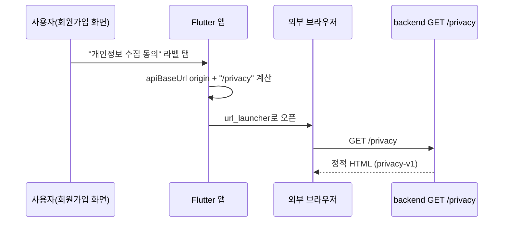

# [계획] 개인정보처리방침 페이지

| 항목 | 내용 |
|------|------|
| 기능명 | 개인정보처리방침 페이지 |
| Spec 폴더 | `docs/specs/075-privacy-policy-page/` |
| 영역 | backend / frontend |
| 작성자 | Claude |
| 작성일 | 2026-08-06 |
| 상태 | 계획 |

## 배경 / 목적

Android 앱을 Google Play에 등록하려면 Play Console 등록 항목에 공개 접근 가능한 privacy
policy URL이 필수다([KAN-66](https://rainbowdev00.atlassian.net/browse/KAN-66)). 현재 회원가입
화면([signup_screen.dart:117-128](../../../frontend/lib/features/onboarding/signup_screen.dart))에
"[필수] 개인정보 수집 동의" 체크박스는 있지만, 실제 방침 문서로 연결되는 링크나 화면이
코드베이스 어디에도 없고 저장소 전체에 공개된 privacy policy URL도 없다. 이 상태로는 Play
심사 등록 자체가 불가능하다.

## 목표 (Goals)

- 외부에서 HTTPS로 접근 가능한 개인정보처리방침 페이지를 제공한다 (Play Console 등록용 URL).
- 회원가입 화면의 개인정보 동의 체크박스에서 이 페이지로 이동할 수 있게 한다.
- 실제 수집 항목(인증 프로필: 닉네임·이메일·생년월일, 위치, 카메라, 여행/퀘스트 인증 데이터)과
  회원탈퇴 절차를 반영한 초안을 작성한다.

## 비목표 (Non-Goals)

- 이용약관(ToS) 본문 작성/연결 — "[필수] 이용약관 동의" 체크박스는 이미 있으나 이번 범위 아님,
  필요시 별도 후속 티켓.
- Play Console에 실제로 URL을 등록하는 작업 — 외부 콘솔 설정이라 코드 범위 밖.
- 법무 검토 — 아래 리스크 참고, 사람이 직접 확인해야 한다.

## 요구사항

- 정적 페이지, 별도 인증 불필요, 외부 크롤러(Play 심사 봇 포함)가 접근 가능해야 한다.
- 페이지는 `docs/conventions/auth-security.md`의 수집 개인정보 SOT(닉네임·이메일·생년월일,
  동의 버전 `privacy-v1`)와 일치해야 한다. 위치·카메라·여행 데이터는 인증 도메인 밖이라 그
  SOT 표에는 없으므로 이 스펙에서 실제 코드 근거(AndroidManifest 권한, 업로드/인증 기능)를
  들어 직접 명시한다.
- 앱 내 링크는 별도 dart-define 없이 기존 필수 빌드값에서 파생한다.

## 설계 개요 / 접근 방식

**backend**: `backend/app/shares/router.py`의 `landing_router` 패턴(APIRouter를 `/api/v1`
prefix 없이 최상위로 등록, `HTMLResponse`로 인라인 HTML 문자열 반환 — 사람이 직접 여는 공개
URL이라는 점에서 동일한 성격,
[060-share-native-experience](../060-share-native-experience/description.md) 참고)을 그대로
재사용한다. 새 모듈 `backend/app/legal/router.py`에 `GET /privacy`를 추가하고
`backend/app/main.py`에 `shares_landing_router`와 같은 방식으로 등록한다. 응답 본문에는 현재
동의 버전 상수(`PRIVACY_CONSENT_VERSION = "privacy-v1"`,
[auth/service.py:25](../../../backend/app/auth/service.py))를 footer에 표시해, 이후 방침
내용이 바뀌면 이 상수를 함께 올려야 한다는 신호를 남긴다.

**frontend**: `signup_screen.dart`의 개인정보 동의 라벨을 탭하면 `url_launcher`로 외부
브라우저를 연다. URL은 `AppConfig.apiBaseUrl`([app_config.dart](../../../frontend/lib/core/config/app_config.dart))의
origin(scheme+host+port)에 `/privacy`를 붙여 계산한다 — 이미 필수 빌드값으로 주입되는
`API_BASE_URL`을 재사용하므로 새 dart-define이 필요 없다.

## 의사결정 (함께 논의 · 근거 필수)

| 결정할 항목 | 선택지 | 제안 / 근거 | 상태 |
|------|--------|------------|------|
| 페이지 렌더링 방식 | A) 인라인 Python 문자열 HTML B) Jinja2 등 템플릿 엔진 도입 | **A 권장.** 페이지가 1개뿐이고 기존 `shares` 랜딩 페이지도 인라인 문자열로 되어 있다(`_render_share_landing_page`). 템플릿 엔진은 새 의존성·설정이 필요해 이 규모에 오버엔지니어링 — 기존 패턴과 일관성 유지가 더 중요 | 합의됨 |
| 라우터 모듈 위치 | A) `shares/router.py`에 추가 B) 새 `app/legal/` 모듈 | **B 권장.** `shares`는 공유카드 도메인이고 개인정보처리방침은 성격이 다른 법적 문서라 같이 두면 응집도가 깨진다. 새 모듈은 라우터 파일 1개뿐이라 구조 오버엔지니어링 아님 | 합의됨 |
| 앱 내 링크 오픈 방식 | A) `url_launcher`로 외부 브라우저 B) in-app WebView 화면 신설 | **A 권장.** 법적 문서는 사용자가 브라우저에서 즐겨찾기/공유하기 편해야 하고, Play 심사 관점에서도 표준적인 방식이다. WebView는 새 의존성 + 화면 + 상태관리가 추가로 필요해 오버엔지니어링. `url_launcher`는 Flutter 공식 패키지(pub.dev, flutter.dev 소속)로 안정적 | 합의됨 |
| URL 계산 방식 | A) 새 dart-define `PRIVACY_POLICY_URL` 추가 B) 기존 `apiBaseUrl`에서 origin 파생 | **B 권장.** 이미 모든 빌드에서 `API_BASE_URL`을 필수로 주입하고 있고([app_config.dart](../../../frontend/lib/core/config/app_config.dart)) privacy 페이지는 항상 같은 backend 배포에 붙어 있으므로 별도 빌드 인자가 불필요하다. 새 dart-define을 추가하면 빌드 커맨드가 하나 더 늘고 두 값이 어긋날 위험만 생긴다 | 합의됨 |

## 영향 범위

- 신규: `backend/app/legal/__init__.py`, `backend/app/legal/router.py`
- 수정: `backend/app/main.py` (라우터 등록), `frontend/pubspec.yaml` (`url_launcher` 추가),
  `frontend/lib/features/onboarding/signup_screen.dart` (링크 연결)
- 문서: 이 spec 폴더, [README.md](../../../README.md) `주요 기능과 위치` 표에 항목 추가

## 작업 단계

- [ ] `backend/app/legal/router.py`에 `GET /privacy` 라우트 추가 (정적 HTML, `privacy-v1` 표시)
- [ ] `backend/app/main.py`에 라우터 등록
- [ ] `frontend/pubspec.yaml`에 `url_launcher` 추가
- [ ] `signup_screen.dart` 개인정보 동의 라벨에 탭 핸들러 연결 (apiBaseUrl origin + `/privacy`)
- [ ] README.md `주요 기능과 위치` 표 갱신
- [ ] 로컬에서 backend 기동 후 `GET /privacy` 응답 확인, 앱에서 탭 → 브라우저 오픈 확인

## 리스크 / 미해결 질문

- **법무 검토 미완료**: 이 페이지 본문은 코드상 수집 항목을 근거로 작성한 초안이며, 실제
  Play Console 등록 전에 사람이 법적 유효성을 검토해야 한다. 페이지 자체에는 "초안" 표시를
  넣지 않는다(실사용자에게 노출되는 공개 문서이므로) — 대신 이 리스크를 PR·Jira에 명시하고
  검토 완료 전까지는 Play Console에 등록하지 않는다.
- **도메인 변경 의존성**: 현재 URL은 `colortrip.p-e.kr`([065-dev-https](../065-dev-https/description.md))
  기반 dev 서버 주소다. 도메인을 바꾸면 이 페이지 URL도 함께 바뀌므로 Play Console 등록
  시점에 재확인이 필요하다.
