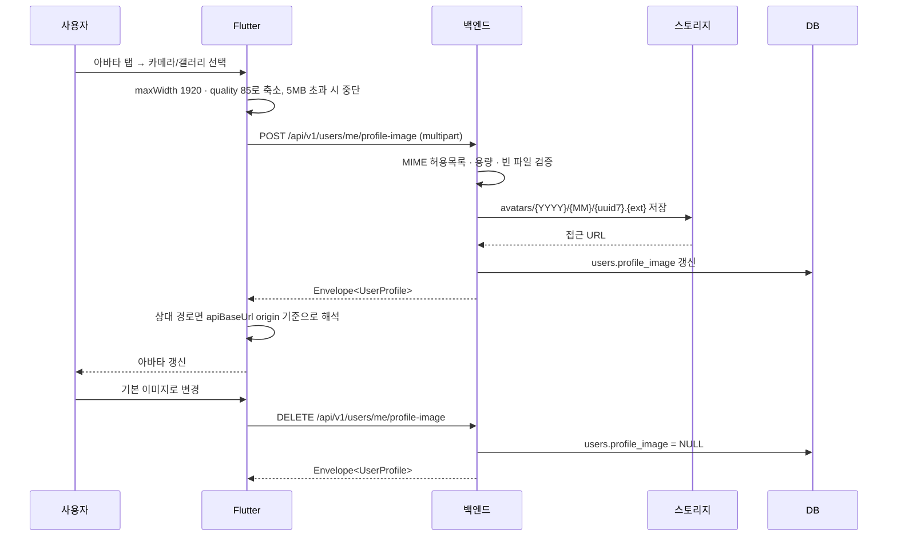

# [설명] 프로필 이미지

## 개요

사용자가 자신의 프로필 이미지를 등록·교체·제거하는 기능이다. 회원가입(온보딩) 중에 선택사항으로 등록할 수 있고, 가입 후에는 `내 정보 수정`에서 언제든 바꾸거나 기본 상태로 되돌릴 수 있다. 등록한 이미지는 `마이` 화면과 `내 정보 수정` 화면의 아바타 자리에 표시된다.

카카오로 처음 로그인하면 카카오 프로필 사진이 초기값으로 채워지므로, 아무것도 하지 않아도 아바타가 비어 있지 않다. 사용자가 직접 올린 이미지는 이 초기값을 덮어쓰며, `기본 이미지로 변경`을 선택하면 값이 비워져 플레이스홀더가 표시된다.

이미지 자체는 퀘스트 사진 인증과 같은 스토리지(운영은 GCS, 개발·테스트는 로컬 디스크)에 저장되고, 사용자 레코드에는 접근 URL만 남는다.

## 동작 방식

이미지 선택 즉시 서버로 업로드되어 저장까지 한 번에 끝난다. 회원가입 화면에서도 마찬가지이며, 온보딩 완료(`다음` 버튼)와는 독립적인 요청이다.



두 endpoint 모두 `ActiveUser`만 요구한다. 회원가입 중에는 닉네임·생년월일·동의가 아직 없어 상위 단계인 `ProfiledUser`·`CurrentUser`를 만족할 수 없기 때문이다. 단계별 접근 제어의 단일 출처는 [인증 & 보안 컨벤션](../../conventions/auth-security.md)이다.

저장은 성공했는데 DB commit이 실패하면, 별도 세션으로 실제 저장 여부를 다시 확인한 뒤 저장되지 않았을 때만 스토리지 객체를 지운다. 퀘스트 사진 업로드와 동일한 보상 로직을 공유한다.

응답 URL은 스토리지 구현에 따라 형태가 다르다. 로컬 디스크는 `/uploads/avatars/…` 상대 경로를, GCS는 `https://storage.googleapis.com/…` 절대 URL을 돌려준다. 카카오 초기값은 카카오 CDN 절대 URL이다. 클라이언트는 세 경우를 모두 `apiBaseUrl` origin 기준으로 해석해 절대 URL은 그대로 통과시킨다.

## 주요 구성 요소 / 위치

| 구성 요소 | 역할 | 위치 |
|-----------|------|------|
| `POST /users/me/profile-image` | 이미지 업로드 + `users.profile_image` 갱신 | `backend/app/auth/router.py` |
| `DELETE /users/me/profile-image` | 프로필 이미지 제거(멱등) | `backend/app/auth/router.py` |
| `replace_profile_image()` · `remove_profile_image()` | 위 두 endpoint의 비즈니스 로직 | `backend/app/auth/service.py` |
| `store_uploaded_image()` | MIME·용량·빈 파일 검증 후 스토리지 저장 (퀘스트 사진과 공용) | `backend/app/uploads/service.py` |
| `commit_or_discard_image()` | commit 실패 시 저장 객체 보상 삭제 (퀘스트 사진과 공용) | `backend/app/uploads/service.py` |
| `PhotoStorage` | GCS / 로컬 디스크 스토리지 추상화 | `backend/app/uploads/storage.py` |
| `users.profile_image` | 현재 프로필 이미지 URL (nullable, 최대 500자) | `backend/app/auth/models.py` |
| `ProfileImagePicker` | 아바타 표시 + 카메라/갤러리/제거 바텀시트 | `frontend/lib/core/widgets/profile_image_picker.dart` |
| `pickImageBytes()` | 이미지 피킹·축소·용량 가드·MIME 판별 (퀘스트 인증과 공용) | `frontend/lib/core/image_picking.dart` |
| `resolveUploadUrlProvider` | 업로드 URL을 `apiBaseUrl` origin 기준 절대 URL로 해석 | `frontend/lib/core/network/dio_client.dart` |
| `uploadProfileImage()` · `removeProfileImage()` | 두 endpoint 호출 | `frontend/lib/data/repositories/auth_repository.dart` |
| 회원가입 화면 피커 | 온보딩 중 선택 등록 | `frontend/lib/features/onboarding/signup_screen.dart` |
| 내 정보 수정 피커 | 가입 후 교체·제거 | `frontend/lib/features/profile/edit_profile_screen.dart` |
| 마이 화면 아바타 | 표시 전용 | `frontend/lib/features/profile/profile_screen.dart` |

## 설정 / 사용법

스토리지 설정은 퀘스트 사진 업로드와 완전히 공유하며 프로필 이미지 전용 환경 변수는 없다.

| 환경 변수 | 기본값 | 설명 |
|-----------|--------|------|
| `GCS_UPLOAD_BUCKET` | (빈 값) | 설정하면 GCS에 저장한다. 비어 있으면 로컬 디스크를 사용한다 |
| `UPLOAD_DIR` | `./uploads` | 로컬 스토리지 경로 |
| `MAX_UPLOAD_SIZE_MB` | `10` | 서버 측 업로드 용량 상한 |

허용 형식은 `image/jpeg`, `image/png`, `image/webp`, `image/heic`다. 클라이언트는 업로드 전에 5MB로 한 번 더 제한한다.

## 예시

업로드 요청과 응답:

```http
POST /api/v1/users/me/profile-image
Authorization: Bearer {access_token}
Content-Type: multipart/form-data; boundary=...

(file: profile.png, image/png)
```

```json
{
  "data": {
    "id": "0198...",
    "email": "user@example.com",
    "nickname": "여행자",
    "birth_date": "2000-01-01",
    "profile_image": "/uploads/avatars/2026/08/0198abcd....png",
    "dna": null,
    "social_provider": "kakao",
    "onboarding_step": "profile",
    "is_restored": false
  }
}
```

제거 요청은 같은 경로에 `DELETE`를 보내며, 응답의 `profile_image`가 `null`이 된다. 이미 `null`인 상태에서 다시 호출해도 동일하게 성공한다.

클라이언트의 URL 해석 결과:

| 서버가 준 값 | `apiBaseUrl` | 화면에서 사용하는 URL |
|--------------|--------------|----------------------|
| `/uploads/avatars/2026/08/a.png` | `https://api.example.com/api/v1` | `https://api.example.com/uploads/avatars/2026/08/a.png` |
| `https://storage.googleapis.com/bucket/avatars/…` | (무관) | 그대로 |
| `https://k.kakaocdn.net/…` | (무관) | 그대로 |
| `null` | (무관) | 플레이스홀더 표시 |

## 관련 문서

- [계획](./plan.md) · [구현 수준](./implementation.md)
- [인증 & 보안 · 개인정보 컨벤션](../../conventions/auth-security.md) — 수집 PII 범위와 단계별 접근 제어의 단일 출처
- [035 Kakao 통합 인증](../035-kakao-auth-integration/) — 프로필·동의 온보딩과 탈퇴 익명화
- [010 여행 퀘스트](../010-journey/) — 사진 업로드 스토리지 결정
- [050 퀘스트 인증](../050-quest-verification/) — 공용 업로드 헬퍼를 함께 쓰는 다른 경로
- [075 개인정보처리방침 페이지](../075-privacy-policy-page/) — 수집 항목 고지
