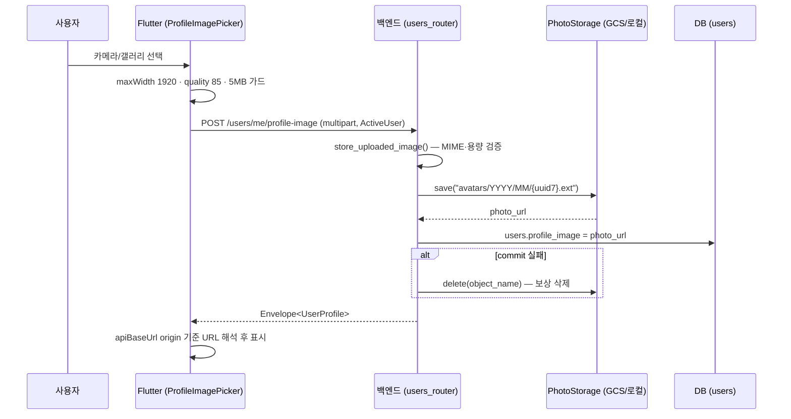

# [계획] 프로필 이미지

| 항목 | 내용 |
|------|------|
| 기능명 | 프로필 이미지 |
| Spec 폴더 | `docs/specs/080-profile-image/` |
| 영역 | backend / frontend |
| 작성자 | KAN-74 담당 |
| 작성일 | 2026-08-13 |
| 상태 | 구현 완료 (에뮬레이터 수동 E2E 미실시) |

## 배경 / 목적

회원가입 화면이 프로필 이미지를 선택사항으로 받도록 계획되어 있었으나 구현이 누락됐다.

`users.profile_image` 컬럼(`String(500)`, nullable)은 [015-database-migration](../015-database-migration/)에서 이미 추가됐고, `UserProfile` 응답 스키마와 Flutter `UserProfile.profileImage`도 이 필드를 실어 나른다. 그러나 **쓰기 경로와 UI가 통째로 비어 있다**:

- 회원가입 화면([signup_screen.dart](../../../frontend/lib/features/onboarding/signup_screen.dart))에 이미지 선택 UI가 없다. `image_picker` 의존성은 퀘스트 사진 인증용으로 이미 있으나 import되지 않는다.
- `OnboardingProfileRequest`·`UserProfileUpdateRequest`([schemas.py](../../../backend/app/auth/schemas.py))와 `save_onboarding_profile()`([service.py](../../../backend/app/auth/service.py))이 이 컬럼을 다루지 않는다.
- 프로필 표시 화면 두 곳이 하드코딩 플레이스홀더다 — [profile_screen.dart:31](../../../frontend/lib/features/profile/profile_screen.dart)의 빈 `CircleAvatar`, [edit_profile_screen.dart:72-84](../../../frontend/lib/features/profile/edit_profile_screen.dart)의 👤 이모지 컨테이너. **값이 있어도 앱 어디에도 보이지 않는다.**

현재 이 컬럼의 유일한 기록 경로는 카카오 최초 로그인 시 카카오 프로필 사진 URL을 초기값으로 저장하는 `_new_kakao_user()`([service.py](../../../backend/app/auth/service.py))다. 사용자가 직접 선택·교체·제거하는 경로가 없다.

이 기능은 그 쓰기 경로와 표시 경로를 채운다.

## 목표 (Goals)

| ID | 목표 |
|----|------|
| PROF-IMG-01 | 회원가입(온보딩) 중에 프로필 이미지를 선택사항으로 등록할 수 있다 |
| PROF-IMG-02 | 내 정보 수정에서 프로필 이미지를 교체할 수 있다 |
| PROF-IMG-03 | 등록한 이미지를 제거해 기본 상태(`NULL`)로 되돌릴 수 있다 |
| PROF-IMG-04 | 마이 화면과 내 정보 수정 화면이 실제 프로필 이미지를 표시한다 |
| PROF-IMG-05 | 업로드 검증·저장·보상 삭제 로직을 퀘스트 사진 업로드와 하나의 구현으로 공유한다 |

## 비목표 (Non-Goals)

- 이미지 크롭·회전·필터 등 편집 기능.
- 교체·삭제·탈퇴로 참조가 끊긴 스토리지 객체의 정리(의사결정 2 참고).
- 프로필 이미지에 대한 별도 신고·검열·모더레이션 흐름.
- 카카오 프로필 이미지의 재동기화(재로그인 시 기존 값을 덮어쓰지 않는 [035](../035-kakao-auth-integration/) 정책 유지).
- 공유 카드에 아바타를 **표시하는** 기능 추가(의사결정 5는 미사용 필드 제거만 다룬다).
- 이미지 원본에 대한 접근 제어(signed URL) 도입.

## 요구사항

### 업로드 · 제거

- `POST /api/v1/users/me/profile-image`는 multipart `file` 하나를 받아 저장하고 `users.profile_image`를 갱신한 뒤 최신 `UserProfile`을 반환한다.
- `DELETE /api/v1/users/me/profile-image`는 `users.profile_image`를 `NULL`로 만들고 최신 `UserProfile`을 반환한다. 이미 `NULL`이어도 성공한다(멱등).
- 두 endpoint 모두 `ActiveUser`를 요구한다. 회원가입 중에는 닉네임·생년월일·동의가 아직 없어 `ProfiledUser`·`CurrentUser`를 만족할 수 없다.
- 허용 형식은 기존 업로드와 동일하게 `image/jpeg`, `image/png`, `image/webp`, `image/heic`로 제한하고, 그 외에는 저장 없이 422를 반환한다.
- 용량 상한은 서버 `MAX_UPLOAD_SIZE_MB`(기본 10MB)를 따르며, 빈 파일도 거부한다.
- 저장 객체 경로는 `avatars/{YYYY}/{MM}/{uuid7}.{ext}`로 퀘스트 사진(`photos/…`)과 분리한다.
- 저장은 성공했으나 DB commit이 실패하면 저장된 객체를 보상 삭제한다.
- 프로필 이미지는 `uploaded_photos` 소유권 행을 만들지 않는다(의사결정 1).

### 클라이언트

- 회원가입 화면은 닉네임 입력 위에 원형 아바타 피커와 `프로필 이미지 (선택)` 캡션을 표시한다.
- 피커를 누르면 카메라 촬영 / 갤러리에서 선택 / 기본 이미지로 변경(등록된 이미지가 있을 때만)을 고르는 바텀시트를 연다.
- 이미지는 선택 즉시 업로드한다(의사결정 3).
- 클라이언트는 업로드 전에 `maxWidth: 1920`, `imageQuality: 85`로 축소하고 5MB를 넘으면 요청하지 않는다 — 퀘스트 사진 인증과 동일한 상한이다.
- 서버가 돌려주는 URL이 상대 경로(`/uploads/…`)이면 `apiBaseUrl`의 origin 기준으로 해석한다. 절대 URL(GCS·카카오 CDN)은 그대로 사용한다.
- 마이 화면과 내 정보 수정 화면은 등록된 이미지를 표시하고, 없으면 기존과 같은 플레이스홀더를 표시한다.
- 업로드·삭제 실패는 화면 전환 없이 오류 메시지로 알리고 직전 상태를 유지한다.

### 개인정보

- 수집하는 인증/프로필 개인정보 범위에 프로필 이미지(선택)를 추가하고 [인증 & 보안 컨벤션](../../conventions/auth-security.md)을 단일 출처로 갱신한다.
- 개인정보처리방침 페이지([075](../075-privacy-policy-page/))의 수집 항목 표에 프로필 이미지를 반영한다.
- 탈퇴 시 `profile_image`는 기존 익명화 경로에서 이미 `NULL`이 된다 — 추가 구현이 필요 없다.

## 설계 개요 / 접근 방식

기존 `POST /api/v1/uploads/photo`는 `CurrentUser`(DNA까지 완료) 게이트라 회원가입 중에는 호출할 수 없다. 전용 endpoint를 신설하되, 검증·저장·보상 삭제 로직은 `uploads` 모듈의 공용 헬퍼로 추출해 두 경로가 함께 사용한다(의사결정 6).

백엔드는 응답 스키마를 바꾸지 않는다. `UserProfile`에 `profile_image`가 이미 있어 온보딩 요청 body(`extra="forbid"`)를 건드릴 필요가 없다.

프론트엔드는 세 개의 공용 조각을 새로 만들고 화면 세 곳이 이를 공유한다.

| 조각 | 역할 |
|------|------|
| `resolveUploadUrlProvider` | 상대 경로 업로드 URL을 `apiBaseUrl` origin 기준 절대 URL로 해석 |
| `core/image_picking.dart` | 피킹·용량 가드·MIME 판별 순수 로직 (현재 퀘스트 인증 화면의 private state에 갇혀 있음) |
| `ProfileImagePicker` | 아바타 표시 + 바텀시트 (provider 비의존, 테스트 seam 포함) |

## 의사결정 (함께 논의 · 근거 필수)

| 결정할 항목 | 선택지 | 제안 / 근거 | 상태 |
|------|--------|------------|------|
| 1. 업로드 endpoint | A) 기존 `/uploads/photo` 게이트를 `ActiveUser`로 완화하고 온보딩 요청에 `profile_image` URL 필드 추가 + `require_owned_photo()` 검증 B) 전용 `POST`·`DELETE /users/me/profile-image` 신설 | **B 권장.** A는 퀘스트 사진과 동일한 2단계 패턴이라 일관적이지만, 일반 업로드 API가 온보딩 미완료 사용자 전체에게 열리고 [035의 권한 사다리](../035-kakao-auth-integration/plan.md)("업로드는 `CurrentUser`") 문구가 깨진다. B는 요청 1회로 끝나 소유권 검증 배관이 불필요하고, 아바타가 "현재 한 장"이라는 의미(교체는 덮어쓰기)와도 맞는다. 검증·저장 로직 중복은 6번 결정으로 해소한다 | 합의됨 |
| 2. 교체·삭제 시 이전 스토리지 객체 정리 | A) 즉시 삭제 B) v1에서는 방치하고 후속 과제로 | **B 권장.** 삭제하려면 URL→object_name 역매핑이 필요한데 **카카오 CDN URL을 반드시 제외**해야 하고, 매핑 버그는 복구 불가능한 객체 삭제로 이어진다. 저장소 전체에서 `storage.delete` 호출부는 보상 삭제 한 곳뿐이며 퀘스트 사진도 정리하지 않으므로 방치가 오히려 일관적이다. 이 앱 규모에서 교체당 최대 10MB는 GCS lifecycle 규칙으로 나중에 일괄 처리하는 편이 저렴하다. `implementation.md` 알려진 한계에 명시한다 | 합의됨 |
| 3. 회원가입 화면의 업로드 시점 | A) 선택 즉시 업로드 B) 바이트를 들고 있다가 "다음" 탭 시 업로드 | **A 권장.** 서버에 draft 슬롯이 없어 B는 "다음"에서 순차 요청 2건(POST 이미지 → PUT 온보딩)이 되고, 중간 실패 시 부분 저장 상태가 생긴다 — B가 피하려던 문제를 오히려 만든다. A는 서버 거부(미지원 형식·용량 초과)가 선택 시점에 드러나고, 즉시 반영이 유일하게 자연스러운 내 정보 수정 화면과 위젯을 그대로 공유할 수 있다. 가입 중단 시 고아 객체가 남지만 2번 결정에서 이미 감수하는 부류이고, 사용자 행은 카카오 로그인 시점에 이미 존재한다 | 합의됨 |
| 4. `uploaded_photos` 소유권 행 생성 | A) 생성 B) 미생성 | **B 권장.** 생성하면 아바타 URL이 `require_owned_photo()`를 통과해 **퀘스트 사진 인증에 재사용 가능해지는 보안 회귀**가 생긴다. 프로필 이미지의 소유권 SOT는 `users.profile_image` 컬럼 자체이므로 별도 대장이 필요 없다. 이 결정을 고정하는 회귀 테스트를 둔다 | 합의됨 |
| 5. 공개 공유 카드의 아바타 노출 | A) 현행 유지 B) 공유 응답에서 아바타 제외 C) 유지하되 개인정보처리방침에 명시 | **B 권장.** `GET /api/v1/shares/{share_code}`([shares/router.py](../../../backend/app/shares/router.py))는 **무인증**이며 `owner_profile_image`를 그대로 반환한다. GCS는 공개 읽기 버킷을 전제하므로 공유 코드를 아는 누구나 아바타 원본에 접근할 수 있다. 지금까지는 카카오 CDN URL만 노출됐지만 사용자가 직접 올린 사진이 들어가면 성격이 달라진다. **확인 결과 이 필드를 소비하는 코드가 없다** — Flutter 앱도, 서버 렌더링 공유 랜딩 페이지(`owner_nickname`만 사용)도 쓰지 않는다. 쓰지 않는 필드가 PII를 무인증으로 흘리고 있으므로 `ShareReadResponse`·`ShareSummaryResponse`에서 제거하는 것이 비용 없이 노출면을 줄이는 방법이다. 나중에 공유 카드에 아바타가 필요해지면 그때 C로 다시 판단한다.  **유래**: [030-share-card](../030-share-card/)·[060-share-native-experience](../060-share-native-experience/) 어느 스펙에도 아바타 언급이 없다. 공유 API 최초 구현(PR #45, KAN-37, 2026-07-23)에서 `owner_nickname`과 함께 "소유자 정보 한 세트"로 넣었으나 카드 디자인에 아바타가 없어 소비되지 않았다. 스펙에 근거가 없는 필드이므로 제거해도 계약 축소가 아니다 | 합의됨 |
| 6. 검증·저장 로직 공유 방식 | A) 전용 endpoint에 복사 B) `uploads/service.py`로 헬퍼 추출 후 양쪽에서 호출 | **B 권장.** MIME 허용목록·2단계 용량 검증·object_name 생성·"새 세션으로 저장 여부 재확인 후 보상 삭제"는 미묘한 순서 의존이 있어 복사하면 한쪽만 고쳐지는 드리프트가 확실히 생긴다. 추출은 새 의존성 없이 함수 2개를 옮기는 수준이고, 기존 `/uploads/photo`의 URL·응답을 바꾸지 않으므로 회귀 위험이 낮다 | 합의됨 |
| 7. `privacy-v1` 버전 상향 | A) 유지 B) `privacy-v2`로 상향 | **A 권장.** 수집 항목이 늘어 개인정보처리방침 본문은 갱신하지만, 아직 Play Console 등록 전이라 재동의를 받아야 할 운영 사용자가 없다. B로 올리면 `has_current_required_consents()`가 전원 실패해 **기존 사용자 전체가 `onboarding_step="profile"`로 되돌아간다.** 실제 출시 이후 항목이 바뀔 때 상향한다 | 합의됨 |

## 영향 범위

### 백엔드

| 파일 | 변경 |
|------|------|
| `backend/app/uploads/service.py` | `ALLOWED_IMAGE_TYPES`, `StoredImage`, `store_uploaded_image()`, `commit_or_discard_image()` 추가 |
| `backend/app/uploads/router.py` | 추출한 헬퍼를 사용하도록 축소. `photos/` prefix와 응답은 그대로 유지 |
| `backend/app/auth/service.py` | `replace_profile_image()`, `remove_profile_image()` 추가 |
| `backend/app/auth/router.py` | `users_router`에 `POST`·`DELETE /me/profile-image` 추가 |
| `backend/app/shares/schemas.py`·`service.py` | 미사용 `owner_profile_image`·`profile_image` 제거 (의사결정 5) |
| `backend/app/legal/router.py` | 개인정보처리방침 수집 항목 표·시행일 갱신 |
| `backend/tests/test_profile_image.py` | 신규 |
| `backend/tests/test_uploads.py` | 리팩터링 회귀 가드 1건 추가 |

DB 마이그레이션은 없다. 컬럼이 이미 존재하고, `backend/tests/test_migration_graph.py`가 head를 고정하고 있어 새 revision을 추가하면 오히려 테스트가 깨진다.

### 프론트엔드

| 파일 | 변경 |
|------|------|
| `frontend/lib/core/network/dio_client.dart` | `resolveUploadUrlProvider` 추가 |
| `frontend/lib/core/image_picking.dart` | 신규 — 피킹 순수 로직 추출 |
| `frontend/lib/core/widgets/profile_image_picker.dart` | 신규 — 공용 아바타 피커 |
| `frontend/lib/data/repositories/auth_repository.dart` | `uploadProfileImage()`, `removeProfileImage()` 추가 |
| `frontend/lib/state/auth_controller.dart` | 위 두 메서드 연결 |
| `frontend/lib/features/onboarding/signup_screen.dart` | 피커 삽입 |
| `frontend/lib/features/profile/edit_profile_screen.dart` | 하드코딩 플레이스홀더를 피커로 교체 |
| `frontend/lib/features/profile/profile_screen.dart` | 빈 `CircleAvatar`를 실제 이미지로 교체 |
| `frontend/lib/features/quests/quest_verify_screen.dart` | 추출한 피킹 로직 사용하도록 리팩터링 |
| `frontend/lib/features/quests/quest_detail_screen.dart` | 인라인 URL 해석을 provider로 교체 |
| `frontend/test/**`, `frontend/integration_test/**` | 신규 테스트 + `AuthRepository` fake 3곳 갱신 |

### 함께 갱신할 문서

| 문서 | 변경 |
|------|------|
| [docs/conventions/auth-security.md](../../conventions/auth-security.md) | 수집 PII 범위(SOT)에 프로필 이미지(선택) 추가, 프로필 이미지 업로드·삭제의 `ActiveUser` 예외 명시 |
| [docs/specs/035-kakao-auth-integration/](../035-kakao-auth-integration/) | PII를 3개로 한정한 서술과 "업로드는 `CurrentUser`" 문구를 현행화하고 이 스펙으로 링크 |
| [docs/specs/075-privacy-policy-page/](../075-privacy-policy-page/) | 수집 항목 표 변경 반영 |
| `README.md` | 주요 기능과 위치 표에 행 추가 |
| [docs/specs/README.md](../README.md) | 080 행 추가 |

## 작업 단계

- [x] 1. 스펙 3종 작성 + 동기화 문서 갱신 → 사용자 승인
- [x] 2. `uploads/service.py` 헬퍼 추출, `uploads/router.py` 축소 → `test_uploads.py` 녹색 확인
- [x] 3. `auth` service·router에 프로필 이미지 endpoint 추가, `shares` 응답에서 미사용 아바타 필드 제거
- [x] 4. `test_profile_image.py` 작성 → 백엔드 전체 검증
- [x] 5. `resolveUploadUrlProvider`·`image_picking.dart` 추출 후 기존 호출부 리팩터링 → 프론트 스위트 확인
- [x] 6. `ProfileImagePicker` + repository·controller + 화면 3곳 + fake 3곳
- [x] 7. 프론트 테스트 작성 → 전체 검증 → `implementation.md` 갱신
- [ ] 8. Android 에뮬레이터 수동 E2E

## 리스크 / 미해결 질문

- GCS 공개 읽기 버킷 전제([010-journey](../010-journey/) 의사결정 3)가 프로필 이미지에도 그대로 적용된다. URL을 아는 누구나 원본에 접근할 수 있으며, 비공개 버킷 + signed URL 전환은 이 스펙의 범위가 아니다.
- 스토리지 객체를 정리하지 않는 결정(2번)은 개인정보처리방침의 "탈퇴 시 지체 없이 파기" 문구와 긴장 관계에 있다. DB 컬럼은 즉시 `NULL`이 되지만 객체 자체는 남는다 — lifecycle 규칙 도입 시점을 별도로 판단해야 한다.
- 회원가입 화면에서 `auth.isBusy`가 모든 입력과 "다음" 버튼을 잠그므로, 업로드 중 잠깐 폼 전체가 비활성화된다. 피커가 자체 스피너를 표시하지만 체감이 나쁘면 `isBusy` 분리가 필요하다.
- 사진 인증과 마찬가지로 `image_picker` 플랫폼 채널이 필요한 구간은 위젯 테스트 범위 밖이라, 실제 카메라·갤러리 동작은 에뮬레이터 수동 확인에 의존한다.
