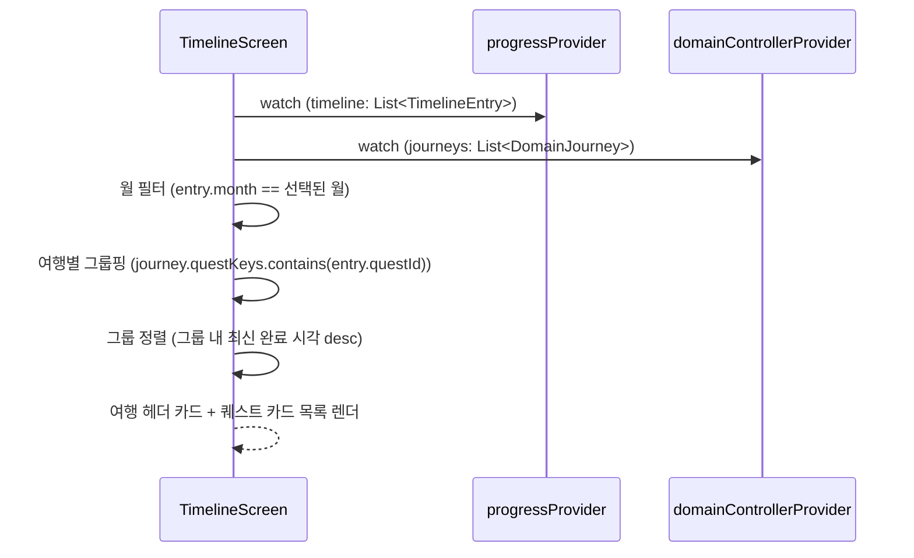

# [설명] 여행 타임라인 화면 — 여행별 그룹핑

## 개요
여행 타임라인(`/timeline`) 화면에서 완료한 퀘스트를 소속 여행(`DomainJourney`) 단위로 묶어서 보여주는 기능이다. 기존에는 월별로만 나열되어 여러 여행을 다닌 사용자가 "이 퀘스트를 어느 여행에서 완료했는지" 알기 어려웠다. `/travel`(여행 목록) 화면이 이미 쓰고 있는 여행 그룹 정보를 그대로 가져와, 타임라인에서도 여행 카드 아래에 그 여행에서 완료한 퀘스트를 시간순으로 보여준다.

## 동작 방식
1. `TimelineScreen`이 `progressProvider`(완료 퀘스트 타임라인)와 `domainControllerProvider`(여행 목록)를 함께 구독한다.
2. 선택된 월(기존 ‹ YYYY년 M월 › 네비게이터)로 완료 퀘스트를 먼저 필터링한다.
3. 필터링된 각 완료 퀘스트를, 그 퀘스트 id가 `questKeys`에 포함된 여행(`DomainJourney`)에 배정한다. 어떤 여행에도 속하지 않으면 지역명 기준 "미분류" 그룹으로 배정한다.
4. 그룹(여행)을 그룹 내 가장 최근 완료 시각 기준으로 정렬한다.
5. 화면은 그룹마다 여행 헤더 카드(제목·기간·지역 태그·`퀘스트 done/total`) + 그 여행에서 완료한 퀘스트를 기존 타임라인 카드(점+선 마커, 사진·지역/유형 태그) 스타일로 나열한다.



## 주요 구성 요소 / 위치

| 구성 요소 | 역할 | 위치 |
|-----------|------|------|
| `TimelineScreen` | 월 필터 + 여행별 그룹핑 + 렌더링 | `frontend/lib/features/timeline/timeline_screen.dart` |
| `_TimelineRow` | 완료 퀘스트 1건의 카드(점+선 마커, 사진 fallback, 지역/유형 태그) | `frontend/lib/features/timeline/timeline_screen.dart` |
| 여행 그룹 헤더 위젯 | 제목·기간·지역 태그·진행도를 보여주는 여행 카드 | `frontend/lib/features/timeline/timeline_screen.dart` (`travel_list_screen.dart`의 `_TripCard`와 스타일 공유) |
| `DomainJourney` | 여행 1건의 메타(id·지역·퀘스트 목록·기간·상태) | `frontend/lib/data/repositories/domain_repository.dart` |
| `TimelineEntry` | 완료 퀘스트 1건의 기록(퀘스트 id·완료 시각·인증 사진) | `frontend/lib/state/progress_state.dart` |
| `domainControllerProvider` | 서버 동기화된 여행 목록·타임라인 스냅샷 제공 | `frontend/lib/state/domain_controller.dart` |

## 설정 / 사용법
* 진입 경로: 홈 화면 "최근 완료" 섹션의 "더보기" → `context.push('/timeline')`.
* 별도 환경변수·설정 없음 — 기존 `progressProvider`/`domainControllerProvider` 데이터를 프론트에서 조합만 한다.

## 예시
`옥천 여행`(2026.08.11~08.13, 퀘스트 1/3)에 속한 완료 퀘스트가 "화인산림욕장 절경 인증샷"(2026.08.10, 옥천군, 자연탐험) 하나뿐이라면, 2026년 8월 그룹에 다음과 같이 보인다.

```
[여행 카드] 옥천 여행   2026.08.11 ~ 08.13   [옥천군]   퀘스트 1/3
  ● 화인산림욕장 절경 인증샷   2026.08.10   [옥천군][자연탐험]
```

## 관련 문서
* [025-travel-timeline](../025-travel-timeline/) — 백엔드 타임라인 API (이 스펙이 쓰는 `TimelineEntry`/`DomainTimelineEntry`의 서버 쪽 출처, 프론트 UI는 비목표로 명시되어 있어 이 스펙에서 다룬다)
* `travel_list_screen.dart` — 여행 그룹 헤더 스타일의 원본 참고
