# [계획] 여행 타임라인 화면 — 여행별 그룹핑

| 항목 | 내용 |
|------|------|
| 기능명 | 여행 타임라인 화면 — 여행별 그룹핑 |
| Spec 폴더 | `docs/specs/080-timeline-journey-grouping/` |
| 영역 | frontend |
| 작성자 | Claude (AI) |
| 작성일 | 2026-08-11 |
| 상태 | 계획 |

## 배경 / 목적
* `/timeline`(여행 타임라인) 화면은 완료한 퀘스트를 월별로만 나열할 뿐, **어느 여행(journey)에서 완료했는지** 구분이 없다.
* `/travel`(여행 목록) 화면은 이미 `DomainJourney` 단위로 여행을 묶어 보여주고 있어([025-travel-timeline](../025-travel-timeline/)는 백엔드 API 범위라 이 프론트 UI는 다루지 않음), 같은 그룹핑 기준을 타임라인에도 적용할 수 있다.
* 여러 여행을 다닌 사용자가 타임라인만 보고 "이건 어느 여행 기록이었지"를 알 수 있게 한다.
* 최근 타임라인 카드를 "여행하기" 화면의 퀘스트 카드 스타일로 리디자인했다(사진 우선순위 fallback, 지역·유형 태그) — 이번 스펙은 그 카드를 여행 단위로 묶는 상위 구조를 추가하는 것이다.

## 목표 (Goals)
* 타임라인 화면에서 완료 퀘스트를 소속 여행(`DomainJourney`) 기준으로 그룹핑해서 보여준다.
* 기존 월 네비게이터(‹ 2026년 8월 ›)는 유지하고, 그 필터링된 범위 안에서 여행별로 묶는다.
* 진행중 여행이든 완료(지난) 여행이든, 그 달에 완료 퀘스트가 1개 이상 있으면 그룹으로 노출한다.
* 여행 그룹 헤더에 제목·기간·지역 태그·퀘스트 진행도(`done/total`)를 보여준다.
* 어떤 여행에도 속하지 않는 완료 퀘스트(예: 여행 시스템 도입 이전의 정적 데이터)도 "미분류" 그룹으로 묶어 누락 없이 보여준다.
* (추가 요청, 참고 디자인 기반) 화면 우상단 토글로 **여행별 보기 ↔ 지역별 보기**를 전환할 수 있게 한다. 지역별 보기는 완전히 다른 화면 구성(월 요약 카드, 지역별 접기/펼치기 섹션)을 쓴다.

## 추가 범위 — 지역별 보기 토글 (참고 디자인 반영)
사용자가 제공한 참고 디자인을 바탕으로 아래를 추가한다.

* **월 선택 UI 교체**: 기존 ‹ 2026년 8월 › 화살표 네비게이터를 가로 스크롤 가능한 월 pill 목록("7월 8월 9월 …")으로 바꾼다. 활동 여부와 무관하게 **데이터가 있는 가장 이른 달부터 이번 달(오늘 기준)까지** 연속으로 보여줘, 활동이 없는 달도 선택해서 "0개 지역 · 0개 퀘스트" 빈 상태를 볼 수 있게 한다(미래 달·"예정" 여행은 다루지 않는다 — 아래 비목표 참고).
* **월 요약 카드**(지역별 보기 전용): "{월}월의 여행 기록", "{지역 수}개 지역 · {완료 퀘스트 수}개 퀘스트", 진행 바 + "{done}/{total} 완료"(그 달에 활동이 있었던 여행들의 `questKeys` 총합 기준).
* **지역별 타임라인**: 완료 퀘스트를 지역 기준으로 묶어, 지역마다 접기/펼치기 가능한 섹션(📍 지역명 + 진행중이면 "여행중" 표시)으로 보여준다. 왼쪽에는 그 지역 섹션의 가장 이른 완료일을 날짜 라벨로 표시한다(항목별 점+선 마커 대신 섹션 단위 날짜 라벨).
* **우상단 토글**: 여행별/지역별 보기 전환 버튼. 완전 대체 방식(두 뷰를 동시에 보여주지 않음).

## 최종 결정 — 토글 제거, 지역별 보기 단일화
위 "우상단 토글" 항목은 구현 후 실제로 써보고 나서 **철회**됐다. 참고 디자인의 카드 스타일을 지역별 보기에 더 정확히 반영해달라는 후속 요청과 함께, 여행별 보기·토글 자체를 없애고 **지역별 보기를 화면의 유일한 구성**으로 확정했다(2026-08-11 대화 중 확인). `TripCard`(`core/widgets/trip_card.dart`)는 `travel_list_screen.dart`에서 계속 쓰이므로 그대로 남긴다. 이에 따라 목표의 "여행별 그룹핑"·"미분류 그룹" 관련 항목은 더 이상 화면에 반영되지 않는다(구현 이력은 [implementation.md](implementation.md) 참고).

## 비목표 (추가분)
* 퀘스트 카드의 부분 진행 표시(참고 디자인의 "1/2", "0/3" 분수) — 이번 스펙에서는 넣지 않는다(사용자 확인).
* "예정"(아직 시작 안 한 미래 여행)을 타임라인에 노출하는 것, 미니 지도 프리뷰, "이 날짜에 여행 추가하기" 버튼 — 참고 디자인에는 있지만 이번 요청 범위에는 포함되지 않는다.

## 비목표 (Non-Goals)
* 백엔드 API·DB 모델 변경 — 프론트에서 기존 `journeys`(`DomainJourney.questKeys`)와 `timeline`(`TimelineEntry.questId`)을 조합해서만 구현한다.
* 여행 카드 자체의 시각 디자인 재설계 — `travel_list_screen.dart`의 기존 여행 카드 스타일을 그대로 참고/재사용한다.
* 퀘스트 카드(사진 fallback, 지역/유형 태그) 디자인 변경 — 이미 완료된 리디자인을 그대로 유지한다.

## 요구사항
* **그룹 매칭**: `journey.questKeys.contains(entry.questId)`로 각 완료 퀘스트가 속한 여행을 계산한다.
* **월 필터**: 기존처럼 `entry.month` 기준으로 먼저 거른 뒤, 그 안에서 여행별로 그룹핑한다.
* **그룹 정렬**: 같은 달 안에서 그룹 내 가장 최근 완료 시각(`completedAt`) 기준 내림차순으로 여행 그룹을 정렬한다.
* **진행중/완료 여행 모두 포함**: 여행 `status`와 무관하게, 그 달에 완료 퀘스트가 있으면 그룹으로 표시한다. 진행중 여행 그룹 헤더에는 `퀘스트 done/total` 진행도를 함께 보여준다(여행 목록 카드와 동일 정보).
* **미분류 처리**: 어떤 `journey.questKeys`에도 속하지 않는 완료 퀘스트는 지역명만으로 구성된 "미분류" 그룹으로 묶어 표시한다(화면에서 숨기지 않는다).
* **빈 상태**: 그 달에 완료 퀘스트가 없으면 기존 "아직 완료한 퀘스트가 없어요" 메시지를 그대로 유지한다.

## 설계 개요 / 접근 방식
* `TimelineScreen.build()`에서 기존 `progressProvider`(타임라인)에 더해 `domainControllerProvider`(여행 목록, `travel_list_screen.dart`와 동일 소스)를 함께 watch한다.
* 월 필터링된 `List<TimelineEntry>`를 여행별로 묶는 순수 함수(`_groupByJourney` 등)를 위젯 밖(또는 별도 헬퍼)에 작성해 단위 테스트가 가능하게 한다.
* 그룹 헤더 위젯은 `travel_list_screen.dart`의 `_TripCard`가 보여주는 정보(제목/기간/지역 태그/진행도)를 그대로 따른다. 코드 중복을 피하기 위해 가능하면 공유 위젯으로 승격한다(아래 의사결정 참고).
* 각 그룹 헤더 아래에 기존 `_TimelineRow`(퀘스트 카드, 점+선 마커 포함)를 그대로 나열한다.

```mermaid
flowchart TD
    A[timeline: List&lt;TimelineEntry&gt;] --> B{월 필터<br/>entry.month == 선택된 월}
    B --> C[filtered entries]
    D[journeys: List&lt;DomainJourney&gt;] --> E{그룹 매칭<br/>journey.questKeys.contains&#40;entry.questId&#41;}
    C --> E
    E --> F[여행별 그룹<br/>+ 미분류 그룹]
    F --> G[그룹 정렬<br/>그룹 내 최신 완료 시각 desc]
    G --> H[여행 헤더 카드 + 퀘스트 타임라인 카드 목록]
```

## 의사결정 (함께 논의 · 근거 필수)

| 결정할 항목 | 선택지 | 제안 / 근거 | 상태 |
|------|--------|------------|------|
| 여행 그룹 헤더 위젯 재사용 방식 | A) `travel_list_screen.dart`의 `_TripCard`를 공유 위젯으로 승격 B) 타임라인 화면에 유사한 위젯을 새로 작성 | **A 채택** — 이미 거의 동일한 정보(제목/기간/지역 태그/진행도)를 보여줘 그대로 재사용하면 중복이 없다. 탭 시 `/region/...` 이동 동작도 타임라인에서 그대로 유지한다. | 합의됨 |
| 미분류(어떤 여행에도 안 걸리는) 퀘스트 처리 | A) 지역명만으로 그룹 묶어서 표시 B) 화면에서 완전히 숨김 | **A 합의됨** — 완료 기록이 조용히 사라지면 사용자가 "내가 한 게 없어졌다"고 오해할 수 있다. 데이터 누락보다 완전성이 우선. | 합의됨 (대화 중 확인) |
| 월 네비게이터 유지 여부 | A) 유지 — 월 필터 후 그 안에서 여행별로 묶기 B) 제거 — 여행별로만 나열 | **A 합의됨** — 한 여행이 여러 달에 걸치는 경우 여행 카드가 여러 번 나오게 되지만, 화면이 지금처럼 "이번 달엔 뭘 했나"를 바로 볼 수 있어야 한다는 기존 UX를 유지. | 합의됨 (대화 중 확인) |

## 영향 범위
* `frontend/lib/features/timeline/timeline_screen.dart`: 그룹핑 로직 + 여행 그룹 헤더 렌더링 추가
* `frontend/lib/features/travel/travel_list_screen.dart`: (A안 채택 시) `_TripCard`를 공유 위젯으로 분리
* `frontend/lib/data/repositories/domain_repository.dart`, `frontend/lib/state/domain_controller.dart`: 읽기만 함, 변경 없음
* `docs/specs/025-travel-timeline/description.md`: "비목표"에 있던 프론트 UI 범위가 이 스펙으로 커버됨을 참고 링크로 추가

## 작업 단계
- [ ] 1. 월 필터링된 entries를 여행별(+미분류)로 그룹핑하는 로직 작성
- [ ] 2. 그룹 정렬(그룹 내 최신 완료 시각 desc) 적용
- [ ] 3. 여행 그룹 헤더 위젯 준비 (공유 위젯 승격 여부 확정 후 작업)
- [ ] 4. `TimelineScreen` 리스트 렌더링을 그룹 구조로 교체 (기존 `_TimelineRow` 카드 재사용)
- [ ] 5. 미분류 그룹 케이스 확인
- [ ] 6. 그룹핑 로직 단위 테스트 작성

## 리스크 / 미해결 질문
* 한 퀘스트가 이론상 여러 `journey.questKeys`에 동시에 걸리는 경우(같은 지역 재방문 등) — 현재 데이터 모델(지역당 활성 여행 1개)에서는 흔치 않지만, 발생 시 먼저 매칭되는 여행에 귀속시키는 단순 처리로 시작하고 실제 이슈가 보고되면 재검토한다.
* 여행 그룹 헤더 카드의 탭 동작(예: `/region/...` 이동)을 타임라인 컨텍스트에서도 유지할지는 구현 단계에서 다시 확인한다.
