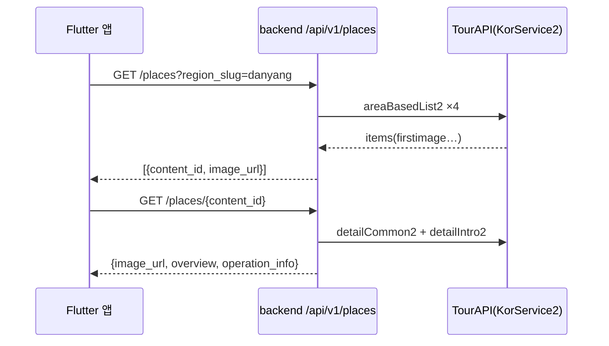

# [계획] 관광지 정보 실시간 조회 (TourAPI 실시간 전환)

| 항목 | 내용 |
|------|------|
| 기능명 | 관광지 정보 실시간 조회 |
| Spec 폴더 | `docs/specs/090-realtime-tour-place-info/` |
| 영역 | 공통 (backend + frontend) |
| 작성자 | Claude (AI) |
| 작성일 | 2026-08-21 |
| 상태 | 계획 |

## 배경 / 목적

* 한국관광공사 OpenAPI FAQ는 **로컬 DB 저장·캐싱 대신 실시간 호출을 강력히 권고**한다(데이터 동기화 오류 방지).
* 현재 앱은 TourAPI에서 받은 이미지 URL·소개문을 스크립트([045 스펙](../045-quest-region-images/))로 `frontend/lib/data/static/quests_data.dart`에 **박아 넣고** 서빙한다 — 저장된 공사 데이터가 낡을 수 있는 구조로, 권고와 어긋난다.
* 낡을 수 있는 공사 데이터(이미지 URL·소개문·운영정보)를 요청 시점에 TourAPI에서 실시간 조회하는 구조로 바꾼다. 이는 백엔드 Quest 모델의 기존 의사결정("운영정보는 저장하지 않고 content_id로 TourAPI 조회", `backend/app/quests/models.py`)과도 방향이 같다.

## 목표 (Goals)

* 퀘스트 썸네일 이미지·장소 소개문·운영정보(운영시간·휴무)를 화면 진입 시 TourAPI 실시간 조회로 표시한다.
* 사진 인증 시 Gemini 판정 프롬프트에 장소 소개문을 실시간 조회해 맥락으로 포함한다.
* TourAPI 오류·한도 초과 시 앱은 기존 placeholder(색 박스·기본 문구)를 표시한다 — 저장된 폴백 값 없음.

## 비목표 (Non-Goals)

* 퀘스트 목록 자체를 TourAPI로 실시간 생성 — 퀘스트 골격(제목·유형·미션·보상)은 우리 게임 콘텐츠로 유지.
* 좌표(lat/lng) 실시간화 — GPS 인증 반경 판정·VWorld 캐시 키에 쓰여 변동에 민감하므로 정적 유지.
* 지역 대표(히어로) 이미지 등 수작업 자산 변경 — 절대 건드리지 않는다.
* 행사·축제 정보(searchFestival2)·연관 관광지 추천(TarRlteTarService1) — 다음 태스크로 분리.
* 응답 캐싱 — 권고 취지에 따라 캐시하지 않는다(호출량은 아래 리스크 참고).

## 요구사항

* 앱은 TourAPI를 직접 호출하지 않는다 — 키는 서버만 든다(APK 추출 방지, [external-apis](../../conventions/external-apis.md) VWorld 항목과 같은 논리).
* 응답은 기존 Envelope 규격([api-design](../../conventions/api-design.md)).
* TourAPI 실패 시 백엔드는 해당 필드를 비워(null) 응답하거나 부분 성공을 반환하고, 앱은 placeholder를 표시한다.
* Gemini 프롬프트의 장소 맥락은 보조 정보다 — 조회 실패 시 기존 프롬프트 그대로 판정한다(인증 자체를 막지 않는다).

## 설계 개요 / 접근 방식

**신규 백엔드 모듈** `backend/app/places/` (router·service·schemas) — "TourAPI 장소 정보 프록시" 단일 책임.

| 엔드포인트 | TourAPI 호출 | 용도 |
|------|------|------|
| `GET /api/v1/places?region_slug={slug}` | `areaBasedList2` ×4 (contentTypeId 12·14·28·39) | 지역 화면 썸네일 — `[{content_id, image_url}]` 목록 반환 |
| `GET /api/v1/places/{content_id}?content_type_id={id}` | `detailCommon2` + `detailIntro2` | 상세 화면 — `{image_url, overview, operation_info}` 반환 |

* 미연결이던 `backend/app/integrations/tour_api/client.py`를 이 모듈이 사용한다(`fetch_detail_common` 메서드 추가). `loader.py`는 여전히 호출자가 없다 — 이번 범위에서 제거·유지 여부는 건드리지 않는다.
* **사진 인증 보강**: `backend/app/quests/verification.py`의 사진 판정 경로에서 퀘스트에 `content_id`가 있으면 `detailCommon2` 소개문을 가져와 `build_photo_judgement_prompt`에 장소 맥락으로 추가한다.
* **frontend**: `Quest` 모델에 `tourContentId`·`tourContentTypeId` 추가(1회 백필 — contentId는 낡는 데이터가 아니라 식별자), TourAPI 유래 `imageUrl`·소개문 `desc`는 dart에서 제거. 신규 `PlaceRepository`(Dio)가 위 두 엔드포인트를 호출하고, 지역 화면·상세 화면이 로딩 상태와 함께 표시한다. 수제 퀘스트(contentId 없음)는 직접 쓴 desc를 그대로 유지한다.

## 의사결정 (함께 논의 · 근거 필수)

| 결정할 항목 | 선택지 | 제안 / 근거 | 상태 |
|------|--------|------------|------|
| 실시간 전환 범위 | 장소 데이터만 / 퀘스트 목록까지 | **장소 데이터(이미지·소개문·운영정보)만** — 퀘스트는 가공된 게임 콘텐츠(제목 템플릿·미션·수제 퀘스트)라 원본 대체 불가. 권고 취지(저장 데이터가 낡는 것 방지)는 장소 데이터 실시간화로 충족 | 합의됨 |
| 실패 시 동작 | placeholder / 정적 값 폴백 | **placeholder** — 정적 폴백은 "저장된 공사 데이터 서빙"이 남아 권고 취지와 어긋나고 경로가 둘이 됨(대체 경로 금지) | 합의됨 |
| 목록 썸네일 조회 방식 | 지역 묶음(areaBasedList2 ×4) / 퀘스트별 개별(detailCommon2 ×N) | **지역 묶음** — 지역 화면 1회 = TourAPI 4건 vs 개별 방식 약 20건(5배). 일 1,000건 한도에서 묶음이 안전 | 합의됨 |
| TourAPI 호출 주체 | 백엔드 프록시 / 앱 직접 | **백엔드 프록시** — 키를 앱에 넣으면 APK에서 추출됨(VWorld 항목에 문서화된 동일 논리) | 합의됨 |
| contentId 저장 여부 | dart에 백필 / 매 요청 이름 매칭 | **dart에 1회 백필** — contentId는 식별자라 낡지 않음. 요청마다 searchKeyword2 이름 매칭은 호출량·오매칭 리스크만 키움 | 합의됨 |
| 확장 활용처 | 운영정보 / 행사·축제 / 연관 관광지 | **운영정보만 포함**(detailIntro2 — 백엔드에 이미 계획된 자리 있음). 행사·축제, 연관 관광지는 신규 UI가 필요해 다음 태스크로 분리 | 합의됨 |

## 영향 범위

* **backend**: `app/places/`(신설) · `app/integrations/tour_api/client.py`(메서드 추가) · `app/quests/verification.py`·`app/integrations/vision/prompt.py`(프롬프트 보강) · `app/main.py`(라우터 등록) · `tests/`
* **frontend**: `data/models/quest.dart` · `data/static/quests_data.dart`(백필·제거) · `data/repositories/place_repository.dart`(신설) · 지역/상세 화면(`features/quests/`) · `test/`
* **scripts**: 백필용 1회 스크립트(기존 `enrich_frontend_quests.py` 개조 또는 별도) — 실행 후 스크립트의 상시 역할은 사라짐
* **문서**: [external-apis](../../conventions/external-apis.md) 호출 지점·미연결 코드 절, [README 실행 파이프라인·주요 기능](../../../README.md), [045 스펙](../045-quest-region-images/) implementation 상태(정적 보강 방식이 본 스펙으로 대체됨), `docs/specs/README.md` 인덱스

## 작업 단계

- [ ] 백엔드: `TourApiClient.fetch_detail_common` 추가, `app/places/` 모듈·엔드포인트 2개 + 테스트
- [ ] 백엔드: 사진 인증 프롬프트 장소 맥락 보강 + 테스트
- [ ] 스크립트: dart에 `tourContentId`·`tourContentTypeId` 백필, TourAPI 유래 `imageUrl`·`desc` 제거
- [ ] 프론트: `Quest` 모델·`PlaceRepository`·화면 연동(로딩·placeholder) + 테스트
- [ ] 문서 동기화(external-apis·README·045·specs 인덱스)

## 리스크 / 미해결 질문

* **쿼터**: 개발계정 일 1,000건. 지역 화면 1회 = 4건, 상세 1회 = 2건 — 데모 규모에선 충분하나 사용자가 늘면 운영계정 전환 필요. 한도 초과 시 placeholder로 동작은 유지된다.
* **공공 API 지연**: 상세 화면이 TourAPI 응답을 기다린다 — 타임아웃을 짧게(수 초) 잡고 초과 시 placeholder.
* **인증 지연**: 프롬프트 보강이 판정에 TourAPI 1건을 더한다 — 실패해도 판정은 진행하므로 기능 리스크는 없음.
* **백엔드 quest 행의 `content_id` 채움 상태 확인 필요** — 비어 있으면 인증 보강이 동작할 대상이 없다(구현 시 확인).
