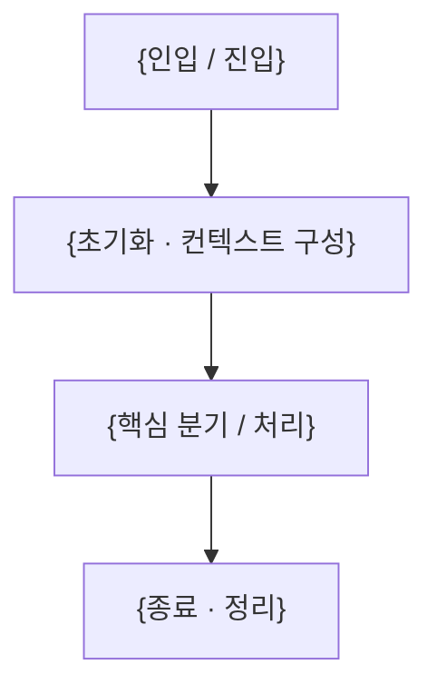

<!--
이 파일은 "프로젝트 README 템플릿"입니다. (docs/template/specs/* 와 같은 템플릿 모음의 일부)
새 프로젝트/레포의 루트 README.md를 작성할 때 이 파일을 복사해 채우세요.
- {중괄호}는 프로젝트 값으로 교체합니다.
- 해당 없는 섹션은 통째로 삭제합니다.
- 안내용 주석은 작성 후 모두 지웁니다.
- ColorTrip은 backend(Python) + frontend(Flutter) 모노레포입니다. 하위 프로젝트가 여러 개면
  설치·실행·의존성·코드 스타일 섹션을 영역(backend/frontend)별로 나눠 적습니다.
섹션 순서(개요 → 설치/실행 → 구조 → 흐름 → 기능 위치 → 의존성 → 코드 스타일 → 유지관리)는
그대로 유지하길 권장합니다.
-->

# {프로젝트명}

{한두 문장 소개 — 무엇을 하는 서비스/제품인지, 어떤 기반 기술 위에 있는지, 구조 한 줄 요약}

> AI 코딩 에이전트로 작업한다면 먼저 [docs/AGENT_GUIDE.md](docs/AGENT_GUIDE.md)를 읽으세요.

## 주요 기능

### 🎯 핵심 기능

<!-- 사용자/도메인 관점의 핵심 기능 -->
- **{기능}**: {설명}

### 🏗️ 아키텍처 특징

<!-- 구조적 특징 (예: 모노레포 구성, 레이어 구조, 클라이언트-서버 계약 등) -->
- **{특징}**: {설명}

## 요구사항

- **{백엔드 런타임}**: {버전} <!-- 예: Python 3.12+ -->
- **{프론트엔드 런타임}**: {버전} <!-- 예: Flutter 3.x / Dart 3.x -->
- **패키지 매니저**: {백엔드 예: uv} / {프론트엔드 예: pub}
- {필수 외부 의존 — DB, 브로커, 외부 서비스 키 등}

## 설치 및 설정

<!-- 모노레포이므로 영역별로 나눠 적는다. -->

### 백엔드 (`backend/`)

```bash
cd backend
{의존성 설치 명령}        # 예: uv sync
{개발 의존성 설치 명령}   # 예: uv sync --group dev
```

### 프론트엔드 (`frontend/`)

```bash
cd frontend
{의존성 설치 명령}        # 예: flutter pub get
```

### 환경 변수 설정

각 영역 루트에 `.env`(또는 해당 도구의 설정 파일)를 만들고 다음을 설정합니다:

```bash
# {그룹 — 예: 핵심 인프라}
{KEY}={값/설명}

# {그룹 — 예: 외부 API 키}
{KEY}={값/설명}
```

## 실행 방법

### 백엔드

```bash
{실행 명령}
```

- **용도**: {}
- **특징**: {핵심 동작·주의점}

### 프론트엔드

```bash
{실행 명령}     # 예: flutter run
```

- **용도**: {}

## 프로젝트 구조

<!-- 레이어가 있으면 의존 방향을 한 줄로 명시 -->
{레이어/영역 의존 방향, 예: frontend → (API) → backend}

```text
{디렉토리 트리 — 각 폴더 옆에 "# 한 줄 책임 설명"을 붙인다}
.
├── backend/    # {백엔드 책임}
├── frontend/   # {프론트엔드 책임}
└── docs/       # 문서 (AGENT_GUIDE, specs, template)
```

> {새 구성요소(모듈/하위 프로젝트) 등록 방법, 반드시 커밋해야 하는 필수 파일 등 구조 관련 주의사항}

## {실행 파이프라인 / 핵심 흐름}

{진입(요청/이벤트 인입)부터 종료까지의 핵심 흐름. frontend ↔ backend 경계를 포함해. 가능하면 mermaid로.}



<!-- 흐름의 핵심 분기, 핵심 모듈/클래스의 역할 등을 하위 섹션(###)으로 보충 -->

## 주요 기능과 위치

기능을 수정할 때 **어느 폴더를 건드려야 하는지**를 정리합니다.

| 기능 | 설명 | 위치 |
|------|------|------|
| **{기능}** | {한 줄 설명} | `backend/...` 또는 `frontend/...` |

> 위 표는 기능이 **어디 있는지**를 가리킵니다. 개별 기능의 **상세 설명**(그 기능이 무엇이고 어떻게 동작하는지)은 이 README에 중복해 적지 않고, 해당 기능 스펙의 `description.md`를 단일 출처(SOT)로 둡니다. 특정 기능 설명이 필요하면 `docs/specs/{NNN}-{기능}/description.md`를 참고/링크하세요.

## 패키지 의존성

### 백엔드 주요 의존성

| 패키지 | 버전 | 설명 |
| ------ | ---- | ---- |
| `{패키지}` | `{버전}` | {용도} |

### 프론트엔드 주요 의존성

| 패키지 | 버전 | 설명 |
| ------ | ---- | ---- |
| `{패키지}` | `{버전}` | {용도} |

## 코드 스타일

### 백엔드 (Python)

```bash
{포맷터 명령}     # 예: uv run ruff format
{린터 명령}       # 예: uv run ruff check
{타입체커 명령}   # 예: uv run pyright
```

설정은 `{설정 파일}`에 있습니다. {반드시 지킬 핵심 규칙 한 줄}

### 프론트엔드 (Flutter/Dart)

```bash
{포맷터 명령}     # 예: dart format .
{린터 명령}       # 예: flutter analyze
```

<!-- (선택) pre-commit 등 자동 검사 훅이 있으면 설치/실행 방법을 적는다 -->

### 자주 쓰는 라이브러리·패턴

<!-- 이 프로젝트에서 일관되게 쓰는 방식. 새 코드가 따라야 할 규칙. -->
- **{패턴}**: {설명}

## 유지 관리 사항

### {성능 튜닝 / 운영 설정}

- `{설정값}`: {의미와 조정 기준}

### 보안

- {시크릿 관리, 운영 환경 설정 등}

### 의존성 업데이트

```bash
{백엔드 의존성 업데이트 명령}
{프론트엔드 의존성 업데이트 명령}
```
